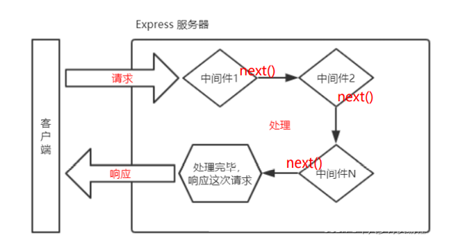
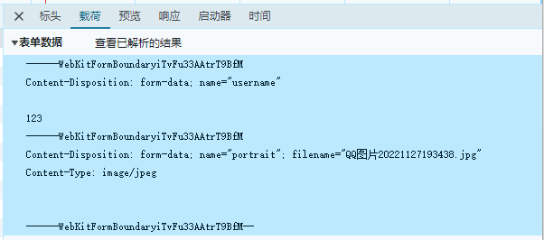
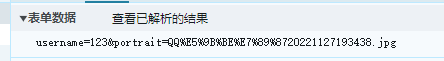

# Express

:::tip Express
基于 Node.js 平台，快速、开放、极简的 Web 开发框架

用于快速创建服务器的第三方模块。

[官网传送门](https://www.expressjs.com.cn/)
:::

## Express框架

### 1. 介绍

express 是一个封装好的**工具包**，封装了很多功能，便于开发 WEB 应用（HTTP 服务）

### 2. 使用

```JavaScript
// 1.导入
const express = require('express')

// 创建应用对象
const app = express()

// 创建路由  get方法，访问/home时执行回调函数
app.get('/home', (req, res) => {
  res.end('hello world')
})

// 监听端口，启动服务
app.listen(3000, ()=>{
  console.log('3000已经启动。');
})
```

### 3. express路由

#### 3.1 概念

路由确定了应用程序如何响应客户端对特定端点的请求

#### 3.2 路由使用

```
app.<method>(path，callback)
```


```JavaScript
// 1.导入
const express = require('express')

// 创建应用对象
const app = express()

// 创建路由  get方法，访问/home时执行回调函数
app.get('/home', (req, res) => {
  res.end('hello world')
})

app.get('/', (req, res) => {
  res.end('home')
})

// post
app.post('/login', (req, res) => {
  res.end('login')
})

// 所有方法
app.all('/test', (req, res) => {
  res.end('test')
})

// 404响应
app.all('*', (req, res) => {
  res.end('404')
})
// 监听端口，启动服务
app.listen(3000, ()=>{
  console.log('3000已经启动。');
})
```

#### 3.3 获取请求参数

```JavaScript
// 1.导入
const express = require('express')

// 创建应用对象
const app = express()

// 创建路由  get方法，访问/home时执行回调函数
app.get('/home', (req, res) => {
  // http://127.0.0.1:3000/home?a=1&b=2
  // 原生
  console.log(req.method); // GET
  console.log(req.url);  // /home?a=1&b=2
  console.log(req.httpVersion);  //1.1
  console.log(req.headers); // Object

  // express操作
  console.log(req.path); // /home
  console.log(req.query); // { a: '1', b: '2' }
  // 获取ip
  console.log(req.ip); //::ffff:127.0.0.1
  // 获取请求头
  console.log(req.headers); //Object
  console.log(req.get('host')); //127.0.0.1:3000
  res.end('hello world')
})

// 监听端口，启动服务
app.listen(3000, ()=>{
  console.log('3000已经启动。');
})
```

#### 3.4 获取路由参数

```JavaScript
// 1.导入
const express = require('express')

// 创建应用对象
const app = express()

// 创建路由  :id id占位符
app.get('/:id.html', (req, res) => {
  // http://127.0.0.1:3000/123123.html
  // 获取url路由参数
  console.log(req.params.id);  //123123
  res.setHeader('content-type', 'text/html; charset=utf-8')
  res.end('商品详情')
})

// 监听端口，启动服务
app.listen(3000, ()=>{
  console.log('3000已经启动。');
})
```

##### 3.4.1 练习

```JavaScript
// 1.导入
const express = require('express')
// const singer1 = require('./singers.json')
const { singers } = require('./singers.json') //解构赋值

// 创建应用对象
const app = express()

// 创建路由  :id id占位符
app.get('/singer/:id.html', (req, res) => {
  // 获取url路由参数
  let { id } = req.params
  console.log(req.params.id);
  let result = singers.find(item => {
    if (item.id == Number(id)) {
      return true
    }
  });

  if (!result) {
    res.statusCode = 404
    res.end('404')
  }

  res.setHeader('content-type', 'text/html; charset=utf-8')
  res.end(`
  <!DOCTYPE html>
  <html lang="en">
  <head>
    <meta charset="UTF-8">
    <meta http-equiv="X-UA-Compatible" content="IE=edge">
    <meta name="viewport" content="width=device-width, initial-scale=1.0">
    <title>Document</title>
  </head>
  <body>
    <h2>${result.singer_name}</h2>
    
  </body>
  </html>
  `)
})

// 监听端口，启动服务
app.listen(3000, () => {
  console.log('3000已经启动。');
})
```

### 4。 Express 响应设置

```JavaScript
// 1.导入
const express = require('express')

// 创建应用对象
const app = express()

// 创建路由
app.get('/response', (req, res) => {
  // 原生响应
  // res.statusCode = 404
  // res.statusMessage = 'Not Found'
  // res.setHeader('XXX', 'YYY')
  // // wirte的内容会和end的内容进行拼接，显示在页面上
  // res.write('hello')
  // res.end(`response`)

  // express响应   express的send会根据内容自动添加{'content-type', 'text/html; charset=utf-8'}
  // res.status(500)
  // res.set('aaa','bbb')
  // res.send('汉字express')
  // res.status(500).set('111','222').send('你好')

  // 其他响应
  // 跳转响应 重定向
  // res.redirect('https://baidu.com')
  // 下载响应
  // res.download(__dirname + '/package.json')
  // 响应JSOM
  // res.json({
  //   name: 'ceshi',
  //   slogon: 'slogon'
  // })
  // 响应文件内容
  res.sendFile(__dirname + '/test.html')

})

// 监听端口，启动服务
app.listen(3000, () => {
  console.log('3000已经启动。');
})
```

### 5. Express 中间件

#### 5.1 概念

**中间件函数** 可以像路由回调一样访问 **请求对象** **(request),** **响应对象** **(response)**

#### 5.2 作用

**使用函数封装公共操作,简化代码**

#### 5.3 类型

全局中间件

路由中间件

##### 5.3.1 定义全局中间件

**每一个请求** 到达服务端之后 **都会执行全局中间件函数**



```JavaScript
/**
 * 记录每个请求的 url 与 IP 地址
 */
// 1.导入
const express = require('express')
const fs = require('fs')
const path = require('path')

// 创建应用对象
const app = express()

// 声明中间件函数  (请求报文对象, 响应报文对象, next函数指向后续的路由回调或中间件函数回调)
function recordMiddleware(req, res, next) {
  // 获取url和ip
  let { url, ip } = req
  fs.appendFileSync(path.resolve(__dirname, './access.log'), `${url} ${ip}\r\n`)
  // 调用next
  next()
}
// 应用中间件
app.use(recordMiddleware)
// 创建路由 
app.get('/home', (req, res) => {
  res.send('hello world')
})

app.get('/admin', (req, res) => {
  res.send('后台home')
})

// 404响应
app.all('*', (req, res) => {
  res.send('404')
})
// 监听端口，启动服务
app.listen(3000, () => {
  console.log('3000已经启动。');
})
```

##### 5.3.2 多个全局中间件

##### 5.3.3 定义路由中间件

```JavaScript
/**
 * 针对 /admin  /setting 的请求, 要求 URL 携带 code=521 参数, 如未携带提示『暗号错误』  
 */

// 1.导入
const express = require('express')

// 创建应用对象
const app = express()

// 创建路由 
app.get('/home', (req, res) => {
  res.send('hello world')
})

// 声明中间件
let checkCode = (req, res, next ) =>{
  if(req.query.code === '521'){
    next()
  }else{
    res.send('error')
  }
}

// 进入/admin -> 进行checkCode函数 -> 函数通过则next() 进入回调函数
app.get('/admin',checkCode, (req, res) => {
  res.send('后台home')
})

app.get('/setting',checkCode, (req, res) => {
  res.send('后台setting')
})

// 404响应
app.all('*', (req, res) => {
  res.send('404')
})
// 监听端口，启动服务
app.listen(3000, () => {
  console.log('3000已经启动。');
})
```

#### 5.4 静态资源中间件

```JavaScript
/**
 * 针对 /admin  /setting 的请求, 要求 URL 携带 code=521 参数, 如未携带提示『暗号错误』  
 */

// 1.导入
const express = require('express')

// 创建应用对象
const app = express()

//静态资源中间件的设置，将当前文件夹下的public目录作为网站的根目录
app.use(express.static(__dirname + '/public'))

//如果访问的内容经常变化，还是需要设置路由
//但是，在这里有一个问题，如果public目录下有index.html文件，单独也有index.html的路由，
//则谁书写在前，优先执行谁

// 创建路由 
app.get('/home', (req, res) => {
  res.send('hello world')
})

// 监听端口，启动服务
app.listen(3000, () => {
  console.log('3000已经启动。');
})
```

#### 5.5 获取请求体数据 body-parser

```JavaScript
/**
 * 按照要求搭建 HTTP 服务
 * 
 * GET   /login  显示表单网页
 * POST  /login  获取表单中的『用户名』和『密码』
 */

// 1.导入
const express = require('express')
const bodyParser = require('body-parser')

// 创建应用对象
const app = express()

// 解析jSON格式的请求体中间件
const jsonParser = bodyParser.json()
// 解析queryString格式的请求体中间件
const urlencodedParser = bodyParser.urlencoded({extended: false})

// 创建路由 
app.get('/login',(req, res) => {
  // res.send('hello world')
  // 响应html文件内容
  res.sendFile(__dirname + '/10-form.html')
})

app.post('/login',urlencodedParser ,(req, res) => {
  console.log(req.body);
  res.send(`用户名: ${req.body.username}
  密码: ${req.body.password}
  `)
})

// 监听端口，启动服务
app.listen(3000, () => {
  console.log('3000已经启动。');
})
```

#### 5.6 防盗链

防止外部网站获取资源

```JavaScript
/**
 * 针对 /admin  /setting 的请求, 要求 URL 携带 code=521 参数, 如未携带提示『暗号错误』  
 */

// 1.导入
const express = require('express')

// 创建应用对象
const app = express()

// 声明中间件
app.use((req, res, next) => {
  // 检索请求头的referer是否为127.0.0.1
  // 获取referer
  let referer = req.get('referer')
  console.log(referer);
  if (referer) {
    // 实例化
    let url = new URL(referer)
    let hostname = url.hostname
    console.log(hostname);
    if(hostname !== '127.0.0.1'){
      res.status(404).send('not found')
      return;
    }
  }
  next()
})

//静态资源中间件的设置，将当前文件夹下的public目录作为网站的根目录
app.use(express.static(__dirname + '/public'))

// 监听端口，启动服务
app.listen(3000, () => {
  console.log('3000已经启动。');
})
```

### 6. Router

#### 6.1 概念

将 **router** 信息抽取出主文件

#### 6.2 作用

对路由进行模块化,更好管理路由

#### 6.3 使用

routes文件夹下创建对象router.js文件

```JavaScript
// 引入express
const express = require('express')

// 创建路由对象
const router = express.Router()

// 创建路由规则
router.get('/admin', (req, res) => {
  res.send('后台admin')
})

router.get('/login', (req, res) => {
  res.send('注册')
})

module.exports = router
```

主文件中引入,使用

```JavaScript
/**
 * 针对 /admin  /setting 的请求, 要求 URL 携带 code=521 参数, 如未携带提示『暗号错误』  
 */

//导入 express
const express = require('express');
const homeRouter = require('./routes/homeRouter')
const adminRouter = require('./routes/adminRouter')
 
//创建应用对象
const app = express();

//设置
app.use(homeRouter)
app.use(adminRouter)

app.all('*',(req, res) => {
  res.send('<h1>404 Not Found</h1>')
})

//监听端口, 启动服务
app.listen(3000, () => {
  console.log('服务已经启动, 端口 3000 正在监听中....')
})
```

### 7. EJS模板引擎

#### 7.1 概念

分离 **用户界面****和业务数据** 的技术

#### 7.2 EJS

官网: https://ejs.co/

中文站:: https://ejs.bootcss.com/

#### 7.3 EJS初

执行js代码

```JavaScript
<% code %>
```

输出转义的数据到模板上

```JavaScript
<%= code %>
```

输出非转义的数据到模板上

```JavaScript
<%- code %>
```

js文件

```JavaScript
// 导入
const ejs = require('ejs')
const fs = require('fs')

// 字符串
let china = '中国'
let weather = '天气'
// 使用ejs渲染
// 解析<%= %>中的内容，将其替换为后方内容，将输入和内容分离开
// let str = '11 <%= china %>'
let str = fs.readFileSync('./01-html.html').toString()

let result = ejs.render(str, {china: china, weather})
console.log(result);
```

html文件

```HTML
<!DOCTYPE html>
<html lang="en">
<head>
  <meta charset="UTF-8">
  <meta name="viewport" content="width=device-width, initial-scale=1.0">
  <title>Document</title>
</head>
<body>
  <h2>11 <%= china %></h2>
  <p><%= weather %></p>
</body>
</html>
```

#### 7.4 列表渲染

js文件

```JavaScript
const ejs = require('ejs');
const xiyou = ['唐僧' ,'1','2','3']

// let str = '<ul>'
// xiyou.forEach(item => {
//   str += `<li>${item}</li>`
// })
// // 闭合str
// str += '</ul>'
// console.log(str);

// EJS
const fs = require('fs');
let html = fs.readFileSync('./02-xiyou.html').toString();
let result = ejs.render(html, {xiyou: xiyou})
  console.log(result);
```

html文件

```HTML
<!DOCTYPE html>
<html lang="en">
<head>
  <meta charset="UTF-8">
  <meta name="viewport" content="width=device-width, initial-scale=1.0">
  <title>Document</title>
</head>
<body>
  <ul>
    <% xiyou.forEach(item => { %>
    <li><%= item %></li>
    <% }) %>
  </ul>
</body>
</html>
```

#### 7.5 条件渲染

js文件

```JavaScript
/**
 * 通过 isLogin 决定最终的输出内容
 * true   输出『<span>欢迎回来</span>』
 * false  输出『<button>登录</button>  <button>注册</button>』
 */
const ejs = require('ejs');
const fs = require('fs')

let isLogin = true;

// 原生js
// if(isLogin){
//   console.log('<span>欢迎回来</span>');
// }else{
//   console.log('<button>登录</button>  <button>注册</button>');
// }

let html = fs.readFileSync('./03-home.html').toString();
// ejs实现
let result = ejs.render(html, {isLogin: isLogin})

console.log(result);
```

HTML文件

```HTML
<!DOCTYPE html>
<html lang="en">
<head>
  <meta charset="UTF-8">
  <meta name="viewport" content="width=device-width, initial-scale=1.0">
  <title>Document</title>
</head>
<body>
  <% if(isLogin){ %>
    <span>欢迎回来</span>
    <% }else{ %>
      <button>登录</button>  <button>注册</button>
    <% } %>
</body>
</html>
```

#### 7.6 express中使用ejs

js文件

```JavaScript
// 导入express
const express = require('express');

const path = require('path');

// 创建应用对象
const app = express();

// 1.设置模板引擎
app.set('view engine', 'ejs'); 
// 2.设置模板文件存放位置  模板文件：具有模板语法内容的文件<% %>
app.set('views', path.resolve(__dirname, './views'))

// 创建路由
app.get('/home', (req, res) => {
  // render响应
  // res.render('模板文件名'， '数据')
  let title = 'nodejs-express-ejs'
  res.render('home',{title})
  // 创建模板文件
  
})

// 监听端口，启动服务
app.listen(3000,()=>{
  console.log('listening on port 3000');
})
```

home.ejs文件

```JavaScript
<!DOCTYPE html>
<html lang="en">
<head>
  <meta charset="UTF-8">
  <meta name="viewport" content="width=device-width, initial-scale=1.0">
  <title>Document</title>
</head>
<body>
  <h2><%= title %></h2>
</body>
</html>
```

#### 7.7 generator

快速搭建骨架

全局安装

**npm** **install -g express-generator**

创建框架

 **express -e 14-generator**

#### 7.8 文件上传

##### 7.8.1 表单

portrait.ejs

```JavaScript
<!DOCTYPE html>
<html lang="en">
<head>
  <meta charset="UTF-8">
  <meta name="viewport" content="width=device-width, initial-scale=1.0">
  <title>文件上传 </title>
</head>
<body>
  <h2>文件上传</h2>
  <hr>
  <!-- enctype="multipart/form-data" 文件上传的必须属性 -->
  <form action='/portrait' method="post" enctype="multipart/form-data">
    用户名：<input type="text" name="username" /> <br>
    头像：<input type="file" name="portrait" /> <br>
    <hr>
    <button>提交</button>
  </form>
</body>
</html>
```

表单设置enctype属性，提交信息时的数据被分块，如下所示



不设置enctype属性，提交信息时的数据如下所示



##### 7.8.2 处理文件上传

**npm** **i formidable** 

```JavaScript
var express = require('express');
var router = express.Router();

// 导入
const formidable = require('formidable')

/* GET home page. */
router.get('/', function (req, res, next) {
  res.render('index', { title: 'Express' });
});

// 显示网页表单
router.get('/portrait', (req, res) => {
  res.render('portrait')

})

// 处理文件上传
router.post('/portrait', (req, res) => {
  // 创建form对象
  const form = formidable({
    multiples: true,
    // 设置上传文件的保持目录
    uploadDir: __dirname + '/../public/images',
    // 保持文件后缀
    keepExtensions: true
  });
  // 解析请求报文
  form.parse(req, (err, fields, files) => {
    if (err) {
      next(err)
      return;
    }
    console.log(fields);
    console.log(files);
    // 服务器保存访问路径
    let url = '/images/' + files.portrait.newFilename;
    res.send(url)
  })
})

module.exports = router;
```
