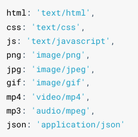

## 初识 Nodejs

:::tip Node.js®
Node.js® is a JavaScript runtime built on Chrome's V8 JavaScript engine

Node.js® 是一个基于 Chrome V8 引擎 的 JavaScript 运行时环境

[官网传送门](https://nodejs.org/en/)

:::

## 注意

不能操纵DOM、BOM的API，可以使用console和定时器API

顶级对象为global，可使用globalThis访问顶级对象

## Buffer缓冲器

### 1. 概念

类似于数组，用于固定长度的字节序列

本质是一段内存空间，专门用来处理**二进制数据**

### 2.特点

buffer大小固定，无法调整

buffer性能较好，可直接对计算机内存进行操作

每个元素大小为1字节

### 3. 使用

#### 3.1 创建Buffer

```JavaScript
// alloc（分配）
let buf = Buffer.alloc(10)
console.log(buf);

// allcoUnsafe(复用空间，数据，速度快)
let buf2 = Buffer.allocUnsafe(10)
console.log(buf2);

// from
let buf3 = Buffer.from('hello world')
let buf4 = Buffer.from([105, 108, 111, 118, 101, 121, 111, 117])
console.log(buf4);
```

#### 3.2 Buffer与字符串的转化，读写

```JavaScript
// Buffer与字符串的转化
let buf4 = Buffer.from([105, 108, 111, 118, 101, 121, 111, 117])
console.log(buf4.toString());

// []
let buf1 = Buffer.from('heeee')
console.log(buf1[0].toString(2)); //查看
console.log(buf1);
buf1[0] = 95  // 修改
console.log(buf1);

// 溢出
let buf2 = Buffer.from('hello')
buf2[0] = 361; //舍弃高位的数字
// 中文
let buf3 = Buffer.from('你好')
console.log(buf3);  //<Buffer e4 bd a0 e5 a5 bd>  六个字节，一个utf-8的中文占三个字节
```

## fs模块

fs 模块可以实现与硬盘的交互

例如文件的创建、删除、重命名、移动还有文件内容的写入、读取以及文件夹的相关操作

### 1. 文件写入

| 方法                        | 说明     |
| --------------------------- | -------- |
| writeFile                   | 异步写入 |
| writeFileSync               | 同步写入 |
| appendFile / appendFileSync | 追加写入 |
| createWriteStream           | 流式写入 |

#### 1.1 writeFile异步写入

语法： **fs.writeFile(file, data[, options],** **callback****)** 

```JavaScript
/*
  需求:
  新建一个文件，座右铭.txt，写入内容，三人行，则必有我师焉
*/

// 1. 导入fs模块
const fs = require('fs')

// 2. 写入内容
fs.writeFile('./座右铭.txt', '三人行，则必有我师焉', err=>{
  // 错误回调，值为错误对象或null
  if(err){
    console.log('写入失败');
    return;
  }else{
    console.log('写入成功');
  }
})
```

#### 1.2 writeFileSync同步写入

语法: **fs.writeFileSync(file, data[, options])** 

```JavaScript
// 1. 导入fs模块
const fs = require('fs')

// 2.同步写入
fs.writeFileSync('./data.txt', 'test')
```

Node.js 中的磁盘操作是由其他 **线程** 完成的，结果的处理有两种模式：

 同步处理 JavaScript 主线程 **会等待** 其他线程的执行结果，然后再继续执行主线程的代码，效率较低

 异步处理 JavaScript 主线程 **不会等待** 其他线程的执行结果，直接执行后续的主线程代码，效率较好

#### 1.3 appendFile / appendFileSync 追加写入

语法:  

 **fs.appendFile(file, data[, options],** **callback****)**

 **fs.appendFileSync(file, data[, options])**

```JavaScript
// appendFile / appendFileSync 追加写入

const fs = require('fs')
// fs.appendFile('./座右铭.txt', '，追加内容', err=>{
//   if(err){
//     console.log('失败');
//     return
//   }else{
//     console.log('成功');
//   }
// })

// fs.appendFileSync('./座右铭.txt', '\r\n换行追加')

// writeFile实现追加
fs.writeFile('./座右铭.txt', '\r\nwirteFile追加', {flag : 'a'} ,err=>{
    if(err){
      console.log('失败');
      return
    }else{
      console.log('成功');
    }
  })
```

#### 1.4 createWriteStream 流式写入

语法： **fs.createWriteStream(path[, options])**

```JavaScript
const fs = require('fs');

// 创建写入流对象
const ws = fs.createWriteStream('./流式写入.txt')

ws.write('写入1\r\n')
ws.write('写入2\r\n')
ws.write('写入3\r\n')
ws.write('写入4\r\n')

// 关闭
ws.close
```

流式写入方式适用于 **大文件写入或者频繁写入** 的场景, writeFile 适合于 **写入频率较低**的场景

#### 1.5 写入文件的场景

下载文件

安装软件

保存程序日志，如 Git

编辑器保存文件

视频录制

当 **需要持久化保存数据** 的时候，应该想到 **文件写入**

### 2. 文件读取

| 方法             | 说明     |
| ---------------- | -------- |
| readFile         | 异步读取 |
| readFileSync     | 同步读取 |
| createReadStream | 流式读取 |

#### 2.1 readFile / readFileSync 异步 / 同步读取

语法： 

**fs.readFile(path[, options],** **callback****)**

**fs.readFileSync(path[, options])**

```JavaScript
const fs = require('fs');

// 异步读取
fs.readFile('./流式写入.txt', (err, data)=>{
  // err错误信息，data读取内容
  if(err){
    console.log('失败');
    return
  }
  console.log(data.toString());
})

// 同步读取
let data = fs.readFileSync('./流式写入.txt')
console.log(data.toString());
```

#### 2.2 流式读取

语法： **fs.createReadStream(path[, options])**

```JavaScript
const fs = require('fs');

// 创建读取流对象
const rs = fs.createReadStream('./流式写入.txt')

// 绑定data事件 每次读取一块就调用一次回调函数。 每次最多读取64kb的数据
rs.on('data', chunk => {
  console.log(chunk);
})
```

#### 2.3 读取文件的场景

电脑开机

程序运行

编辑器打开文

查看图片

播放视频

播放音乐

Git 查看日志

上传文件

查看聊天记录

### 3. 移动和重命名

语法： 

 **fs.rename(oldPath, newPath,** **callback****)**

 **fs.renameSync(oldPath, newPath)** 

```JavaScript
const fs = require('fs');

// 调用rename  本质：更改文件路径
// 重命名
fs.rename('./座右铭.txt', './座右铭重命名.txt', err =>{
  if(err){
    console.log('Error ren');
    return;
  }
  console.log('成功');
})

// 移动
fs.rename('./data.txt', '../资料/data.txt', err =>{
  if(err){
    console.log('Error ren');
    return;
  }
  console.log('成功');
})
```

### 4. 文件删除

语法： 

 **fs.unlink(path,** **callback****)**

 **fs.unlinkSync(path)**

```JavaScript
 const fs = require('fs');

// unlink  unlinkSync
// fs.unlink('./流式写入.txt', err=>{
//   if(err){
//     console.log('删除失败');
//     return
//   }
//   console.log('成功');
// })

// rm  rmSync
fs.rm('./座右铭重命名.txt', err => {
  if (err) {
    console.log('删除失败');
    return
  }
  console.log('成功');
})
```

### 5. 文件夹操作

| 方法                | 说明 |
| ------------------- | ---- |
| mkdir/mkdirSync     | 创建 |
| readdir/readdirSync | 读取 |
| rmdir/rmdirSync     | 删除 |

#### 5.1 mkdir创建

语法： 

 **fs.mkdir(path[, options],** **callback****)**

 **fs.mkdirSync(path[, options])**

```JavaScript
const fs = require('fs');

// 创建 mkdir
// fs.mkdir('./html', err => {
//   if (err) {
//     console.log('删除失败');
//     return
//   }
//   console.log('成功');
// })

// 递归创建
// fs.mkdir('./a/b/c', {recursive: true}, err => {
//   if (err) {
//     console.log('删除失败');
//     return
//   }
//   console.log('成功');
// })
```

#### 5.2 readdir读取

语法： 

 **fs.readdir(path[, options],** **callback****)**

 **fs.readdirSync(path[, options])**

```JavaScript
const fs = require('fs');

fs.readdir('../资料', (err, data) => {
  if (err) {
    console.log('删除失败');
    return
  }
  console.log(data);
})
```

#### 5.3 rmdir删除

语法： 

 **fs.rmdir(path[, options],** **callback****)**

 **fs.rmdirSync(path[, options])**

```JavaScript
// 删除文件夹  文件夹不为空会失败
// fs.rmdir('./html', err => {
//   if (err) {
//     console.log('删除失败');
//     return
//   }
//   console.log('成功');
// })

// 递归删除
// 删除文件夹
fs.rm('./a',{recursive: true}, err => {
  if (err) {
    console.log('删除失败');
    return
  }
  console.log('成功');
})
```

### 6. 查看资源状态

语法： 

 **fs.stat(path[, options],** **callback****)**

 **fs.statSync(path[, options])** 

```JavaScript
const fs = require('fs');

// stat  
fs.stat('./座右铭-写入流复制.txt', (err, data) => {
  if (err) {
    console.log('删除失败');
    return
  }
  // console.log(data);
  // ifFile
  console.log(data.isFile());
  // isDirectory
  console.log(data.isDirectory());
})
```

### 7. 路径问题

相对路径

- ./座右铭.txt 当前目录下的座右铭.txt 
- 座右铭.txt 等效于上面的写法 
- ../座右铭.txt 当前目录的上一级目录中的座右铭.txt 

绝对路径 

- D:/Program Files windows 系统下的绝对路径 
- /usr/bin Linux 系统下的绝对路径

相对路径中所谓的 **当前目录** ，指的是 **命令行的工作目录** ，而并非是文件的所在目录

所以当命令行的工作目录与文件所在目录不一致时，会出现一些 BUG

### 8. __dirname

__dirname 与 require 类似，都是 Node.js 环境中的'全局'变量

**__****dirname** 保存着 **当前文件所在目录的绝对路径** ，可以使用 __dirname 与文件名拼接成绝对路径

```JavaScript
let data = fs.readFileSync(__dirname + '/data.txt');
```

使用 fs 模块的时候，尽量使用 __dirname 将路径转化为绝对路径，这样可以避免相对路径产生的 Bug

## Path

| API           | 说明                     |
| ------------- | ------------------------ |
| path.resolve  | 拼接规范的绝对路径       |
| path.sep      | 获取操作系统的路径分隔符 |
| path.parse    | 解析路径并返回对象       |
| path.basename | 获取路径的基础名称       |
| path.dirname  | 获取路径的目录名         |
| path.extname  | 获取路径的扩展名         |

```JavaScript
const path = require('path');

console.log('__dirname', __dirname);  // F:\test\node\nodeLearn\03-path
path.resolve(__dirname, './index.html')

console.log(path.resolve(__dirname, './index.html')); // F:\test\node\nodeLearn\03-path\index.html
console.log(path.resolve(__dirname, 'index.html')); // F:\test\node\nodeLearn\03-path\index.html

console.log(path.sep); //   \

console.log(__filename); //F:\test\node\path\path.js

/* {
  root: 'F:\\',
  dir: 'F:\\test\\node\\path',
  base: 'path.js',
  ext: '.js',
  name: 'path'
} */
console.log(path.parse(__filename));   

console.log(path.basename(__filename)); //path.js

console.log(path.dirname(__filename)); //F:\test\node\path

console.log(path.extname(__filename)); //.js
```

## HTTP

#### 1. 创建HTTP服务

```JavaScript
// 1.导入http模块
const http = require('http');

// 2.创建服务对象
// request 意为请求. 是对请求报文的封装对象, 通过 request 对象可以获得请求报文的数据
// response 意为响应. 是对响应报文的封装对象, 通过 response 对象可以设置响应报文
const server = http.createServer((request, response) =>{
  // 中文乱码解决
  response.setHeader('content-type', 'text/html;charset = utf-8')
  response.end('hello http server')
})

// 3.监听端口，启动服务
server.listen(9000, () => {
  // 服务启动成功后执行
  console.log('服务启动成功');
})
```

#### 2. 获取http请求报文

| 语法                                                         | 说明          |
| ------------------------------------------------------------ | ------------- |
| request.method                                               | 请求方法      |
| request.httpVersion                                          | 请求版本      |
| request.url                                                  | 请求路径      |
| request.('url').parse(request.url).pathname                  | url路径       |
| request..('url').parse(request.url, true).query              | url查询字符串 |
| request.headers                                              | 请求头        |
| request.on('data',function(chunk){})request.on('end',function(){}) | 请求体        |

```JavaScript
// 1.导入http模块
const http = require('http');

// 2.创建服务对象
// request 意为请求. 是对请求报文的封装对象, 通过 request 对象可以获得请求报文的数据
// response 意为响应. 是对响应报文的封装对象, 通过 response 对象可以设置响应报文
const server = http.createServer((request, response) =>{
  // 中文乱码解决
  response.setHeader('content-type', 'text/html;charset = utf-8')
  // http://127.0.0.1:9000/account?a=1111&keyword=11231231
  // 请求方法
  console.log('请求方法',request.method); //GET
  console.log('请求版本',request.httpVersion); //1.1
  // 请求路径
  console.log('请求路径',request.url); //account?a=1111&keyword=11231231
  console.log('请求头',request.headers); //Object
  response.end('hello http server')
})

// 3.监听端口，启动服务
server.listen(9000, () => {
  // 服务启动成功后执行
  console.log('服务启动成功');
})
```

#### 3. 提取请求报文body

```JavaScript
// 1.导入http模块
const http = require('http');

// 2.创建服务对象
// request 意为请求. 是对请求报文的封装对象, 通过 request 对象可以获得请求报文的数据
// response 意为响应. 是对响应报文的封装对象, 通过 response 对象可以设置响应报文
const server = http.createServer((request, response) => {
  let body = ''
  request.on('data', chunk => {
    body += chunk;
  })

  request.on('end', () => {
    console.log(body);  // post方法提交的参数 username=12321&password=3123
    response.end('hello http')
  })
  // 中文乱码解决
  response.setHeader('content-type', 'text/html;charset = utf-8')

})

// 3.监听端口，启动服务
server.listen(9000, () => {
  // 服务启动成功后执行
  console.log('服务启动成功');
})
```

#### 4. 提取http请求报文中url路径及信息

```JavaScript
//导入 http 模块
const http = require('http');
//1. 导入 url 模块
const url = require('url');

//创建服务对象
const server = http.createServer((request, response) => {
  // http://127.0.0.1:9000/abc/def?keyword=123
  //2. 解析 request.url 
  console.log('res.url',request.url); // /abc/def?keyword=123
  // true使得query数据变为一个对象
  let res = url.parse(request.url, true);
  //路径
  console.log('res.pathname',res.pathname); ///abc/def
  // let pathname = res.pathname;
  //查询字符串
  console.log('res.query.keyword',res.query.keyword);  //123
  // let keyword = res.query.keyword;
  response.end('url');
});

//监听端口, 启动服务
server.listen(9000, () => {
  console.log('服务已经启动....')
});
//导入 http 模块
const http = require('http');

//创建服务对象
const server = http.createServer((request, response) => {
  //实例化 URL 的对象
  // let url = new URL('/search?a=100&b=200', 'http://127.0.0.1:9000');
  let url = new URL(request.url, 'http://127.0.0.1');
  // http://127.0.0.1:9000/account?a=1111&keyword=11231231
  console.log('request.url', request.url); // /account?a=1111&keyword=11231231
  //输出路径
  console.log('pathname',url); // Object
  //输出 keyword 查询字符串
  console.log(url.searchParams.get('keyword')); //11231231
  response.end('url new');
});

//监听端口, 启动服务
server.listen(9000, () => {
  console.log('服务已经启动....')
});
```

##### 4.1 练习

| 请求类型 | 请求地址 | 响应体结果 |
| -------- | -------- | ---------- |
| get      | /login   | 登录       |
| get      | /reg     | 注册       |

```JavaScript
// 1.http
const http = require('http');

// 2.创建服务对象
const server = http.createServer((resquest, response)=>{
  // http://127.0.0.1:9000/abc/def?keyword=123
  // 获取请求方法
  let {method} = resquest
  // 获取请求的url路径
  let {pathname} = new URL(resquest.url, 'http://127.0.0.1')
  console.log(method); // GET
  console.log(pathname);  //  /abc/def
  response.setHeader('content-type', 'text/html;charset=utf-8')
  if(method === 'GET' && pathname === '/login'){
    response.end('登录')
  }else if(method === 'GET' && pathname === '/reg'){
    response.end('注册')
  }else{
    response.end('404')
  }
})

server.listen(9000, ()=>{
  console.log('9000启动成功');
})
```

#### 5. 设置http响应报文

```JavaScript
//导入 http 模块
const http = require('http');

//创建服务对象
const server = http.createServer((request, response) => {
  //1. 设置响应状态码
  // response.statusCode = 200
  //2. 响应状态的描述 
  // response.statusMessage = 'message'
  //3. 响应头
  // response.setHeader('content-type', 'text/html;charset=utf-8')
  // response.setHeader('text', ['a','b'])
  //4. 响应体的设置
  response.write('11')
  response.write('11')
  response.write('11')
  response.end()
});

//监听端口, 启动服务
server.listen(9000, () => {
  console.log('服务已经启动....')
});
```

#### 6. 响应练习

搭建 HTTP 服务，响应一个4行3列的表格，并且要求表格有 **隔行换色效果** ，且点击 单元格能 **高亮显示**

```JavaScript
//导入 http 模块
const http = require('http');

//创建服务对象
const server = http.createServer((request, response) => {
  response.end(`
    <!DOCTYPE html>
    <html lang="en">
      <head>
        <meta charset="UTF-8">
        <meta http-equiv="X-UA-Compatible" content="IE=edge">
        <meta name="viewport" content="width=device-width, initial-scale=1.0">
        <title>Document</title>
        <style>
          td {
            padding: 20px 40px;
          }
      
          table tr:nth-child(odd) {
            background: rgb(179, 165, 201);
          }
      
          table tr:nth-child(even) {
            background: #fcb;
          }
      
          table,
          td {
            border-collapse: collapse;
          }
        </style>
      </head>
      <body>
        <table border="1">
          <tr>
            <td></td>
            <td></td>
            <td></td>
          </tr>
          <tr>
            <td></td>
            <td></td>
            <td></td>
          </tr>
          <tr>
            <td></td>
            <td></td>
            <td></td>
          </tr>
          <tr>
            <td></td>
            <td></td>
            <td></td>
          </tr>
        </table>
        <script>
          //获取所有的 td
          let tds = document.querySelectorAll('td');
          //遍历
          tds.forEach(item => {
            item.onclick = function () {
              this.style.background = '#222';
            }
          })
        </script>
      </body>
    </html>`)

});

//监听端口, 启动服务
server.listen(9000, () => {
  console.log('服务已经启动....')
});
//导入 http 模块
const http = require('http');
const fs = require('fs');

//创建服务对象
const server = http.createServer((request, response) => {
  //读取文件内容
  let html = fs.readFileSync(__dirname + '/10-table.html');
  console.log(__dirname);
  response.end(html); //设置响应体
});

//监听端口, 启动服务
server.listen(9000, () => {
  console.log('服务已经启动....')
});
```

#### 7. 响应扩展

```JavaScript
//导入 http 模块
const http = require('http');
const fs = require('fs');

//创建服务对象
const server = http.createServer((request, response) => {
  //获取请求url的路径
  let {pathname} = new URL(request.url, 'http://127.0.0.1');
  console.log('pathname: ' , pathname);
  if(pathname === '/'){
    //读取文件内容
    let html = fs.readFileSync(__dirname + '/10_table.html');
    response.end(html); //设置响应体
  }else if(pathname === '/index.css'){
    //读取文件内容
    let css = fs.readFileSync(__dirname + '/index.css');
    response.end(css); //设置响应体
  }else if(pathname === '/index.js'){
    //读取文件内容
    let js = fs.readFileSync(__dirname + '/index.js');
    response.end(js); //设置响应体
  }else{
    response.statusCode = 404;
    response.end('<h1>404 Not Found</h1>')
  }
  
});

//监听端口, 启动服务
server.listen(9000, () => {
  console.log('服务已经启动....')
});
```

#### 8. 搭建静态资源

```JavaScript
//导入 http 模块
const http = require('http');
const fs = require('fs');

//创建服务对象
const server = http.createServer((request, response) => {
  //获取请求url的路径
  let {pathname} = new URL(request.url, 'http://127.0.0.1');
  console.log('pathname: ' , pathname);
  let filePath = __dirname + '/page' + pathname;
  fs.readFile(filePath, (err, data) => {
      if(err){
          response.end('读取失败')
          return
      }
      response.end(data)
  })
});

//监听端口, 启动服务
server.listen(9000, () => {
  console.log('服务已经启动....')
});
```

#### 9. 静态资源目录

##### 9.1 url

```HTML
<!DOCTYPE html>
<html lang="en">
<head>
  <meta charset="UTF-8">
  <meta http-equiv="X-UA-Compatible" content="IE=edge">
  <meta name="viewport" content="width=device-width, initial-scale=1.0">
  <title>URL</title>
</head>
<body>
  <!-- 绝对路径 -->
  <a href="https://www.baidu.com">百度</a>
  <a href="//jd.com">京东</a>
  <a href="/search">搜索</a>
  <hr>
  <!-- 相对路径 -->
  <a href="./css/app.css">访问CSS</a>
  <a href="js/app.js">访问JS</a>
  <a href="../img/logo.png">访问图片</a>
  <a href="../../img/logo.png">访问图片</a>
</body>
</html>
```

##### 9.2 mime类型

**mime** **类型结构： [type]/[subType]**

**例如： text/****html** **text/****css** **image/jpeg image/png application/****json**

HTTP 服务可以设置响应头 Content-Type 来表明响应体的 MIME 类型，浏览器会根据该类型决定如何处理资源

下面是常见文件对应的 mime 类型



```JavaScript
/**
 * 创建一个 HTTP 服务，端口为 9000，满足如下需求
 * GET  /index.html        响应  page/index.html 的文件内容
 * GET  /css/app.css       响应  page/css/app.css 的文件内容
 * GET  /images/logo.png   响应  page/images/logo.png 的文件内容
 */
//导入 http 模块
const http = require('http');
const fs = require('fs');
const path = require('path');
//声明一个变量
let mimes = {
  html: 'text/html',
  css: 'text/css',
  js: 'text/javascript',
  png: 'image/png',
  jpg: 'image/jpeg',
  gif: 'image/gif',
  mp4: 'video/mp4',
  mp3: 'audio/mpeg',
  json: 'application/json'
}

//创建服务对象
const server = http.createServer((request, response) => {
  if(request.method !== 'GET'){
    response.statusCode = 405;
    response.end('<h1>405 Method Not Allowed</h1>');
    return;
  }
  //获取请求url的路径
  let {pathname} = new URL(request.url, 'http://127.0.0.1');
  //声明一个变量
  let root = __dirname + '/page';
  // let root = __dirname + '/../';
  //拼接文件路径
  let filePath = root + pathname;
  //读取文件 fs 异步 API
  fs.readFile(filePath, (err, data) => {
    if(err){
      console.log(err);
      //设置字符集
      response.setHeader('content-type','text/html;charset=utf-8');
      //判断错误的代号
      switch(err.code){
        case 'ENOENT':
          response.statusCode = 404;
          response.end('<h1>404 Not Found</h1>');
        case 'EPERM':
          response.statusCode = 403;
          response.end('<h1>403 Forbidden</h1>');
        default:
          response.statusCode = 500;
          response.end('<h1>Internal Server Error</h1>');
      }
      
      return;
    }
    //获取文件的后缀名
    let ext = path.extname(filePath).slice(1);
    //获取对应的类型
    let type = mimes[ext];
    if(type){
      //匹配到了                          text/html;charset=utf-8
      if(ext === 'html'){
        response.setHeader('content-type', type + ';charset=utf-8');
      }else{
        response.setHeader('content-type', type);
      }
    }else{
      //没有匹配到
      response.setHeader('content-type', 'application/octet-stream');
    }
    //响应文件内容
    response.end(data);
  })
  
});

//监听端口, 启动服务
server.listen(9000, () => {
  console.log('服务已经启动....')
});
```

#### 10. GET和POST请求

##### 10.1 场景

GET 请求的情况

- 在地址栏直接输入 url 访问
- 点击 a 链接
- link 标签引入 css 
- script 标签引入 js 
- img 标签引入图片
- form 标签中的 method 为 get （不区分大小写） 
- ajax 中的 get 请求

POST 请求的情况：

- form 标签中的 method 为 post（不区分大小写） 
- AJAX 的 post 请求

##### 10.2 区别

GET 和 POST 是 HTTP 协议请求的两种方式。 

- GET 主要用来获取数据，POST 主要用来提交数据
- GET 带参数请求是将参数缀到 URL 之后，在地址栏中输入 url 访问网站就是 GET 请求， POST 带参数请求是将参数放到请求体中 
- POST 请求相对 GET 安全一些，因为在浏览器中参数会暴露在地址栏
- GET 请求大小有限制，一般为 2K，而 POST 请求则没有大小限制

## Node.js模块化

### 1. 概念

将一个复杂的程序文件依据一定规则（规范）拆分成多个文件的过程称之为 **模块化**

其中拆分出的 **每个文件就是一个模块**，模块的内部数据是私有的，不过模块可以暴露内部数据以便其他模块使用

好处：

1. 防止命名冲突 
2. 高复用性 
3. 高维护性

### 2. 模块暴露数据

me.js

```JavaScript
//声明一个函数
function tiemo(){
  console.log('贴膜...');
}

//暴露数据
module.exports = tiemo;
```

index.js

```JavaScript
//导入模块
const tiemo = require('./me.js');

//调用函数
tiemo();
```

多种暴露数据方式

1. module.exports = value

```JavaScript
//声明一个函数
function tiemo(){
  console.log('贴膜...');
}

//捏脚
function niejiao(){
  console.log('捏脚....');
}
module.exports = {
  tiemo,
  niejiao
}
```

2. exports.name = value

```JavaScript
//声明一个函数
function tiemo(){
  console.log('贴膜...');
}

//捏脚
function niejiao(){
  console.log('捏脚....');
}
// exports 暴露数据
exports.niejiao = niejiao;
exports.tiemo = tiemo;
```

module.exports 可以暴露 **任意数据**

```JavaScript
// module.exports = 'iloveyou';
// module.exports = 521;
```

不能使用  **exports = value** 的形式暴露数据，模块内部 module 与 exports 的隐式关系  **exports = module.exports = {}** ，**require 返回的是目标模块中  module.exports 的值**

```JavaScript
// exports = 'iloveyou' // X

// exports = module.exports = {}
// console.log(module.exports); //{}
// console.log(module.exports === exports); //true

exports = module.exports = {tiemo:tiemo} 

//exports是往对象中添加属性，exports和module.exports存的都是一个地址，都是对用一对象的引用
exports.tiemo = tiemo;
```

### 3. 导入模块

```JavaScript
const test = require('./test');
```

注意：

1. 对于自己创建的模块，导入时路径建议写 相对路径，且不能省略./和../ 
2. js 和  json 文件导入时可以不用写后缀，c/c++编写的 **node** 扩展文件也可以不写后缀 但是一般用不到
3. 如果导入其他类型的文件，会以 **js** 文件进行处理
4. 如果导入的路径是个文件夹，则会首先检测该文件夹下  **package.json** 文件中 **main** 属性对应的文件。如果存在则导入，反之如果文件不存在会报错。 如果 main 属性不存在，或者 **package.json** **不存在**，则会尝试导入文件夹下的  **index.json** ， 如果还是没找到，就会报错
5. 导入 **node.js** 内置模块时，直接 require 模块的名字即可，无需加./ 和../ 

### 4. 导入模块的基本流程

  **require** 导入 **自定义模块**的基本流程

1. 将**相对路径转为绝对路径**，定位目标文件
2. 缓存检测
3. 读取目标文件代码
4. 包裹为一个函数并执行(自执行函数)。通过 **arguments.callee.tostring()**查看自执行函数
5. 缓存模块的值
6. 返回 **module.exports** 的值

```JavaScript
/**
 * 伪代码
 */

function require(file){
  //1. 将相对路径转为绝对路径，定位目标文件
  let absolutePath = path.resolve(__dirname, file);
  //2. 缓存检测
  if(caches[absolutePath]){
    return caches[absolutePath];
  }
  //3. 读取文件的代码
  let code = fs.readFileSync(absolutePath).toString();
  //4. 包裹为一个函数 然后执行
  let module = {};
  let exports = module.exports = {};
  (function (exports, require, module, __filename, __dirname) {
    const test = {
      name: '尚硅谷'
    }
  
    module.exports = test;
  
    //输出
    console.log(arguments.callee.toString());
  })(exports, require, module, __filename, __dirname)
  //5. 缓存结果
  caches[absolutePath] = module.exports;
  //6. 返回 module.exports 的值
  return module.exports;
}

const m = require('./me.js');
```

## 包管理工具

### 1. 概念

**package** 一组特定功能的源码集合

常见的包管理工具

Npm

Yarn

Cnpm

### 2. Npm

#### 2.1 npm基本使用

##### 2.1.1 搜索包

1. 命令行 **npm** **s/search 关键字**
2. 网站搜索 https://www.npmjs.com/

##### 2.1.2 下载安装包

 **npm** **i**

 **npm** **install**

##### 2.1.3 require导入npm包的基本流程

1. 在当前文件夹下 node_modules 中寻找同名的文件夹
2. 在上级目录中下的 node_modules 中寻找同名的文件夹，直至找到磁盘根目录

#### 2.2 生产环境和开发环境

#### 2.3 生产依赖和开发依赖

通过在安装时设置选项进行区分

| 类型     | 命令                               | 补充                                                         |
| -------- | ---------------------------------- | ------------------------------------------------------------ |
| 生产依赖 | npm i -S uniqnpm i -save uniq      | -S 等效于 --save, **-S是默认选项**包信息保存在package.json 中 **dependencies** 属性 |
| 开发依赖 | npm i -D lessnpm i --save-dev less | -D 等效于 --save-dev包信息保存在package.json 中 **devDependencies** 属性 |

#### 2.4 全局安装

**npm** **i -g nodemon**

自动重启node应用程序

#### 2.5 安装指定版本

 **npm i** **jquery****@1.11.2**

#### 2.6 删除依赖

局部删除

 **npm remove uniq**

 **npm r uniq**

全局删除

 **npm remove -g nodemon**

#### 2.7 配置命令别名

 **package.json** 中的 **scripts** 属性

```JavaScript
{
  "scripts": {
    "test": "echo \"Error: no test specified\" && exit 1",
    "server": "node ./03_http.js",
    "start": "node ./03_http.js"
  },
}
```

### 3. Cnpm

### 4. Yarn

### 5. 管理发布包

#### 5.1 创建与发布

1. 创建文件夹，并创建文件**index.js**，在文件中声明函数，使用 **module.exports** 暴露
2. npm 初始化工具包，package.json 填写包的信息(包的名字是唯一的)
3. 注册账号 https://www.npmjs.com/signup
4. 激活账号 ( 一定要激活账号)
5. 修改为官方的官方镜像(命令行中运行 **nrm use** **npm** )
6. 命令行下 **npm** **login** 填写相关用户信息
7. 命令行下 **npm** **publish** 提交包

#### 5.2 更新包

1. 更新包中的代码
2. 测试代码是否可用
3. 修改 **package.json** 中的版本号
4. 发布更新 **npm** **publish**

#### 5.3 删除包

执行如下命令删除包  **npm** **unpublish --force**

删除条件：

- 你是包的作者
- 发布小于 24 小时
- 大于 24 小时后，没有其他包依赖，并且每周小于 300 下载量，并且只有一个维护者
