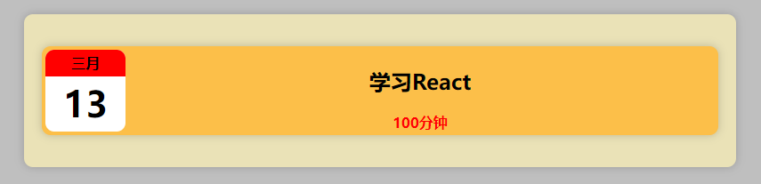

# React 项目

## React 项目结构

开发步骤:
 - 创建项目,目录结构如下
 ```
 根目录
  - public
    - index.html (添加标签 <div id='root'></div>)
  - src
    - App.js
    - index.js
 ```
 - 进入项目所在目录: `npm init -y` 或 `yarn init -y`。
 - 安装项目依赖: `npm install react react-dom react-scripts -S` 或 `yarn add react react-dom react-scripts`。
 - 运行  `npx react-scripts start`。

 **index.html**
 ```html
<!DOCTYPE html>
<html lang="en">
<head>
  <meta charset="UTF-8">
  <meta name="viewport" content="width=device-width, initial-scale=1.0">
  <title>React项目</title>
</head>
<body>
  <div id="root"></div>
  <!-- 
    public/index.html 是首页模板,webpack在编译文件时,以index.html为模板生成index.html
   -->
</body>
</html>
 ```

 **index.js**
```js
// src/index.js  是js的入口文件

// 引入 ReactDOM
import ReactDOM from 'react-dom/client';

// 创建JSX
const App = <div>
  <h1>React项目</h1>
  <p>第一个React项目</p>
</div>

// 获取根容器
const root = ReactDOM.createRoot(document.getElementById('root'));
// 将APP渲染进根容器
root.render(App);
```

## React 小练习

创建 **public/index.html** 根元素

```html
<!DOCTYPE html>
<html lang="en">
<head>
  <meta charset="UTF-8">
  <meta name="viewport" content="width=device-width, initial-scale=1.0">
  <title>学习log</title>
</head>
<body>
  <div id="root"></div>
</body>
</html>
```

创建 **src/index.js** 样式文件。

初始化项目：`npm init -y` 或 `yarn init -y`。

安装项目依赖: `npm install react react-dom react-scripts -S` 或 `yarn add react react-dom react-scripts`。

运行  `npx react-scripts start`。

修改 **src/index.js** 样式。

```js
import ReactDOM from 'react-dom/client';
// 引入样式表
import './index.css';

// 创建一个React元素
const App = <div className="logs">
    {/* 日志项容器 */}
    <div className="item">
        {/* 日期的容器 */}
        <div className="date">
            <div className="month">
                四月
            </div>
            <div className="day">
                19
            </div>
        </div>

        {/* 日志内容的容器 */}
        <div className="content">
            <h2 className="desc">学习React</h2>
            <div className="time">40分钟</div>
        </div>
    </div>
</div>;

// 获取根元素
const root = ReactDOM.createRoot(document.getElementById('root'));
// 渲染元素
root.render(App);
```

在src中创建 **index.css** 文件。

```css
*{
  box-sizing: border-box;
}

body {
  background-color: #bfbfbf;
  margin: 0;
}

/* 外层容器样式 */
.logs{
  background-color: #eae2b7;
  width: 800px;
  margin: 50px auto;
  padding: 20px;
  border-radius: 10px;
  -webkit-border-radius: 10px;
  -moz-border-radius: 10px;
  -ms-border-radius: 10px;
  -o-border-radius: 10px;
  box-shadow: 0 0 10px rgba(0,0,0, .2); /*  阴影 */
}

/* 设置item */
.item{
  background-color: #FCBF49;
  display: flex;
  border-radius: 10px;
  -webkit-border-radius: 10px;
  -moz-border-radius: 10px;
  -ms-border-radius: 10px;
  -o-border-radius: 10px;
  box-shadow: 0 0 10px rgba(0,0,0, .2); /*  阴影 */
  margin: 16px 0;
  padding: 4px;
}

.date{
  width: 90px;
  background-color: white;
  border-radius: 10px;
  -webkit-border-radius: 10px;
  -moz-border-radius: 10px;
  -ms-border-radius: 10px;
  -o-border-radius: 10px;
  text-align: center;
  font-weight: bold;
  overflow: hidden;
}

.month{
  height: 30px;
  line-height: 30px;
  background-color: red;

}

.day{
  height: 60px;
  line-height: 60px;
  font-size: 40px;
}

/* 设置内容样式 */
.content{
  flex: auto;
  text-align: center;
  font-weight: bold;
}

.time{
  color: red;
}
```

**效果**


