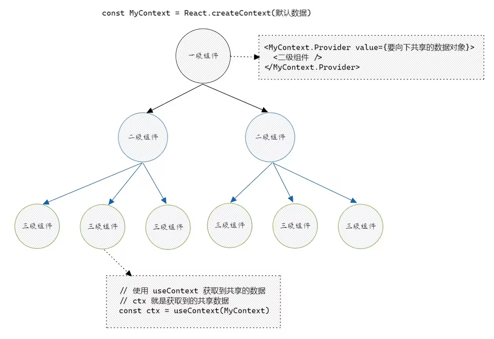

# Hooks-useContext

在 react 函数式组件中，如果组件的嵌套层级过深，当父组件想把数据共享给最深层的子组件时，传统方法是使用 props，一层一层将数据传递下去。

使用 props 层层传递的维护性太差，可使用 `React.createContext()` + `useContext()` 轻松实现多层组件的数据传递。



## 1. useContext 语法格式

主要步骤：
- 在 **全局** 创建 Context 对象；
- 在 **父组件** 中使用 Context.Provider 提供数据；
- 在 **子组件** 中使用 useContext 使用数据；

```ts
import React, { useContext } from 'react'

// 全局
const MyContext = React.createContext(初始数据)

// 父组件
const Father = () => {
  return <MyContext.Provider value={{name: 'escook', age: 22}}>
    <!-- 省略其它代码 -->
  </MyContext.Provider>
}

// 子组件
const Son = () => {
  const myCtx = useContext(MyContext)
  return <div>
    <p>姓名：{myCtx.name}</p>
    <p>年龄：{MyCtx.age}</p>
  </div>
}
```

## 2. 定义组件结构

定义 `LevelA、 LevelB、LevelC` 的组件结构如下：

```ts
export const LevelA: React.FC = () => {

  const [count, setCount] = React.useState(0)

 return (
  <div style={{padding: 30, backgroundColor: 'lightblue', width: '50vw'}}>
    <p>Count: {count}</p>
    <button>+1</button>
    <LevelB />
  </div>
 )
}

const LevelB: React.FC = () => {
  return (
    <div style={{padding: 30, backgroundColor: 'lightgreen'}}>
      <LevelC />
    </div>
  )
}

const LevelC: React.FC = () => {
  return (
    <div style={{padding: 30, backgroundColor: 'lightsalmon'}}>
      <button>+1</button>
      <button>重置</button>
    </div>
  )
}
```

## 3. createContext 配合 useContext 使用数据

在父组件中，调用 `React.createContext` 向下共享数据，在子组件中调用 `useContext()` 获取数据。

```ts
import React, { useContext} from "react";

type ContextType = {
  count: number;
  setCount: React.Dispatch<React.SetStateAction<number>>
}

// 1. 创建 context 对象
const AppContext = React.createContext<ContextType>({} as ContextType)

export const LevelA: React.FC = () => {

  const [count, setCount] = React.useState(0)

 return (
  <div style={{padding: 30, backgroundColor: 'lightblue', width: '50vw'}}>
    <p>Count: {count}</p>
    <button onClick={() => setCount((prev) => prev + 1)}>+1</button>
    {/* 2. 使用 Provider 包裹子组件 将数据向下传递*/}
    <AppContext.Provider value={{count, setCount}}>
      <LevelB />
    </AppContext.Provider>
  </div>
 )
}

const LevelB: React.FC = () => {
  return (
    <div style={{padding: 30, backgroundColor: 'lightgreen'}}>
      <LevelC />
    </div>
  )
}

const LevelC: React.FC = () => {
  // 3. 使用 useContext 获取数据
  const ctx = useContext(AppContext)
  const add = () => {
    ctx.setCount(prev => prev + 1)
  }
  const reset = () => {
    ctx.setCount(0)
  } 
  return (
    <div style={{padding: 30, backgroundColor: 'lightsalmon'}}>
      <p>Count: {ctx.count}</p>
      <button onClick={add}>+1</button>
      <button onClick={reset}>重置</button>
    </div>
  )
}
```

## 4. 以非侵入的方式使用 Context

在 3 中的代码，父组件向下传递数据时，侵入了 `<AppContext.Provider>` 这样的代码。为了保证父组件中代码的单一性及 Provider 的通用性，可考虑将 `Context.Provider` 封装到独立的 `Wrapper` 函数式组件中。

```ts
type ContextType = {
  count: number;
  setCount: React.Dispatch<React.SetStateAction<number>>
}

// 1. 创建 context 对象
const AppContext = React.createContext<ContextType>({} as ContextType)

export const AppContextWrapper: React.FC<React.PropsWithChildren> = (props) => {
  
  const [count, setCount] = React.useState(0);
  
  return <>
    <AppContext.Provider value={{count, setCount}}>
      {props.children}
    </AppContext.Provider>
  </>
}
```

定义好 `Wrapper` 组件后，可在 `App.tsx` 中导入并使用 `Wrapper` 和 `LevelA` 组件后

```ts
import React from 'react';
import { AppContextWrapper, LevelA } from './components/use_context/01.base';


// React.FC 表示为函数组件
const App: React.FC = () => {
  return (
    <AppContextWrapper>
      <!-- AppContextWrapper 中嵌套使用了 LevelA 组件，形成了父子关系 -->
      <!-- LevelA 组件会被当做 children 渲染到 Wrapper 预留的插槽中 -->
      <LevelA />
    </AppContextWrapper>
  );
};

export default App
```

此时组件树的嵌套关系：`App-Wrapper-LevelA-LevelB-LevelC`。均可通过 context使用数据。

```ts
export const LevelA: React.FC = () => {

  const {count, setCount} = useContext(AppContext);

 return (
  <div style={{padding: 30, backgroundColor: 'lightblue', width: '50vw'}}>
    <p>Count: {count}</p>
    <button onClick={() => setCount((prev) => prev + 1)}>+1</button>
    <LevelB />
  </div>
 )
}

const LevelC: React.FC = () => {
  // 3. 使用 useContext 获取数据
  const ctx = useContext(AppContext)
  const add = () => {
    ctx.setCount((prev) => prev + 1)
  }
  const reset = () => {
    ctx.setCount(0)
  } 
  return (
    <div style={{padding: 30, backgroundColor: 'lightsalmon'}}>
      <p>Count: {ctx.count}</p>
      <button onClick={add}>+1</button>
      <button onClick={reset}>重置</button>
    </div>
  )
}
```

:::tip
**核心思路：**每个 Context 都创建一个对应的 Wrapper 组件，在 Wrapper 组件中使用 Provider 向 children 注入数据。
:::

## 5. 使用 useContext 重构 useReducer 案例

定义 Context 要向下共享的TS数据类型：

```ts
// 1. 定义 context 对象类型
type ContextType = {
  user: UserType;
  dispatch: React.Dispatch<ActionType>;
}
```

使用 React.createContext 创建 Context 对象：

```ts
// 2. 创建 context对象
const useInfoContext = React.createContext({} as ContextType);
```

创建 AppContextWrapper 组件，将 `Father` 组件中的 `useImmerReducer` 调用过程抽离到 ContextWrapper 中：

```ts
// 3. 创建 wrapper组件
export const UserInfoContextWrapper: React.FC<React.PropsWithChildren> = (props) => {
  // 4. 将需要注入的数据进行提升
  const [state, dispatch] = useImmerReducer(reducer, defaultState, initAction);

  return <useInfoContext.Provider value={{user: state, dispatch}}>{props.children}</useInfoContext.Provider>
}
```

改造 App 组件，分别导入 `UserInfoContextWrapper` 和 `Father` 组件，并形成父子关系的嵌套，这样 Father 组件及其子组件可通过 useContext 访问数据。

```ts
import React from 'react';
import { Father, UserInfoContextWrapper } from './components/use_context/02.reducer';


// React.FC 表示为函数组件
const App: React.FC = () => {
  return (
    <UserInfoContextWrapper>
      <Father />
    </UserInfoContextWrapper>
  );
};

export default App
```

改造 Father, Son1, Son2, GrandSon 组件，调用 `useContext` 获取并使用 Context 中的数据。同时，Father 组件也不需要通过 props 传递数据：

```ts
export const Father: React.FC = () => {
  const {user: state, dispatch} = useContext(useInfoContext);

  const changeName = () => {
    state.name = '李四';
    dispatch({ type: 'UPDATE_NAME', payload: '李四' })
  }

  return (
    <div>
      <button onClick={changeName} >修改 name 名</button>
      <p>{JSON.stringify(state)}</p>
      <div className='father'>
        <Son1/>
        <Son2/>
      </div>
    </div>
  )
}

const Son1: React.FC = (props) => {
  const { dispatch } = useContext(useInfoContext);
  const add = () => {
    dispatch({ type: 'INCREMENT', payload: 1 });
  };
  return (
    <div className='son1'>
      <p>{JSON.stringify(props)}</p>
      <button onClick={add}>+1</button>
    </div>
  )
}

const Son2: React.FC = (props) => {
  const { dispatch } = useContext(useInfoContext);
  const sub = () => {
    dispatch({ type: 'DECERMENT', payload: 1 });
  };
  return (
    <div className='son2'>
      <p>{JSON.stringify(props)}</p>
      <button onClick={sub}>-1</button>
      <hr />
      <GrandSon/>
    </div>
  )
}

const GrandSon: React.FC = () => {
  const { dispatch } = useContext(useInfoContext);

  const reset = () => {
    dispatch({ type: 'RESET'});
  }
  return (
    <>
      <p>GrandSon</p>
      <button onClick={reset}>reset</button>
    </>
  )
}
```
