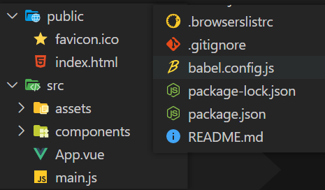

# Vue 脚手架

[官网传送门](https://cli.vuejs.org/zh/)

## 创建 Vue 项目

- 全局安装 vue 脚手架：`npm i -g @vue/cli`
- 创建项目：`vue create project-name`
- 运行项目：`npm run serve`
- 暴露 webpack 配置：`vue inspect > output.js`

## Vue 脚手架项目结构

```shell
.
├── node_modules
├── public
│ ├── favicon.ico: 页签图标
│ └── index.html: 主页面
├── src
│ ├── assets: 存放静态资源
│ │ └── Licon.svg
│ │── component: 存放组件
│ │ └── HelloWorld.vue
│ │── App.vue: 汇总所有组件
│ │── main.js: 入口文件
├── .gitignore: git 版本管制忽略的配置
├── babel.config.js: babel 的配置文件
├── package.json: 应用包配置文件
├── README.md: 应用描述文件
├── package-lock.json：包版本控制文件
```



`index.html` 代码分析：

```html
<!DOCTYPE html>
<html lang="">
  <head>
    <meta charset="utf-8" />
    <!-- 针对IE浏览器的一个特殊配置，含义是让IE浏览器以最高的渲染级别渲染页面 -->
    <meta http-equiv="X-UA-Compatible" content="IE=edge" />
    <!-- 开启移动端的理想视口 -->
    <meta name="viewport" content="width=device-width,initial-scale=1.0" />
    <!-- <%= BASE_URL %> 表示 public 文件夹路径 -->
    <link rel="icon" href="<%= BASE_URL %>favicon.ico" />
    <!-- 拿 package-lock.json 的 name 作为标题 -->
    <title><%= htmlWebpackPlugin.options.title %></title>
  </head>
  <body>
    <!-- 当浏览器不支持js时noscript中的元素就会被渲染 -->
    <noscript>
      <strong>We're sorry but <%= htmlWebpackPlugin.options.title %> doesn't work properly without JavaScript enabled. Please enable it to continue.</strong>
    </noscript>
    <!-- 容器 -->
    <div id="app"></div>
    <!-- built files will be auto injected -->
  </body>
</html>
```

## 不同版本的 Vue 与 `render` 函数

1. `vue.js` 与 `vue.runtime.xxx.js` 的区别：

- `import Vue from 'vue'` 默认导入 `vue.runtime.esm.js`
- `vue.js` 是完整版的 Vue，包含：核心功能 + 模板解析器
- `vue.runtime.xxx.js` 是运行版的 Vue，只包含：核心功能；没有模板解析器

2. `vue.runtime.xxx.js` 没有模板解析器，故不能使用 `template` 配置项，需使用 `render` 函数接收到的 `createElement` 函数去指定具体内容

```js
import Vue from 'vue'
import App from './App.js'
Vue.config.productionTip = false

new Vue({
  render: h => h(App),
}).$mount('#app')

// render()
render: function(createElement) {
  // 创建元素
  return createElement('h1', 'Hello Vue')
}
render: createElement => createElement(App)
```

## vue.config.js 配置文件

1. 使用 `vue inspect > output.js` 可以查看到 Vue 脚手架的默认配置。
2. 使用 `vue.config.js` 可以对脚手架进行个性化定制，[详情](https://cli.vuejs.org/zh/config/)

## TodoList 案例总结

1. 组件化编码流程：

- 拆分静态组件：组件要按照功能点拆分，命名不要与 html 元素冲突。
- 实现动态组件：考虑好数据的存放位置，数据是一个组件在用，还是一些组件在用：
  - 一个组件在用：放在组件自身即可
  - ​ 一些组件在用：放在他们共同的父组件上（状态提升）
- 实现交互：从绑定事件开始。

2. `props` 适用于：

- 父 ==> 子
- 子 ==> 父（要求父先给子一个函数）

3. `v-model` 绑定的值不能是 `props` 传过来的值，因为 `props` 是不可以修改的！

4. `props` 传过来的若是对象类型的值，修改对象中的属性时 Vue 不会报错，但不推荐

## 一些第三方包

- [nanoid](https://gitee.com/mirrors/nanoid#nano-id)

```shell
npm install nanoid

import { nanoid } from nanoid

model.id = nanoid()
```

- [dayjs](https://dayjs.fenxianglu.cn/)
