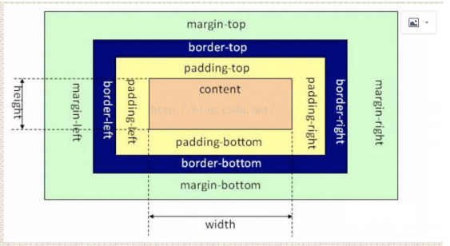
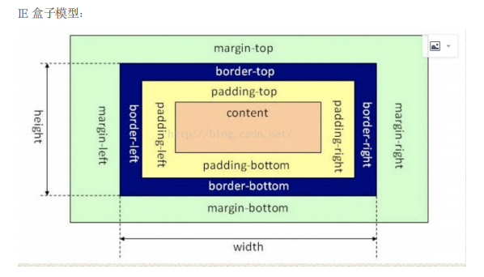

### CSS的盒模型

在HTML页面中的所有元素都可以看成是一个盒子。

盒子的组成：内容content、内边距padding、边框border、外边距margin

盒模型的类型：

标准盒模型	width = content宽度；height =content高度 

总宽度：	width+padding+border+margin



IE盒模型	width = content+padding+border；	height = content+padding+border

总宽度：	width+margin



控制盒模型的模式：box-sizing:content-box(默认，标准盒模型)、border-box(IE盒模型)、inherit(继承父盒子)

### 行内元素和块级元素什么区别，怎么相互转换

**块级元素**

块级元素独占一行，默认垂直向下排列；

高度、宽度、margin及padding都是可控的，设置有效，有边距效果；

宽度没有设置时，默认为100%；

块级元素中可以包含块级元素和行内元素。

**行内元素**

行内元素和其他行内元素都会在一行；

高度、宽度是不可控的，设置无效，由内容决定。

使用display属性能够将三者任意转换：

display:inline;转换为行内元素；设置宽高无效，垂直方向margin无效，水平方向都有效

display:block;转换为块状元素；设置宽高有效，margin/padding水平垂直方向都有效

display:inline-block;转换为行内块状元素。设置宽高有效，margin/padding水平垂直方向都有效

### css中长度单位

1. **像素（px）**：像素是相对长度单位，通常用于网页布局和元素尺寸的定义。1 像素（pixel）是显示器上的一个最小点，通常对应于屏幕上的一个物理像素。
2. **百分比（%）**：百分比单位相对于父元素的相关属性进行计算，例如宽度、高度、内边距和外边距等。可以使元素的大小相对于父元素或其他参考元素进行自适应调整。
3. **相对长度单位**：

- - **em**：相对于父元素字体大小的倍数，1em 等于父元素的字体大小。
  - **rem**：相对于根元素（即 html元素）字体大小的倍数，1rem 等于根元素的字体大小。
  - **vw（视窗宽度）**：相对于视口宽度的百分比，1vw 等于视口宽度的 1%。
  - **vh（视窗高度）**：相对于视口高度的百分比，1vh 等于视口高度的 1%。
  - **vmin**：相对于视口宽度和高度中较小值的百分比。
  - **vmax**：相对于视口宽度和高度中较大值的百分比。

4. **绝对长度单位**：

- - **in**（英寸）、**cm**（厘米）、**mm**（毫米）、**pt**（点）、**pc**（派卡）：物理尺寸单位，通常用于打印样式表中。
  - **px**（像素）：通常被视为绝对长度单位，但在一些高分辨率屏幕中可能表现为相对长度单位。

5. **其他单位**：

- - **角度单位**：deg（度）、rad（弧度）、grad（梯度）。
  - **时间单位**：s（秒）、ms（毫秒）。
  - **频率单位**：Hz（赫兹）、kHz（千赫兹）。
  - **分辨率单位**：dpi（每英寸点数）、dpcm（每厘米点数）、dppx（每像素点数）。

### 重绘和重排(回流)

**重绘**：重绘指的是更新元素的可见样式而不影响布局的过程。当元素的可见样式发生变化，例如颜色、背景色、边框等，但布局不受影响时，浏览器只需要重新绘制元素的外观，而不需要重新计算元素的位置和大小。

**重排**（回流）：重排指的是当页面的布局（Layout）发生变化时，浏览器需要重新计算元素的位置和大小，以及页面的布局。这可能是由于元素的尺寸、位置、显示状态等发生变化，以及新增或删除元素等情况。


**引起重排重绘的原因有：**

- 添加或者删除可见的 DOM 元素。
- 元素尺寸位置的改变。浏览器页面初始化。
- 浏览器窗口大小发生改变。
- 重排一定导致重绘，重绘不一定导致重排。 

**减少重绘重排的方法有：**

- 使用 translate 替代 top。
- 使用 visibility 替换 display: none ，因为前者只会引起重绘，后者会引起重排
- 把 DOM 离线后修改，比如：先把 DOM 给 display:none，再进行修改
- 不把 DOM 结点的属性值放在一个循环里当成循环里的变量
- 动画速度越快，重排次数越多，也可以选择使用 requestAnimationFrame
- 避免使用CSS表达式（例如：calc()）。
- 避免频繁操作DOM，当需要多次操作 DOM 元素时，可以将它们添加到 DocumentFragment 中进行操作，然后再将整个 DocumentFragment 一次性添加到文档中。这样可以减少 DOM 操作的次数。
- 避免频繁读取会引发重排/重绘的属性，如果确实需要多次使用，可以将它们的值缓存在变量中，然后重复使用这些变量，而不是重复调用这些属性。
- 对具有复杂动画的元素使用绝对定位，使它脱离文档流，否则会引起父元素及后续元素频繁回流。

### BFC（Block Formatting Context）即块级格式化上下文。

**块格式化上下文**（Block Formatting Context，BFC）是 Web 页面的可视 CSS 渲染的一部分，是块级盒子的布局过程发生的区域，也是浮动元素与其他元素交互的区域。

创建BFC的场景：根元素、浮动元素、绝对定位元素、行内块元素、表格单元格、匿名表格单元格元素、overflow不为visible和clip的块级元素、弹性元素、网格元素、display为flow-root的元素等元素。

BFC的作用：

1. 从包含块的顶部将盒子垂直一个一个排列，
2. 垂直方向的距离由margin决定，
3. 同一个BFC中，相邻两个盒子折叠垂直方向的margin，
4. 每个盒子的左边缘紧挨包含块的左边缘

1）解决块级元素垂直方向margin重叠

原因：外边距合并，当2个垂直外边距相遇时，他们将形成一个外边距。合并之后的外边距的高度等于外边距的高度中的较大值。

解决方法：将其中一个盒子包裹在一个BFC中，（普通的div，设置overflow属性为auto）

2）解决浮动高度塌陷问题

描述：父元素不设置高度，子元素设置浮动，父元素高度消失

解决方法：给父元素加overflow属性为auto

### 伪类和伪元素的区别是什么？

1. 伪类：希望样式在某些特定状态下才被呈现到指定的元素时，换句话说就是，当某个元素状态改变时，给元素添加一些特殊效果。比如：hover就能够指定当鼠标悬浮在某元素上时，期望该元素要显示的样式；
2. 伪元素：则是创建了一些不在文档树中的元素，并为其添加样式，需要注意的是**伪元素样式里必须要给它一个content属性**。比如可以通过::before伪元素在一个元素前增加一些文本，并为这些文本添加样式。这些文本实际上不在文档树中，所以叫伪元素；
3. 区别：伪类的操作对象是文档树中已有的元素，伪元素则是创建文档树以外的元素并为其添加样式。所以二者最核心的区别：是否创造了“新的元素”。伪类用单号:，伪元素用双冒号::。

### CSS定位

**固定定位 fixed：**

元素的位置**相对于浏览器窗口**是固定位置，窗口滚动它也不会移动。fixed定位使元素的位置**与文档流无关**，因此**不占据空间**。 Fixed定位的元素和其他元素重叠。

**相对定位 relative：**

一个相对定位的元素，可以通过**设置垂直或水平位置**，让这个元素**相对于它的起点进行移动**。在使用相对定位时，无论怎样移动，**元素仍然占据原来的空间，**仍然在文档流中。

**绝对定位 absolute：**

- 绝对定位的特点

1. 不设置偏移量,元素的位置不会发生任何改变。
2. 开启绝对定位之后,元素会从原有的**文档流中脱离**。相对于设置了绝对定位或者相对定位的祖先元素。
3. 绝对定位会改变元素的性质。行内元素变为块元素，块元素的宽度被内容撑开(即块元素中原有内容有多宽，开启绝对定位之后的块元素就有多宽)。

- 绝对定位会使元素提升一个层级，可通过z-index控制。

注意：在同一父元素下，对未开启绝对或相对定位的元素设置z-index都不会覆盖开启绝对或相对定位的元素；

绝对定位的元素和相对定位的元素z-index相同

**粘性定位 sticky：**

粘性定位的元素是依赖于用户的滚动，在**relative** 与**fixed** 定位之间切换。当页面没有超出目标区域时，它的行为就像**relative;** 当页面滚动超出目标区域，它的表现就像 **fixed。**

sticky 属性值有以下几个特点：

- 该元素并**不脱离文档流**，仍然**保留元素原本**在文档流中的**位置**。
- 当元素在容器中被滚动超过指定的偏移值时，元素在容器内固定在指定位置。亦即如果你设置了top: 50px，那么在sticky元素到达距离相对定位的元素顶部50px的位置时固定，不再向上移动。
- 元素固定的相对偏移是相对于离它最近的具有滚动框的祖先元素，如果祖先元素都不可以滚动，那么是相对于屏幕范围来计算元素的偏移量。

**默认定位 Static：**

默认值。没有定位，元素出现在正常的流中。

**inherit:**

规定应该从父元素继承 position属性的值。

### CSS选择器，优先级

id选择器，class选择器，标签选择器，伪元素选择器，伪类选择器等

!important>内联样式>ID选择器>class选择器>属性选择器>元素选择器>通配符选择器

1. 同一元素引用了多个样式时，排在后面的样式属性的优先级高；
2. 样式选择器的类型不同时，优先级顺序为：id选择器 > class选择器 >标签选择器；
3. 标签之间存在层级包含关系时，后代元素会继承祖先元素的样式。如果后代元素定义了与祖先元素相同的样式，则祖先元素的相同的样式属性会被覆盖。继承的样式的优先级比较低，比标签选择器的优先级低； 
4. 带有!important标记的样式属性的优先级最高。
5. 样式表的来源不同时，优先级顺序为：内联样式>内部样式 >外部样式 >用户自定义样式 >浏览器默认样式

### transition和 animation的区别

transition和animation是CSS中用于制作动画效果的两种方式。大部分属性是相同的，他们都是随时间改变元素的属性值。

- transition是一种简单的动画效果，**需要触发一个事件才能改变属性**。用于在一个元素的不同状态之间平滑地过渡。它可以在元素的属性发生改变时自动触发，如鼠标悬停在元素上时颜色变化。**transition为 2帧**
- animation是一种更复杂的动画效果，**不需要触发任何事件的情况下随时间改变属性值**。可以创建多个关键帧，并且可以指定动画的循环次数，持续时间，延迟时间等。**而 animation可以一帧一帧的**
- 简单来说transition是简单的过渡效果，animation是复杂的动画效果。

### CSS3中对溢出的处理

text-overflow属性

- clip是修剪文本；
- ellipsis为显示省略符号来表被修剪的文本；
- string为使用给定的字符串来代表被修剪的文本。

### 隐藏页面中某个元素的方法

1. display: none：元素在页面上消失，不占据空间。
2. visibility: hidden：让元素消失，占据空间位置，一种不可见的状态。
3. opacity: 0：设置了元素的透明度为0，元素不可见，占据空间位置。
4. position移到外部，z-index涂层遮盖等等。
5. **transform: scale(0,0)**：将元素缩放为 0，来实现元素的隐藏。元素仍在页面中占据位置，但是不会响应绑定的监听事件。

### CSS3的新属性

在布局方面新增了 flex布局，

在选择器方面新增了例如first-of-type,nth-child等选择器，

在盒模型方面添加了 box-sizing来改变盒模型，

在动画方面增加了 animation，2d变换，3d变换等，

在颜色方面添加透明，rbga等，

在字体方面允许嵌入字体和设置字体阴影，最后还有媒体查讯等

### 浮动

浮动是另一种布局方法，浮动元素脱离普通文档流，浮在普通文档流之上。float 属性可以使一个元素脱离正常的文档流（normal flow），然后被安放到它所在容器的的左端或右端，并且其他的文本和行内元素环绕它。

**为什么要清除浮动**

父元素没有设置高度，由子元素撑满，但是浮动的元素会造成父元素高度塌陷。因为浮动元素脱离了文档流，所以浮动元素并不会占据包含元素的空间，包含元素高度不会自动撑开，造成塌陷。我们需要清除浮动。

**清除浮动的方法**

1. **额外标签法**：使用带 clear属性的空元素

在浮动元素添加一个空的块级元素标签，设置clear:both属性效果。

```css
<div style="width:200px">
  <div style="width:50px;height:50px;float:left;"></div>
  <div style="clear:both;"></div>
</div>
```

1. **父盒子加overflow属性**（触发BFC）

给浮动元素的容器**添加 overflow:hidden或auto或scroll**。可以清除浮动，在添加 overflow属性后，浮动元素又回到了容层，把容器高度撑起，达到了清理浮动的效果。

1. **给父盒子添加浮动**

给父盒子添加浮动即可清除内部浮动，但是这样会使其整体浮动，影响布局，不推荐使用。

1. :after伪元素

给父元素添加after伪元素，设置伪元素的样式属性为

```css
.father:after{
  content:'';//必须
  display:block;
  clear:both;
}
```

### 垂直居中的方法

1. 设置父元素为table-cell：display: table-cell; vertical-align: middle; text-align: center; /* 水平居中 */;子元素为display: inline-block;
2. 使用grid布局：父元素：display: grid; 子元素：align-self: center; justify-self: center;
3. 子绝父相：父元素设置相对定位，子元素设置绝对定位left:50%;top:50%;左外边距负盒子宽度一半；上外边距负高度一半。
4. 使用absolute+margin:auto，父元素设置相对定位; 子元素left,top,bottom,right设置为0,margin设为auto。

### 常见的CSS布局单位

- 像素px：布局的基础，一个像素表示终端屏幕能显示的最小区域。

- - css像素：为web开发者提供，在css中使用一个抽象单位。
  - 物理像素：与设备的硬件密度有关，任何设备的物理像素1都是固定的。

- 百分比%：当浏览器的宽度或者高度发生变化时，通过百分比单位可以使得浏览器中的组件的宽和高随着浏览器的变化而变化，从而实现响应式的效果。子元素的百分比相对于直接父元素。
- em和rem：相对单位，

- - em在设置字体大小时是相对于父元素的font-size，元素的width、height、padding、margin使用em时，取决于该元素本身的font-size；
  - rem相对于根元素，谷歌浏览器的默认字体是16px

- vw和vh：相对于视图窗口的宽高，视图窗口宽高为100vw/vh；
- vmin和vmax：vw和vh中的较小/大值；

### 两栏布局：左边固定，右边适应

1. 利用浮动：左边设置左浮动并固定宽度x，右边设置左边距为x，宽度设置为auto
2. 利用浮动：左侧设置左浮动并固定宽度x，右边设置overflow: hidden，此时触发了BFC，BFC区域不会于浮动元素层叠，所以右侧只需要设置overflow: hidden就可以
3. 利用flex：父盒子设置flex布局，左子盒子设置固定宽度x，右子盒子设置flex:1

### 三栏布局：左右固定，中间适应

1. 利用flex：父盒子设置flex布局，左右子盒子设置固定宽度，中间子盒子设置flex:1
2. 利用绝对定位：父盒子设置相对定位，左子盒子设置绝对定位并固定宽度x，右子盒子设置绝对定位固定宽度y并设置top:0;right:0，中间子盒子设置右外边距y左外边距x

### 圣杯布局

利用浮动和负边距来实现。父级元素设置左右的 padding，三列均设置向左浮动，**中间一列放在最前面**，**宽度设置为父级元素的宽度**，因此后面两列都被挤到了下一行，通过设置 margin 负值将其移动到上一行，再利用相对定位，定位到两边。

具体实现

<父><中间><左边><右边></父>

父盒子：设置左内边距x，右内边距y，

子中间：设置左浮动，宽度100%

子左边：设置相对定位，left为负x，固定宽度x，左浮动，左外边距为负100%

子右边：设置相对定位，left为y，固定宽度y，右浮动，左外边距为负100%

### 双飞翼布局

双飞翼布局相对于圣杯布局来说，左右位置的保留是通过中间列的 margin 值来实现的，而不是通过父元素的 padding 来实现的。本质上来说，也是通过浮动和外边距负值来实现的。

```css
<style>
    .header {
      height: 100px;
      width: 100%;
      background-color: antiquewhite;
    }
    .footer {
      height: 100px;
      width: 100%;
      background-color: blue;
    }
    .container {
      overflow: hidden;
    }
    .inner {
      margin-left: 200px;
      margin-right: 200px;
    }
    .left,
    .center,
    .right {
      height: 300px;
      float: left;
      position: relative;
    }
    .center {
      width: 100%;
      background-color: pink;
    }
    .left {
      width: 200px;
      margin-left: -100%;
      left: -200px;
      background-color: skyblue;
    }
    .right {
      width: 200px;
      margin-left: -200px;
      right: -200px;
      background-color: yellow;
    }
  </style>
<div class="header"></div>
  <div class="container">
    <div class="inner">
      <div class="center"></div>
      <div class="left"></div>
      <div class="right"></div>
    </div>
  </div>
<div class="footer"></div>
```

### 如何根据设计稿进行移动端适配？

移动端适配主要有两个维度：

- **适配不同像素密度，** 针对不同的像素密度，用 CSS 媒体查询，选择不同精度的图片，以保证图片不会失真；
- **适配不同屏幕大小，** 由于不同的屏幕有着不同的逻辑像素大小，所以如果直接使用 px 作为开发单位，会使得开发的页面在某一款手机上可以准确显示，但是在另一款手机上就会失真。为了适配不同屏幕的大小，应按照比例来还原设计稿的内容。

为了能让页面的尺寸自适应，可以使用 rem，em，vw，vh 等相对单位。

### flex布局

基本知识

- flex是 Flexible Box的缩写，意为"弹性布局"。指定容器 display: flex即可。
- flex目前web开发使用最多的布局方案
- 两个重要的概念

  flex-container:   开启了flex布局的元素

  flex-items:   flex-container的直接子元素

- 开启flex布局的方式：	display:flex;//块级元素		display:inline-flex//行内元素
- 开启flex布局后，flex-items里面的元素默认变成inline-block
- 默认情况下所有的flex-items都会在同一行显示
- 主轴main-axis和交叉轴cross-axis

**应用在flex-container上的css属性**

**flex-flow：flex-direction和flex-wrap的缩写属性**

  flex-flow:column nowrap

**flex-direction：改变主轴的方向，即是沿着main axis主轴从main start开始往main end方向排列**

  flex-direction:row,             从左到右排flex-items(默认值)

  flex-direction:row-reverse      row方向反向  

  flex-direction:column           从上往下排 

  flex-direction:column-reverse   从下往上排   

**flex-wrap：flex-items放不下时设置换行，不换行时会压缩flex-items的宽度**

  flex-wrap:nowrap                设置不换行（默认值）

  flex-wrap:wrap                  设置换行（如果高度没撑满，高度均分）

  flex-wrap:wrap-reverse          wrap的反转显示

**justify-content：决定flex-items在主轴的排列时对齐方式**

  justify-content:flex-start      开始对齐（默认值）

  justify-content:flex-end        结尾对齐

  justify-content:center          居中对齐

  justify-content:space-between   两端无间距，所有间距等分（间距数为flex-items数-1）

  justify-content:space-evenly    两端有间距，所有间距等分（间距数为flex-items数+1）

  justify-content:space-around    两端有间距，中间间距等分，两端间距为中间间距的一半（间距数为flex-items数+1）

**align-items：决定flex-items在cross axis轴上的对齐方式**

  align-items:normal             当flex-items没有设置高度的时候，默认拉伸flex-items高度为flex-container的高度（默认值）

  align-items:stretch             效果同normal

  align-items:flex-start          交叉轴顶部对齐

  align-items:flex-end            交叉轴底部对齐

  align-items:center              交叉轴中间对齐

  align-items:baseline            与基线对齐（文本的基线）

  注意：只有normal和stretch会在flex-items未设置高度时拉伸，其它四个在没有高度时显示div元素的默认高度

**align-content：决定多行flex-items在cross-axis上的对齐方式，用法和justity-content类似**

  align-content:stretch         （默认值）不会拉伸

  align-content:flex-start      交叉轴开始对齐

  align-content:flex-end        交叉轴结尾对齐

  align-content:center          交叉轴居中对齐

  align-content:space-between   交叉轴两端无间距，所有间距等分（间距数为flex-items数-1）

  align-content:space-evenly    交叉轴两端有间距，所有间距等分（间距数为flex-items数+1）

  align-content:space-around    交叉轴两端有间距，中间间距等分，两端间距为中间间距的一半（间距数为flex-items数+1）

**应用在flex-items上的css属性**

flex：flex-grow、flex-shrink和flex-basis简写

  一个值时，带p单位表示flex-basis，不带p单位表示flex-grow

  第二个值，一个无单位的表示flex-shrink，一个有效宽度表示flex-basis简写

**flex-grow：设置flex-items如何扩展，默认值为0**

  当flex-container在main axis上有剩余的size时，flex-grow才会有效

  如果所有flex items的flex-grow总和超过1，每个item扩展的size为container 的剩余size * flex-grow / sum

  如果所有flex items的flex-grow总和不超过1，每个item扩展的size为container的剩余size * flex-grow

**flex-basis：设置flex-items宽度，会覆盖自己的width属性**

  flex-basis:auto             宽度使用width

  flex-basis:200px          覆盖自身的width，设置宽度为200px

**flex-shrink：决定flex-shrink如何收缩**

  当前flex-items在main axis方向上超过了flex-container的size，flex-shrink属性才会生效

  flex-shrink:1               按比例收缩(默认值)

**order：决定flex-items排布的顺序。可以设置为任意整数，值越小越排在前面，默认值为0**

**align-self**：通过在flex-items设置这个属性覆盖flex-container设置的align-items

  align-self:auto             遵从flex-container的align-items（默认值）

  align-self:                 其他字段和align-items一样