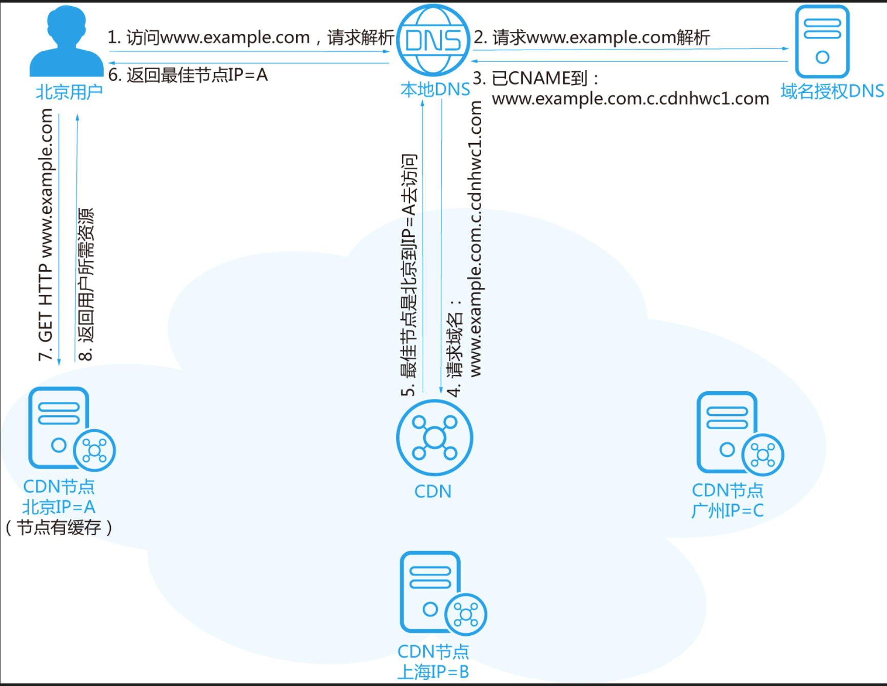

### 进程与线程区别是什么？

（ 1 ）进程是**资源分配和调度**的基本单位，是计算机中的程序关于某数据集合上的一次运行活动。

（ 2 ）线程是cpu运行调度的最小单位。一个进程中可以有多个线程，它们共享进程资源。单线程是指在一个进程中只有一个线程在执行，js属于单线程。

（ 3 ）进程和线程的区别：

（a）**资源分配**：进程是资源分配的基本单位；线程不拥有资源，多个线程共享同一个进程的资源；

（b）**调度**：进程的调度是由操作系统负责的，操作系统分配时间片来轮流给不同的进程执行；而线程的调度是由进程内部的调度算法决定的，操作系统只负责给进程分配时间片，而不控制线程。

（c）**系统开销**：进程的系统开销比线程大，因为进程需要分配独立的内存空间和系统资源，而线程只需要在进程内共享这些资源，因此线程的创建和切换比进程快。

（d）**通信方面**：进程之间的通信和同步需要使用系统提供的进程间通信（IPC）机制，如消息队列、管道、共享内存等。线程之间通过共享内存、信号量、互斥量等方式来进行通信。

（e）**稳定性**：由于进程拥有独立的内存空间和系统资源，进程之间不会相互干扰，因此一个进程崩溃不会影响其他进程的正常运行；而线程之间共享同一进程的资源，一个线程的崩溃可能

### 进程间通信方式

进程间通信（Inter-Process Communication，IPC）是指不同进程之间进行数据交换和共享信息的一种机制。以下是几种常见的进程间通信方式：

1. **管道（Pipe）**：管道是一种半双工通信方式，用于具有亲缘关系的进程间通信。它分为匿名管道和命名管道两种类型。匿名管道在父子进程间通信时比较常用，而命名管道允许无关的进程之间进行通信。
2. **消息队列（Message Queue）**：消息队列是一种消息传递机制，允许不同进程之间通过操作系统内核发送和接收消息。发送消息的进程将消息放入队列，接收消息的进程则从队列中读取消息。
3. **信号量（Semaphore）**：信号量是一种计数器，用于控制多个进程对共享资源的访问。通过对信号量的操作，进程可以进行锁定、解锁和等待等操作，从而实现对共享资源的同步访问。
4. **共享内存（Shared Memory）**：共享内存是一种直接的进程间通信方式，允许多个进程共享同一块内存区域。进程可以将数据写入共享内存区域，其他进程则可以读取这些数据。
5. **套接字（Socket）**：套接字是一种网络通信的通用机制，可以用于在不同主机上的进程之间进行通信。套接字通信可以实现进程之间的远程通信，通常用于网络编程。

### 进程调度算法

进程调度算法是操作系统中用于决定哪些进程应该在何时执行的一种策略。常见的进程调度算法包括：

1. **先来先服务（First Come, First Served，FCFS）**：按照进程到达的先后顺序进行调度，即先到达的进程先执行，直到完成或被阻塞。
2. **短作业优先（Shortest Job First，SJF）**：按照进程的执行时间长度进行调度，即执行时间最短的进程优先执行。
3. **最高响应比优先（Highest Response Ratio Next，HRRN）**：根据进程的等待时间和执行时间的比例来计算响应比，优先调度响应比最高的进程。
4. **时间片轮转（Round Robin，RR）**：每个进程被分配一个时间片（时间段），按照顺序轮流执行，当时间片用完时，进程被放回就绪队列，并等待下一轮调度。
5. **多级反馈队列（Multilevel Feedback Queue，MLFQ）**：将就绪队列划分为多个优先级别的队列，每个队列使用不同的调度算法，优先级别低的队列具有更长的时间片，而优先级别高的队列具有更短的时间片，进程根据优先级别和时间片执行。

### OSI七层模型

（1）物理层：在物理层，数据通过物理介质进行传输。它负责传输比特流，包括数据编码、传输速率、电压等；

常见协议：Ethernet、IEEE 802.11（Wi-Fi）、RS-232、USB。

（2）数据链路层：数据链路层主要负责数据帧的传输，包括帧的传输、错误检测和纠正、帧同步、流量控制等；

常见协议：Ethernet、PPP（点对点协议）、MAC（介质访问控制）。

（3）网络层：网络层负责路由和转发数据包。它的任务包括地址分配、路由选择、数据包分片和重组等；

常见协议：IP（Internet协议）、ICMP（Internet控制消息协议）、ARP（地址解析协议）、OSPF（开放最短路径优先）。

（4 ）传输层：传输层提供端到端的可靠数据传输，包括数据分段、传输控制、错误恢复等；

常见协议：TCP（传输控制协议）、UDP（用户数据报协议）。

（5）会话层：会话层负责建立、管理和终止会话。它的任务包括会话管理、同步、检查点和恢复等；

（6）表示层：表示层负责数据格式的转换和加密解密。它的任务包括数据压缩、数据加密、数据格式转换等；

常见协议：SSL/TLS（安全套接层/传输层安全）。

（7）应用层：负责为用户提供应用程序接口，为用户应用程序提供服务，定义了HTTP、FTP、SMTP、DNS等应用层协议。

常见协议：HTTP（超文本传输协议）、FTP（文件传输协议）、SMTP（简单邮件传输协议）、DNS（域名系统）。

### 讲讲TCP三次握手？

URG：紧急指针（urgent pointer）有效。		ACK：确认序号有效,确认接收到消息；
PSH：接收方应该尽快将这个报文交给应用层。		RST：重置连接。
SYN：发起一个新连接。						FIN：释放一个连接。

（1）第一次握手（SYN = 1， seq(client) = x）

  客户端向服务端发送连接请求报文段。该报文段中包含自身的数据通讯初始序号。请求发送后，客户端便进入 SYN-SENT 状态。**服务端**得出**客户端的发送能力**和**服务端的接收能力**都正常。

（2）第二次握手（SYN = 1，ACK = 1，确认序号 = x+1, seq(server) = y）

  服务端收到连接请求报文段后，如果同意连接，则会发送一个应答，该应答中也会包含自身的数据通讯初始序号，发送完成后便进入 SYN-RECEIVED 状态。**客户端**得出**客户端和服务端的发送接收能力**都正常，但是此时服务器并不能确认客户端的接收能力是否正常；

（3）第三次握手（ACK = 1，确认序号 = y+1, seq(client) = x + 1）

  客户端收到连接同意的应答后，还要向服务端发送一个确认报文。客户端发完这个报文段后便进入 ESTABLISHED 状态，服务端收到这个应答后也进入 ESTABLISHED 状态。服务端才能得出**客户端发送接收能力**正常。此时连接建立成功。


### 讲讲TCP四次挥手？

（1） 第一次挥手：- 若客户端 A 认为数据发送完成，则它需要向服务端 B 发送连接释放请求。

（2）第二次挥手：-服务端 收到连接释放请求后，会告诉应用层要释放 TCP 链接。然后会发送 ACK 包，并进入 **CLOSE_WAIT** 状态，表示客户端 到 服务端 的连接已经释放，不接收 客户端发的数据了。但是因为 **TCP 连接时双向的**，所以服务端 仍旧可以发送数据给 客户端。

（3）第三次挥手：- 服务端 如果此时还有没发完的数据会继续发送，完毕后会向 客户端 发送连接释放请求，然后 服务端 便进入**LAST-ACK**状态。

（4）第四次挥手：- 客户端 收到释放请求后，向 服务端 发送确认应答，此时 客户端 进入 **TIME-WAIT** 状态。该状态会持续 2MSL（最大段生存期，指报文段在网络中生存的时间，超时会被抛弃） 时间，若该时间段内没有服务端 的重发请求的话，就进入 **CLOSED** 状态。当 服务端 收到确认应答后，也便进入 CLOSED 状态。


- 方式一，为客户端配置多IP
- 方式二，分别连接不同的服务端

所以一台client发起百万条连接是没有任何问题的

### http和https的区别

1. 加密： HTTP 是明文传输，HTTPS 是 HTTP的更加安全的版本，通过使用SSL/TLS进行加密传输的数据；
2. 连接方式： HTTP（三次握手）和 HTTPS （三次握手+数字证书）连接方式不一样；
3. 端口： HTTP 默认的端口是 80和 HTTPS 默认端口是 443
4. HTTP 的连接很简单，是无状态的：打开一个服务器上的网页和上一次打开这个服务器上的网页之间没有任何联系；HTTPS 协议是由 SSL+HTTP 协议构建的可进行加密传输、身份认证的网络协议，比 HTTP 协议安全。

### http各版本的改进都是什么？

（a）HTTP/0.9：功能简陋，只支持GET方法，只支持纯文本一种内容，只能发送HTML格式字符串；

（b）HTTP/1.0：无状态、无连接，支持多种数据格式Content-Type，增加POST、HEAD等方法，增加头信息，每个TCP连接只能发送一个http请求（非长连接）；缺点：**队头阻塞**。HTTP/1.0规定下一个请求必须在前一个请求响应到达之后才能发送，若前一个请求响应一直不到达，那下一个请求就不发送，同样后面的请求也被阻塞。

（c）HTTP/1.1：默认持久长连接、请求管道化、增加缓存处理、增加Host字段、支持断点传输分块传输等；

（d）HTTP/2.0：二进制分帧、多路复用、头部压缩、服务器推送、流量控制。

### https原理是什么？为什么可以保证安全性？

原理：HTTPS 协议 = HTTP 协议 + SSL/TLS 协议，在 HTTPS 数据传输的过程中，用 SSL/TLS 对数据进行加密和解密，用 HTTP 对加密后的数据进行传输，由此可以看出 HTTPS 是由 HTTP 和 SSL/TLS 一起合作完成的。

如何保证安全性：HTTPS 为了兼顾安全与效率，**同时使用了对称加密和非对称加密**。数据是被对称加密传输的，对称加密过程需要客户端的一个密钥，为了确保能把该密钥安全传输到服务器端，采用非对称加密对该密钥进行加密传输，总的来说，**对数据进行对称加密，对称加密所要使用的密钥通过非对称加密传输**。

**验证数据完整性：**

**消息认证码（MAC）**：TLS协议使用MAC来确保数据的完整性和认证。在数据传输时，每条消息都会附加一个MAC，该MAC由消息内容和秘密钥匙计算得出。当消息接收方收到消息时，会用同样的密钥计算消息的MAC，并与发送方附加的MAC进行比较。如果两者相同，则认为消息是完整未经篡改的；如果不同，则说明数据在传输过程中可能被篡改。

### HTTP请求过程

HTTP（Hypertext Transfer Protocol）是一种用于传输超文本数据的应用层协议。HTTP 请求过程通常分为以下几个步骤：

1. **建立连接**：

- - 客户端通过 TCP/IP 协议与服务器建立连接。在建立连接之前，客户端需要通过 DNS 解析获取服务器的 IP 地址。

2. **发送请求**：

- - 客户端向服务器发送 HTTP 请求。请求由请求行、请求头和请求体组成。

- - - 请求行：包含请求方法、请求的 URL 和 HTTP 协议版本。
    - 请求头：包含关于客户端请求的其他信息，如请求的主机名、请求内容的类型等。
    - 请求体：包含客户端发送给服务器的数据，例如 POST 请求中的表单数据。

3. **服务器处理请求**：

- - 服务器接收到请求后，根据请求的 URL、请求方法等信息进行处理。处理的方式可以是获取资源、执行特定操作、处理数据等。

4. **服务器响应**：

- - 服务器处理完请求后，将响应发送回客户端。响应由响应行、响应头和响应体组成。

- - - 响应行：包含响应的状态码和状态消息。
    - 响应头：包含响应的其他信息，如响应的内容类型、响应时间等。
    - 响应体：包含服务器返回给客户端的数据，例如 HTML 页面内容、JSON 数据等。

5. **关闭连接**：

- - 一次 HTTP 请求-响应交互完成后，客户端与服务器之间的连接通常会关闭，释放资源。在 HTTP/1.1 中，可以通过设置 **Connection: keep-alive** 头字段来保持连接复用，以提高性能。

以上是 HTTP 请求的基本过程。在实际应用中，还可能涉及到重定向、缓存、认证、安全等额外的步骤或机制。

### https握手过程


（e）HEAD：获取报文首部。与 GET 方法一样，都是向服务器发出指定资源的请求，只不过服务器将不传回资源的本文部分，只返回头部消息；

（f）TRACE：TRACE请求是一种HTTP方法，它允许客户端向服务器发送一个请求，并在响应中返回服务器收到的原始请求内容；

```javascript
客户端在发起一个请求时，这个请求可能要穿过防火墙、代理、网关、或者其它的一些应用程序。
这中间的每个节点都可能会修改原始的 HTTP 请求。
由于有一个“回环”诊断，在请求最终到达服务器时，服务器会弹回一条 TRACE 响应，并在响应主体中携带它收到的原始请求报文的最终模样。
这样客户端就可以查看 HTTP 请求报文在发送的途中，是否被修改过了。
```

（g）PATCH：在HTTP协议中，请求方法 PATCH 用于对资源进行部分修改；

```javascript
在HTTP协议中， PUT 方法已经被用来表示对资源进行整体覆盖，
而 POST 方法则没有对标准的补丁格式的提供支持。
不同于 PUT 方法，而与 POST 方法类似，PATCH 方法是非幂等的，
这就意味着连续多个的相同请求会产生不同的效果。
```

（h）OPTIONS：查询目标资源所支持的HTTP请求方法。它通常用于跨域资源共享（CORS）的预检请求（preflight request），以确定实际请求是否被服务器接受。

（i）CONNECT：CONNECT 方法可以开启一个客户端与所请求资源之间的双向沟通的通道。它可以用来创建隧道（tunnel）。 

### options请求

（a）出现的原因：1、同源策略：即同协议、同域名、同端口，都相同则称这个URL为同源。同源策略的存在，主要是用于限制文档与它加载的脚本与另一个资源的交互，为重要的安全策略；2、跨域资源共享CORS：CORS就是两种在不同的域、协议或端口（即不在同源中），服务之间能相互访问；

（b）OPTIONS请求：在CORS机制一个域名A要访问域名B的服务，在一些特殊的复杂请求下（简单请求并不会进行预请求），浏览器必须先使用OPTIONS请求进行一个预检请求（preflight request）来获取B服务是否允许跨域请求，服务进行确认之后，才会发起真正的HTTP请求。在预检请求的返回中，服务器端也可以通知客户端，是否需要携带身份凭证（包括 Cookies 和 HTTP 认证相关数据）；

（c）options请求会携带的头部信息：携带几个关键的Request Header，

Access-Control-Request-Method：告诉服务器实际请求所使用的 HTTP 方法

Access-Control-Request-Headers：告诉服务器实际请求所携带的自定义首部字段

Origin：发起请求的域名 （协议、域名、端口号）

（d）options响应头信息：

Access-Control-Allow-Methods：返回服务器允许的请求、

Access-Control-Allow-Credentials：允许跨域携带 cookie

Access-Control-Allow-Origin：允许跨域请求的域名，这个可以在服务端配置一些信任的域名白名单

Access-Control-Allow-Headers：客户端请求所携带的自定义首部字段

### get和post区别是什么？

（a）GET 在浏览器回退时是无害的，而 POST 会再次提交；

（b）Get 请求能缓存，Post 不能；

（c）Post 相对 Get 相对安全一些，因为 Get 请求都包含在 URL 中，而且会被浏览器保存记录，Post 不会。但是再抓包的情况下都是一样的；

（d）Post 可以通过 request body 来传输比 Get 更多的数据；

（e）URL 有长度限制，会影响 Get 请求，但是这个长度限制是浏览器规定的；

（f）Post 支持更多的编码类型且不对数据类型限制；

（g）post，浏览器先发送 header，服务器响应 100 continue，浏览器再发送 data，服务器响应 200 ok(返回数据)。

### http状态码&&以及常见状态码

（a）1XX 指示信息

表示请求已接收，继续处理

（b）2XX 成功

200 OK

201 Created 通常指 POST 请求的结果，已在服务器上成功创建了一个或多个新资源。

202 Accepted 表示已接受处理请求，但处理尚未完成，表异步。

204 No content，表示请求成功，但响应报文不含实体的主体部

205 Reset Content，表示请求成功，要求请求方重置内容

206 Partial Content，进行范围请求

（c）3XX 重定向

301 永久性重定向，表示资源已被分配了新的 URL

302 临时性重定向，表示资源临时被分配了新的 URL

303 表示资源存在着另一个 URL，应使用 GET 方法获取资源

304 Not Modified 未修改，重定位到浏览器。这个状态码通常是在客户端发起条件请求（通常是GET请求）时，服务器判断客户端缓存的资源仍然是最新版本，并且无需重新传输整个响应体的情况下返回的。【自从上次请求后，请求的网页未修改过。服务器返回此响应时，不会返回网页内容。如果网页自请求者上次请求后再也没有更改过，您应将服务器配置为返回此响应（称为 If-Modified-Since HTTP 标头）】

307 临时重定向，和 302 含义类似，但是期望客户端保持请求方法不变向新的地址发出请求

（d）4XX 客户端错误

400 请求报文存在语法错误

401 Unauthorized， 表示请求没有被认证，或者认证不正确请重新认证和重试。

403 Forbidden，用户被认证后，用户没有被授权在特定资源上执行操作的权限

404 在服务器上没有找到请求的资源

（e）5XX 服务器错误

500 表示服务器端在执行请求时发生了错误

501 表示服务器不支持当前请求所需要的某个功能

503 表明服务器暂时处于超负载或正在停机维护，无法处理请求

### 讲讲http缓存机制（浏览器缓存）。

浏览器第一次请求数据时，服务器会将缓存标识与数据一起响应给客户端，客户端将它们备份至缓存中。

在浏览器加载资源的时候，首先会根据请求头的expires和cache-control判断是否命中强缓存策略，如果本地存储的信息未过期，就从本地缓存中加载资源。如果资源在强制缓存中已过期，浏览器会向服务器发送请求，通过Last-Modified/If-Modified-Since、ETag/If-None-Match判断服务器的资源是否更新，进行协商缓存的流程。

（a）强制缓存

Expires是http1.0的规范，用于表示资源的过期时间的请求头字段，值是一个绝对时间，是由服务器端返回的。当请求时间小于服务端返回的到期时间，直接使用缓存数据，命中强缓存。

缺点：expires是根据本地时间来判断的，假设客户端和服务器时间不同，会导致缓存命中误差。

http1.1规范中，提出了cache-control字段，且**这个字段优先级高于上面提到的****Expires**，值是相对时间。

**只有响应报文首部设置Cache-Control为非0的max-age或者设置了大于请求日期的Expires，并且Cache-Control不存在no-cache、no-store时，会真正命中强缓存。**

cache-control的属性

| **字段**    | 参数 | **说明**                                                     |
| ----------- | ---- | ------------------------------------------------------------ |
| max-age=xxx | 必须 | 缓存的内容将在 xxx 秒后失效, , 和Last-Modified一起使用时, 优先级较高 |
| s-maxage    | 必须 | 和max-age一样，但这个是设定代理服务器的缓存时间              |
| no-cache    | 可省 | 每次发送请求前，都会向服务器进行验证，如果服务器允许，才能使用本地缓存。 |
| no-store    | 无   | 所有内容都不会被缓存                                         |
| public      | 可省 | 所有内容都将被缓存(客户端和代理服务器都可缓存)               |
| private     | 无   | 内容只缓存到私有缓存中(仅客户端可以缓存，代理服务器不可缓存) |

（b）协商缓存


**Last-Modified/If-Modified-Since:(GMT格式时间)**        If-Modified-Since是一个请求首部字段，只能用在**GET**或者**HEAD**请求中。Last-Modified是一个响应首部字段，标记文件在服务器最后被修改的时间。当带着If-Modified-Since头访问服务器请求资源时，服务器会和Last-Modified进行对比，如果Last-Modified的时间早于或等于If-Modified-Since，则标识资源未修改，会返回一个不带主体的304响应，否则将重新返回资源。

**ETag/If-None-Match**        ETag是一个响应首部字段，它是根据实体内容生成的一段hash字符串，标识资源的状态，是唯一标识，由服务端产生。If-None-Match值为之前服务器端返回的资源上的ETag。当服务器上没有任何资源的**ETag**属性值与**If-None-Match相同**的时候，服务器会返回带有所请求资源实体的200响应，否则服务器会返回不带实体的304响应。ETag优先级比Last-Modified高，同时存在时会以ETag为准。

因为ETag的特性，所以相较于Last-Modified有一些优势：

1. 有些浏览器无法获取资源的最后修改时间。
2. 最后修改时间变了但是内容可能没变，使用ETag可以正确缓存。
3. 可能有些文件修改比较频繁，秒级以内修改的，If-Modified-Since 的时间精确度只能到秒级，使用 Etag 就能够保证这种需求下客户端在 1 秒内能刷新多次。

etag的缺陷

1. ETag 需要服务器生成唯一标识符，这需要计算资源和时间。
2. ETag 生成可能会受到服务器软件或版本影响，导致 ETag 不能完全匹配。
3. ETag 机制对于动态内容并不适用，因为它们的 ETag 值可能随着时间的变化而改变，而且这种变化可能并不是预期的。
4. ETag 不支持跨域资源共享，它依赖服务器生成的标识符，而跨域资源的服务器无法直接访问到原始服务器。
5. ETag 机制可能会导致缓存过期的问题。如果资源的 ETag 标识符没有发生变化，但是实际内容已经发生了变化，这将导致缓存命中，从而返回过期的内容。


**缓存的优先级：**Pragma > Cache-Control > Expires > ETag > Last-Modified

**缓存的优点**

1. 减少了冗余的数据传递，节省宽带流量
2. 减少了服务器的负担，提高了网站性能
3. 加快了客户端加载网页的速度 这也正是HTTP缓存属于客户端缓存的原因。

### localStorage、sessionStorage的区别是什么？

（a）共同点

- 存储大小均为5M左右
- 都有同源策略限制。
- 仅在客户端中保存，不参与和服务器的通信

（b）区别

1. 数据储存时间

- localStorage: 存储的数据是永久性的，除非用户人为删除否则会一直存在。
- sessionStorage: 与存储数据的脚本所在的标签页的有效期是相同的。一旦窗口或者标签页被关闭，那么所有通过sessionStorage 存储的数据也会被删除。

1. 作用域--谁拥有数据的访问权

- localStorage: 在同一个浏览器内，同源文档之间共享 localStorage 数据，可以互相读取、覆盖。
- sessionStorage: 与 localStorage 一样需要同一浏览器同源文档这一条件。不仅如此，sessionStorage 的作用域还被限定在了窗口中，也就是说，只有同一tap页、同一窗口的同源文档才能共享数据。

### cookie与session的区别是什么？

（a）cookie

服务器通过设置`set-cookie`这个响应头，将 cookie 信息返回给浏览器，浏览器将响应头中的 cookie 信息保存在本地，当下次向服务器发送 HTTP 请求时，浏览器会自动将保存的这些 cookie 信息添加到请求头中。

（b）session

\- 存放在服务器的一种用来存放用户数据的类似 HashTable 的结构

\- 浏览器第一次发送请求时，服务器自动生成了 HashTable 和 SessionID 来唯一标识这个 hash 表，并将 sessionID 存放在 cookie 中通过响应发送到浏览器。浏览器第二次发送请求会将前一次服务器响应中的 sessionID 随着 cookie 发送到服务器上，服务器从请求中提取 sessionID，并和保存的所有 sessionID 进行对比，找到这个用户对应的 hash 表。

\- 一般这个值是有时间限制的，超时后销毁，默认 30min

\- 当用户在 web 页面间跳转时，存储在 session 对象中的变量不会丢失而是在整个用户会话中一直存在下去。

\- session 依赖于 cookie，因为 sessionID 是存放在 cookie 中的。

（c）区别

- cookie 存在客户端，session 存在于服务端；
- cookie 在客户端中存放，容易伪造，不如 session 安全；
- session 会消耗大量服务器资源，cookie 在每次 HTTP 请求中都会带上，影响网络性能；
- 跨域的支持范围不一样，比方说 a.com 的 Cookie 在 api.a.com 下能用，session不支持跨域使用

### localStorage与cookie的区别？

（a）存储容量：cookie 通常为 4KB 左右，而 localStorage 可以存储更多的数据，一般为 5MB 左右。

（b）存储位置：cookie 存储在浏览器中，而 localStorage 的数据存储在浏览器中。 

（c）数据传输：cookie 的数据会随着 HTTP 请求发送到服务器端，而 localStorage 的数据不会随着请求发送到服务器端，只是存储在本地浏览器中。

（d）生命周期：cookie 可以设置过期时间，也可以在浏览器关闭后失效，而 localStorage 存储的数据一般不会过期，除非手动删除或清除浏览器缓存。

（e）安全性：cookie 的数据可以被其他脚本或者第三方工具获取，容易受到 XSS 攻击，而 localStorage 的数据只能由同源的脚本获取，相对来说更安全一些。

（f）访问范围：localStroage与协议、端口、域名都有关（同源）非同源不能访问中间的localStorage；cookie只和domain和path有关，与协议端口无关；

**cookie使用setcookie(cookie名, 过期时间, path(可省，默认'/'), domain(可省，默认当前域名))设置cookie**

- domain参数可以设置父域名以及自身，但不能设置其它域名，包括子域名，否则cookie不起作用
- cookie设置为顶级域名，则**全部的域名**，顶级域名、二级域名、三级域名等，都可以共享该cookie
- 如果cookie设置为当前域名，则**当前域名及其下面的所有子域名**可以共享该cookie

### cookie与token的区别？

答： [原博](https://juejin.cn/post/7111349594625146887)

（a）cookie

服务器通过设置`set-cookie`这个响应头，将 cookie 信息返回给浏览器，浏览器将响应头中的 cookie 信息保存在本地，当下次向服务器发送 HTTP 请求时，浏览器会自动将保存的这些 cookie 信息添加到请求头中。

（b）token

Token，简单来说，就是类似 cookie 的一种验证信息，客户端通过登录验证后，服务器会返回给客户端一个加密的 token，然后当客户端再次向服务器发起连接时，带上token，服务器直接对token进行校验即可完成权限校验。

（c）区别

- Cookie 作为 HTTP 规范，存在跨域限制，并且 Cookie 作为 HTTP 规范中的内容，其存在**默认存储**以及**默认发送**的行为，存在一定的安全性问题。相较于 Cookie，**token 需要自己存储，自己进行发送**，不存在跨域限制，因此 Token 更加的灵活，在安全性上也能够做更多的优化；
-  Cookie 存储的内存空间只有 4kb，存储的主要是一个用户 id，其他的用户信息都存储在服务器的 Session 中，而 Token 没有内存限制，用户信息可以存储 Token 中，返回给用户自行存储，因此可以看出，采用 Cookie 的话，由于所有用户都需要在服务器的 Session 中存储相对应的用户信息，所以如果用户量非常大，这对于服务器来说，将是非常大的性能压力，而Token 将用户信息返回给客户端各自存储，也就完全避开这个问题了。

### 为什么token不放在cookie里？

（a）token一般存储在sessionStorage/localStorage里面，token的出现就是为了解决用户登录后的鉴权问题，如果采用cookie+session的鉴权方式，则无法有效地防止[CSRF攻击](https://juejin.cn/post/6966887553588789262)；

（b）同时，如果服务端采用负载均衡策略进行分布式架构，session也会存在一致性问题，需要额外的开销维护session一致性。

### 副作用和幂等的概念 

（a）副作用指对服务器上的资源做改变，搜索是无副作用的，注册是副作用的；

（b）幂等指发送 M 和 N 次请求（两者不相同且都大于 1），服务器上资源的状态一致，比如注册 10 个和 11 个帐号是不幂等的，对文章进行更改 10 次和 11 次是幂等的；

（c）在规范的应用场景上说，Get 多用于无副作用，幂等的场景，例如搜索关键字。Post 多用于副作用，不幂等的场景，例如注册。

### 什么是跨域？为什么会出现跨域？如何解决跨域问题？

（a）什么是跨域？：CORS全称Cross-Origin Resource Sharing，意为跨域资源共享。CORS就是两种在不同的域、协议或端口（即不在同源中），服务之间能相互访问；

（b）为什么会出现跨域？：当一个资源去访问另一个不同域名或者同域名不同端口的资源时，就会发出跨域请求。如果此时另一个资源不允许其进行跨域资源访问，那么访问就会遇到跨域问题。

（c）如何解决跨域问题？：（1）CORS（后端）：目前最主流最简单的方案，直接让后端设置响应头**Access**-**Control**-**Allow**-**Origin**，允许资源共享；（2）JSONP（前端+后端）：通过script标签的src来发请求没有跨域限制来获取资源，JSONP只支持get请求，不支持post，请求回来的东西当做js来执行；（3）Nginx反向代理（后端）：第一步是将客户端请求代理到另一个服务器上；第二步是启用 CORS 功能，允许客户端跨域请求服务器资源，第三步是重启 Nginx 服务，使配置生效；（4）Proxy：因为服务器与服务器之间交互不报错，利用本地服务器做代理，在vue.config.js配置文件中配置跨域。

```javascript
1、在 Nginx 配置文件中添加一个 location 段：
location /api {
  proxy_pass http://example.com;
}//这个 location 段的含义是，
//当客户端请求地址以 /api 开头时，Nginx 会将这个请求代理到 http://example.com 上。
2、启用 Nginx 的 CORS 功能：
add_header 'Access-Control-Allow-Origin' '*';
add_header 'Access-Control-Allow-Credentials' 'true';
add_header 'Access-Control-Allow-Headers' 'Authorization,Content-Type,Accept';
add_header 'Access-Control-Allow-Methods' 'GET, POST, PUT, DELETE, OPTIONS';
```

### CDN是什么？它的原理是什么？ 

（a）cdn是什么？：CDN（Content Delivery Network，内容分发网络）通过在网络各处部署节点服务器，实现将源站内容分发至所有 CDN 节点，使用户可以就近获得所需的内容。CDN 服务缩短了用户查看内容的访问延迟，提高了用户访问网站的响应速度与网站的可用性，解决了网络带宽小、用户访问量大、网点分布不均等问题；

（b）cdn原理？：当用户访问使用 CDN 服务的网站时，本地 DNS 服务器通过 CNAME 方式将最终域名请求重定向到 CDN 服务。CDN 通过一组预先定义好的策略(如内容类型、地理区域、网络负载状况等)，将当时能够最快响应用户的 CDN 节点 IP 地址提供给用户，使用户可以以最快的速度获得网站内容。使用 CDN 后的 HTTP 请求处理流程如下：

CDN节点有缓存场景：



CDN节点无缓存场景：


### localstorage和sessionStorage会遇到什么安全问题

答： 以下示例以localstorage本地储存举例。

（a）跨站脚本攻击（XSS攻击）：攻击者**利用网站没有对用户提交数据进行转义处理或者过滤不足**的缺点，进而添加一些脚本，嵌入到 web 页面中去。使接下来访问该页面的用户执行嵌入的代码。利用这些恶意脚本，获取用户的敏感信息如 Cookie、SessionID 等，进而危害数据安全。

（b）跨站请求伪造（CSRF）攻击：CSRF攻击是一种利用用户已经登录的身份执行未经授权的操作的攻击方式。攻击者通过诱使用户访问一个包含恶意请求的页面，当用户已经登录了目标网站时，浏览器会自动发送已登录用户的身份信息，并执行恶意请求。

（c）数据泄露：本地存储中的数据通常不加密，这意味着如果计算机上存在恶意软件或未经授权的第三方可以访问计算机，那么这些数据可能会被盗取。

### 怎么解决localstorage和sessionStorage出现的安全问题

（a）对用户输入进行验证和过滤：对于存储在会话存储或本地存储中的数据，应该使用一些开源的JavaScript库（例如DOMPurify）来进行验证和过滤登录输入中的HTML和JavaScript代码，以防止XSS攻击。

（b）使用安全的编码技术：为了防止存储在会话存储或本地存储中的数据受到CSRF攻击，可以使用一些安全的编码技术，例如基于时间的令牌（time-based tokens）和双重认证（two-factor authentication）来验证用户身份。这些技术可以帮助确保只有经过身份验证的用户才能够访问和修改存储的数据；

（c）加密敏感数据：对于敏感数据，可以使用加密算法对其进行加密，以保护其不受未经授权的访问。在使用加密算法时，需要确保密钥的安全性，并使用安全的加密算法和密钥长度。

### 网络攻击有哪些？如何防御？

（a）xss(cross site scripting) 跨站脚本攻击：攻击者**利用网站没有对用户提交数据进行转义处理或者过滤不足**的缺点，进而添加一些脚本，嵌入到 web 页面中去。使接下来访问该网站的用户执行嵌入的代码。利用这些恶意脚本，获取用户的敏感信息如 Cookie、SessionID 等，进而危害数据安全。

一般防御方法：（只要有输入数据的地方，就可能存在XSS危险）

1. HttpOnly cookie：将cookie标记为HttpOnly，这将防止浏览器使用JavaScript访问cookie，减少了攻击者利用XSS获取cookie的机会。
2. 输入检查和过滤：使用一些开源的JavaScript库（例如DOMPurify）来进行验证和过滤输入中的HTML和JavaScript代码。
3. 使用CSP：配置网络服务器返回content-security-policy的HTTP标头，或者通过meta元素配置。

```javascript
<meta http-equiv="Content-Security-Policy"
  content="default-src 'self'; img-src https://*; child-src 'none';" />
```

（b）csrf(cross site request forgery) 跨站请求伪造：CSRF攻击是一种利用用户已经登录的身份执行未经授权的操作的攻击方式。攻击者通过诱使用户访问一个包含恶意请求的页面，当用户已经登录了目标网站时，浏览器会自动发送已登录用户的身份信息，并执行恶意请求。


1. 使用Token：在服务器端生成一个随机数作为Token，将其发送到客户端，在客户端提交请求时，将Token一同提交。服务器端接收到请求后，验证Token是否一致，如不一致则拒绝请求；
2. 添加验证码：在敏感操作或登录操作时，添加验证码来验证用户的身份，防止攻击者使用伪造的请求；

（c）sql注入(SQL injection)：所谓 SQL 注入，在Web应用的输入字段中插入或“注入”恶意SQL代码，从而破坏或篡改数据库；

1. 使用参数化查询：将用户输入参数与SQL语句分离，从而避免恶意用户注入恶意SQL代码；
2. 输入验证：包括类型、长度、格式、合法性验证等，防止输入不合法字符；
3. 不使用动态SQL：动态SQL容易受到SQL注入攻击，因此最好使用预处理语句和存储过程。

### CSP内容安全策略

**CSP**是一个额外的安全层，检测并削弱某些特定类型的攻击，包括跨站脚本和数据注入攻击等。

**缓解跨站脚本攻击**：通过在CSP 指定有效域—白名单—使服务器管理者有能力减少或消除 XSS 攻击所依赖的载体。一个 CSP 兼容的浏览器将会仅执行从白名单域获取到的脚本文件，忽略所有的其他脚本（包括内联脚本和 HTML 的事件处理属性）。

**缓解数据包嗅探攻击**：服务器还在CSP中可指明哪种协议允许使用；比如，服务器可指定所有内容必须通过 HTTPS 加载。一个完整的数据安全传输策略不仅强制使用 HTTPS 进行数据传输，也为所有的 [cookie 标记secure标识](https://developer.mozilla.org/zh-CN/docs/Web/HTTP/Cookies)，网站也可以使用 [Strict-Transport-Security](https://developer.mozilla.org/zh-CN/docs/Web/HTTP/Headers/Strict-Transport-Security) 响应头，提供自动的重定向使得 HTTP 页面跳转 HTTPS 版本，确保连接它的浏览器只使用加密通道。

### 前端登录界面的脚本安全问题

前端登录界面的脚本安全问题主要包括跨站脚本攻击（XSS）和跨站请求伪造（CSRF）。

（1）输入过滤：对于用户输入的数据，需要进行过滤和验证，确保输入的数据符合规范。可以使用第三方库如DOMPurify来对输入数据进行过滤，从而防止XSS攻击。

（2）使用HTTPS：通过使用HTTPS协议，可以确保数据在传输过程中是加密的，防止中间人攻击。同时，可以在HTTP请求头中添加一些安全相关的参数，如Content-Security-Policy，防止XSS攻击。

（3）设置CSRF Token：在表单提交时，可以生成一个CSRF Token，将其存储在Session或Cookie中，并在表单中添加一个隐藏的字段，用于提交Token。服务器端验证表单提交的Token是否合法，防止CSRF攻击。

### OAuth2的原理

OAuth 引入了一个授权层，用来分离：客户端和资源所有者。获取资源所有者同意以后，服务器向客户端**颁发令牌**。客户端通过令牌，去请求数据。

授权的四种方式（不管哪一种授权方式，第三方应用申请令牌之前，都必须先到系统备案，说明自己的身份，然后会拿到两个身份识别码：客户端 ID（client ID）和客户端密钥（client secret）。）

授权码code：（授权码通过前端传送，令牌储存在后端）

1. 1. A 网站提供一个链接，用户点击后就会跳转到 B 网站，授权用户数据给 A 网站使用。
   2. 用户跳转后，B 网站会要求用户登录，然后询问是否同意给予 A 网站授权。用户表示同意，这时 B 网站就会跳回redirect_uri参数指定的网址。跳转时，会传回一个授权码。
   3. A 网站拿到授权码以后，就可以在后端向 B 网站请求令牌。
   4. B 网站收到请求以后，就会颁发令牌。

隐藏式token：（令牌储存在前端，不安全，会话期有效）

1. 1. A 网站提供一个链接，要求用户跳转到 B 网站，授权用户数据给 A 网站使用。
   2. 用户跳转到 B 网站，登录后同意给予 A 网站授权。这时，B 网站就会跳回redirect_uri参数指定的跳转网址，并且把令牌作为 URL 参数，传给 A 网站。A 网站直接在前端拿到令牌。

密码式password：（高信用）

1. 1. A 网站要求用户提供 B 网站的用户名和密码。拿到以后，A 就直接向 B 请求令牌。
   2. B 网站验证身份通过后，直接给出令牌。

客户端凭证client_credentials：

1. 1. 第一步，A 应用在命令行向 B 发出请求（自己的信息）。
   2. 第二步，B 网站验证通过以后，直接返回令牌。

### jwt鉴权机制

**header****头部：**头部为算法字段名alg和token类型(JWT)组成的JSON，使用Base64编码。

**payload****载荷**

载荷即消息体，JSON格式，存放实际的内容，也就是Token的数据声明。

字段：iss:签发人；exp:token过期时间；sub:主题；aud:受众；nbf:生效时间；iat:签发时间；jti:编号

**Signature****签名**

签名是对头部和载荷内容进行签名，一般情况，设置一个secretKey，对前两个的结果进行HMACSHA256算法，公式如下：Signature = HMACSHA256(base64Url(header)+.+base64Url(payload),secretKey)

一旦前面两部分数据被篡改，只要服务器加密用的密钥没有泄露，得到的签名肯定和之前的签名不一致。

### DNS缓存

DNS缓存是指将先前解析过的域名和其对应的IP地址等记录保存在本地缓存中的过程。当用户在浏览器中访问某个网站时，操作系统会先检查本地DNS缓存中是否存在该域名对应的IP地址记录，如果存在，则直接返回给浏览器，从而加快访问速度和降低网络延迟。

DNS缓存可以分为以下两种类型：

递归缓存：当访问某个网站时，如果本地缓存中没有域名对应的ip地址，就会向根域名服务器进行查询，根域名服务器上没有记录的话就会，根域名服务器自己会向其一级域名服务器进行查询，依次类推，直到获取域名对应的IP地址记录，将结果返回给用户。并将结果记录在本地缓存中。

迭代缓存：当访问某个网站时，如果本地缓存中没有域名对应的ip地址，就会向根域名服务器进行查询，根域名服务器上没有记录的话会将一级域名服务器的信息，发送给本地域名服务器，让本地域名服务器向一级域名服务器进行查询。

### 一次DNS解析的过程

（a）首先搜索浏览器自身的 DNS 缓存，如果存在则域名解析到此完成；

（b）如果浏览器自身的缓存里面没有找到对应的条目，那么会尝试读取操作系统的 hosts 文件看是否存在对应的映射关系，如果存在则域名解析到此完成；

（c）如果本地 hosts 文件不存在映射关系，则查找本地 DNS 服务器(ISP 服务器或者自己手动设置的 DNS 服务器)，如果存在则域名到此解析完成；

（d）如果本地 DNS 服务器还没找到的话，它就会向根服务器发出请求进行递归查询。

### 根域名服务器跟下面的一二级服务器有什么关系？[原博](https://juejin.cn/post/6844903873518239752)

答:根域名服务器是互联网域名系统中最高层次的 DNS 服务器，负责管理所有顶级域名（如.com、.net、.org等）的 DNS 服务器信息，以及为 DNS 查询提供根域名服务器的 IP 地址。

一级域名服务器是负责管理某个顶级域名（如.com、.net、.org等）的 DNS 服务器，例如.com顶级域名的一级域名服务器负责管理所有以.com结尾的域名的DNS解析。而二级域名服务器则是负责管理某个域名的子域名的 DNS 服务器。

根域名服务器和一二级域名服务器之间的关系是：当一个DNS查询请求到达本地DNS服务器时，如果本地DNS服务器缓存中没有所需的DNS记录，它会向根域名服务器发出请求，获取查询域名所属顶级域名的一级域名服务器信息。然后，本地DNS服务器会向该一级域名服务器发出请求，获取查询域名所属的二级域名服务器信息。最终，本地DNS服务器将向查询域名所属的二级域名服务器发出请求，获取查询域名对应的IP地址信息。

因此，根域名服务器是互联网域名系统的核心组成部分，提供了所有顶级域名的DNS服务器信息，而一级和二级域名服务器则负责管理各自所属的域名的DNS服务器信息，从而协同完成了互联网域名解析的整个过程。

### 前后端鉴权

**HTTP基本鉴权**：发送请求时提供账号密码对用户身份验证，以base64格式加密，并放在Authorization字段中。

**session-cookie鉴权**：在验证登录信息后，服务器创建session，生成唯一标识这个session的sid发送给浏览器，浏览器自动将sid存放在本地cookie中，下次发送请求时会带上这个cookie。服务器收到这个sid后会去查找对应的session，判断是否合法。

**token鉴权**：唯一标识uid+时间戳time+签名sign

**Refresh Token**：业务接口鉴权的token为Access Token，专门生成Access Token的token称为ReFresh Token。在验证登录信息后，服务器会返回Access Token 和 Refresh Token 给客户端，客户端把两个token存在本地，Access Token过期后，客户端会把ReFresh Token传给后端，验证通过后，服务器返回新的Access Token。

**JWT鉴权**：JWT 是 Auth0 提出的通过 对 JSON 进行加密签名来实现授权验证的方案，由头部header：typ(token类型，此时为JWT)，alg(使用的hash算法)；payload负载：(用户信息)；signature签名。

**单点登录SSO**：解决在多个应用系统中，只需要登录一次，就可以访问其他相互信任的应用系统。

同域名下：使用session-cookie实现

不同域名：使用中央授权服务CSA

**OAuth2.0：**

**信任登录**：指所有不需要用户主动参与的登录，例如建立在私有设备与用户之间的绑定关系，凭证就是私有设备的信息，此时不需要用户再提供额外的凭证。在 A 网站有登录状态的时候，可以直接跳转到 B 网站而不用登录，就是 信任登录。因为OAuth，信任登录才得以实现。

**联合登录**：类似OAuth2.0中的密码式。

**唯一登录**：禁止多人同时登录同一账号，后者的登录行为，会导致前者掉线。登录成功后保存一个已登录的状态，在其他地方登录时会清除之前的token，生成新token，并保存一个登录状态。第一次登录的地方再请求数据时，使用的token已经过期，跳转重新登录页面。

**扫码登录：**pc端展示二维码，定时轮询二维码状态；手机端扫码后，将凭证信息和二维码id给服务器，服务器验证通过返回临时token给手机端，PC端将二维码状态变为待确认状态；手机点击确认按钮，携带临时token确认登录；服务器更改二维码状态为已确认，生成真实的token，将真实token返回给PC端；PC端保存token，凭借PC端token就可以访问api。

### 浏览器的渲染进程的主要线程

- **GUI渲染线程**：负责渲染浏览器界面，解析HTML，CSS构建DOM树和renderObject树，布局绘制等。当界面需要重绘（Repaint）或由于某种操作引发回流(reflow)时，该线程就会执行。
- **JS引擎线程**（V8）：负责处理Javascript脚本程序，运行代码。和GUI线程互斥。
- **事件触发线程**：用来控制事件循环。当JS引擎执行异步代码块时，会将对应任务添加到事件线程中，当执行条件被触发时，该线程会把事件添加到待处理队列的队尾，等待JS引擎的处理。
- **定时触发器线程**：setInternal与setTimeout所在线程。
- **异步http请求线程**：XMLHttpRequest连接后，浏览器新开一个线程，如果请求有回调函数，异步线程就会将回调放入事件队列中。等待JavaScript引擎执行。 

### Chrome浏览器中的进程

- 浏览器进程： 负责控制浏览器除标签页外的界面，包括地址栏、书签、前进后退按钮等，以及与其他进程的协调工作，同时提供存储功能。
- GPU进程：负责整个浏览器界面的渲染。
- 网络进程：负责发起和接受网络请求。
- 插件进程：主要是负责插件的运行，因为插件可能崩溃，所以需要通过插件进程来隔离，以保证插件崩溃也不会对浏览器和页面造成影响。
- 渲染进程：负责控制显示tab标签页内的所有内容，核心任务是将HTML、CSS、JS转为网页，渲染引擎Blink和JS引擎V8都是运行在该进程中，默认情况下Chrome会为每个Tab标签页创建一个渲染进程。

### 浏览器的内部结构


- **用户界面**：包括地址栏、后退/前进按钮、书签目录等。
- **浏览器引擎**：查询及操作渲染引擎的接口。
- **渲染引擎**：显示请求的内容，比如请求内容为 HTML，则负责解析 HTML 、CSS，并将解析结果显示出来。
- **网络子系统**：完成网络调用，比如 HTTP 请求，它具有平台无关的接口，可以在不同平台工作。
- **Javascript 解释器**：解释执行 Javascript 代码。
- **XML 解析器**：解析 XML。
- **显示后端**：绘制基本的窗口小部件，如组合框和窗口
- **数据持久性子系统**：属于持久层，浏览器需要在硬盘中保存类似 Cookie 的各种数据。

**其中页面加载和渲染，离不开浏览器引擎、渲染引擎、网络子系统、JavaScript 解释器**

### 从输入url到页面展示出来的整个过程。

**解析url地址（DNS解析）；TCP连接；发送http请求；服务器接收请求；服务器响应；TCP链接断开；浏览器解析资源；缓存。**

1，**寻址**：输入 url后，首先需要找到这个 url域名的服务器 ip,为了寻找这个 ip，浏览器首先会寻找缓存，查看缓存中是否有记录，缓存的查找记录为：浏览器缓存-》系统缓存-》路由器缓存，缓存中没有则查找系统的 hosts文件中是否有记录，如果没有则查询 DNS服务器。

2，**发送http请求**：得到服务器的 ip地址后，浏览器根据这个 ip以及相应的端口号，构造一个 http请求，这个请求报文会包括这次请求的信息，主要是请求方法，请求说明和请求附带的数据，并将这个 http请求封装在一个 tcp包中，这个 tcp包会依次经过传输层，网络层，数据链路层，物理层到达服务器，服务器解析这个请求来作出响应，返回相应的 html给浏览器。

3，**解析html**：html是一个树形结构，浏览器根据这个 html来构建 DOM树。

当浏览器的**网络线程**收到 HTML 文档后，会产生一个**渲染任务**，并将其传递给**渲染主线程**的消息队列。 在事件循环机制的作用下，渲染主线程取出消息队列中的渲染任务，开启**渲染流程**。 

整个渲染流程分为多个阶段，分别是： **HTML 解析、样式计算、布局、分层、绘制、分块、光栅化、画** 每个阶段都有明确的输入输出，上一个阶段的输出会成为下一个阶段的输入。 这样，整个渲染流程就形成了一套组织严密的生产流水线。

**解析HTML文档**：解析过程中遇到HTML元素会解析HTML元素生成DOM树，遇到 CSS 会下载并解析 CSS，遇到 JS会暂停解析HTML，而是去下载并执行 JS。完成后，会得到 DOM 树和 CSSOM 树。

- **css 加载对后续 JavaScript 的执行会造成阻塞**。JS会操作css，前面的css未加载完，JS找不到操作的对象
- **css 加载对 Dom 的解析没有阻塞**，但是对于 Dom 的渲染造成了阻塞。CSS 文件还没有下载解析好，主线程不会等待，继续解析后续的 HTML。这是因为下载和解析 CSS 的工作是在预解析线程中进行的。
- **javascript 加载会阻塞 css 解析和渲染**。因为 JS 代码的执行过程可能会修改当前的 CSSOM 树，所以 CSSOM 树的生成必须暂停。
- **javascript 加载会阻塞 dom 解析和渲染**。因为 JS 代码的执行过程可能会修改当前的 DOM 树，所以 DOM 树的生成必须暂停。

**样式计算：**主线程会遍历得到的 DOM 树，依次为树中的每个节点计算出它最终的样式。在这一过程中，很多预设值会变成绝对值，比如red会变成rgb(255,0,0)；相对单位会变成绝对单位，比如em会变成px。完成后，就得到一棵带有样式的 DOM树。

**布局：**布局阶段会依次遍历 DOM 树的每一个节点，计算每个节点的**几何信息**。例如节点的宽高、相对包含块的位置。完成后得到布局树。DOM 树和布局树并非一一对应。比如display:none的节点没有几何信息，因此不会生成到布局树。

**分层**：主线程会使用一套复杂的策略对整个布局树中进行分层。分层的好处在于，将来某一个层改变后，仅会对该层进行后续处理，从而提升效率。

**绘制：**主线程会为每个层单独产生绘制指令集，用于描述这一层的内容该如何画出来。完成绘制后，主线程将每个图层的绘制信息提交给合成线程，剩余工作将由**合成线程**完成。

**分块**：合成线程首先对每个图层进行分块，将其划分为更多的小区域。

**光栅化：**合成线程会将块信息交给 GPU 进程，以极高的速度完成光栅化。GPU 进程会开启多个线程来完成光栅化，并且优先处理靠近视口区域的块。光栅化的结果，就是一块一块的位图。光栅化可以简单理解成如何将图像或者物体所蕴含的几何信息呈现在屏幕，比如：对于一个三角形来说需要用屏幕空间上哪些点的集合来表示它（用离散的点集来表示连续的线条或图像）。

**画**：合成线程拿到每个层、每个块的位图后，生成一个个指引信息。指引会标识出每个位图应该画到屏幕的哪个位置，以及会考虑到旋转、缩放等变形。transform变形发生在合成线程，与渲染主线程无关，这就是transform效率高的本质原因。合成线程会把 quad 提交给 GPU 进程，由 GPU 进程产生系统调用，提交给 GPU 硬件，完成最终的屏幕成像。

### 浏览器多进程

浏览器是多进程的，但通常情况下每个进程都包含多个线程。

浏览器是多进程的，浏览器每一个 tab 标签都代表一个独立的进程（也不一定，因为多个空白 tab 标签会合并成一个进程），浏览器内核（浏览器渲染进程）属于浏览器多进程中的一种。

主要的浏览器进程包括：

1. **浏览器主进程（Browser Process）**：也称为渲染进程（Renderer Process），负责管理用户界面、与用户交互、加载和管理子进程等。主要功能包括处理用户输入、处理浏览器事件、与网络通信、子进程管理等。
2. **渲染进程（Renderer Process）**：负责解析和渲染网页内容，每个标签页通常都会对应一个独立的渲染进程。渲染进程中包含多个线程，主要包括：

- - **主线程（Main Thread）**：负责解析 HTML、CSS 和 JavaScript，构建 DOM 树、样式计算、布局和绘制等。
  - **异步事件线程（Async Event Threads）**：处理异步事件，如鼠标点击、定时器等。
  - **工作线程（Worker Threads）**：用于执行 Web Worker 的任务，以提高性能和并行度。
  - **GPU 线程（GPU Thread）**：使用 GPU 加速的线程，负责处理页面的图形绘制。

1. **插件进程（Plugin Process）**：负责运行浏览器插件，每个插件通常会运行在独立的进程中，以提高稳定性和安全性。

浏览器每个进程有多个线程，主要有以下线程

1. GUI 渲染线程：负责渲染页面，解析 html，css 构成 DOM 树等，当页面重绘或者由于某种操作引起回流都会调起该线程。和 js 引擎线程是互斥的，当 js 引擎线程在工作的时候，GUI 渲染线程会被挂起，GUI 更新被放入在 js 任务队列中，等待 js 引擎线程空闲的时候继续执行。
2. js 引擎线程：单线程工作，负责解析运行 JavaScript 脚本。和 GUI 渲染线程互斥，js 运行耗时过长就会导致页面阻塞。
3. 事件触发线程：当事件符合触发条件被触发时，该线程会把对应的事件回调函数添加到任务队列的队尾，等待 js 引擎处理。
4. 定时器触发线程：浏览器定时计数器并不是由 js 引擎计数的，阻塞会导致计时不准确。开启定时器触发线程来计时并触发计时，计时完成后会被添加到任务队列中，等待 js 引擎处理。
5. http 请求线程：http 请求的时候会开启一条请求线程。请求完成有结果了之后，将请求的回调函数添加到任务队列中，等待 js 引擎处理。

### SSL证书验证

SSL证书验证是通过公钥加密技术实现的，其基本流程如下：

1. **建立连接**：当客户端（浏览器）访问一个使用SSL/TLS加密的网站时，首先会向服务器发送一个请求，请求建立安全连接。
2. **服务器返回证书**：服务器接收到请求后，会将自己的SSL证书（包含公钥和一些身份信息）发送给客户端。
3. **验证证书**：客户端收到服务器的证书后，会对其进行验证，包括以下几个方面：

- - **证书是否由受信任的证书颁发机构（CA）签发**：客户端会检查证书中的签发者是否是受信任的CA机构，以确保证书的合法性和真实性。
  - **证书是否过期**：客户端会检查证书的有效期，确保证书没有过期。
  - **域名是否匹配**：客户端会检查证书中的域名是否与当前访问的网站域名匹配，以防止中间人攻击（Man-in-the-Middle Attack）。

1. **生成会话密钥**：如果证书验证通过，客户端会生成一个随机的会话密钥（称为对称密钥），用于加密后续的通信内容。
2. **使用公钥加密会话密钥**：客户端使用服务器证书中的公钥加密生成的会话密钥，并将加密后的密钥发送给服务器。
3. **服务器解密会话密钥**：服务器使用自己的私钥（与公钥对应的私钥）解密客户端发送的会话密钥。
4. **建立安全连接**：客户端和服务器使用约定好的加密算法和会话密钥来加密和解密通信内容，建立安全连接。

