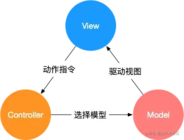
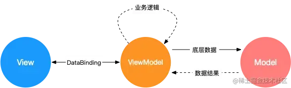
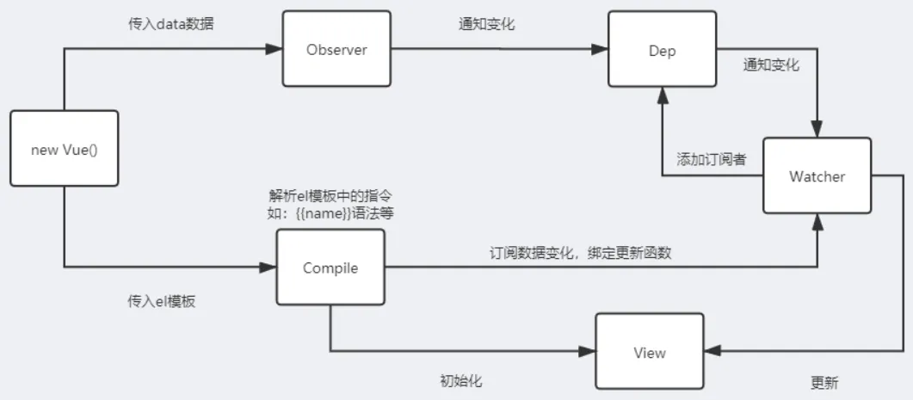
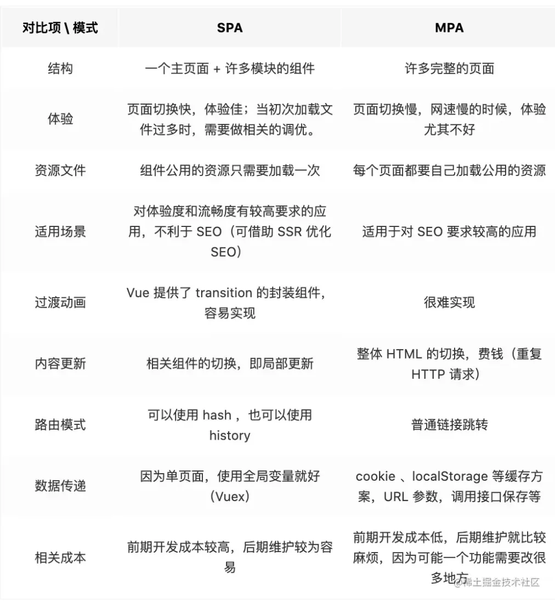

### MVVM、MVC、MVP的区别

MVC、MVP 和 MVVM ，主要通过分离关注点的方式来组织代码结构，优化开发效率。

**（1）MVC**

MVC 通过分离 Model、View 和 Controller 的方式来组织代码结构。其中 View 负责页面的显示逻辑，Model 负责存储业务数据，以及对数据的操作。并且 View 和 Model 应用了观察者模式，当 Model 层发生改变的时候它会通知 View 层更新页面。Controller 层是 View 层和 Model 层的纽带，它主要负责用户与应用的响应操作，当用户与页面产生交互的时候，Controller 中的事件触发器就开始工作了，通过调用 Model 层，来完成对 Model 的修改，然后 Model 层再去通知 View 层更新。 


（2）MVVM

MVVM 分为 Model、View、ViewModel：

- Model代表数据模型，数据和业务逻辑都在Model层中定义，对应的就是data的数据。
- View代表UI视图，DOM，负责数据的展示。
- ViewModel视图模型：Vue的实例对象，连接View和Model的桥梁。负责监听Model中数据的改变并且控制视图的更新，处理用户交互操作。

Model和View并无直接关联，而是通过ViewModel来进行联系的，当数据改变的时候，ViewModel能监听到数据的变化，自动更新视图，当用户操作视图的时候，ViewModel也可以监听到视图的变化，然后通知数据进行改动，实现双向数据绑定。

​    ViewModel通过双向绑定把View和Model连接起来，他们之间的同步是自动的，不需要人为干涉，所以只需要关注业务逻辑即可，不需要操作DOM，同时也不需要关注数据的状态问题，因为她是由MVVM统一管理

这种模式实现了 Model和View的数据自动同步，因此开发者只需要专注于数据的维护操作即可，而不需要自己操作DOM。



**（3）MVP**

MVP 模式与 MVC 唯一不同的在于 Presenter 和 Controller。在 MVC 模式中使用观察者模式，来实现当 Model 层数据发生变化的时候，通知 View 层的更新。这样 View 层和 Model 层耦合在一起，当项目逻辑变得复杂的时候，可能会造成代码的混乱。MVP 的模式通过使用 Presenter 来实现对 View 层和 Model 层的解耦。MVC 中的Controller 只知道 Model 的接口，因此它没有办法控制 View 层的更新，MVP 模式中，View 层的接口暴露给了 Presenter 因此可以在 Presenter 中将 Model 的变化和 View 的变化绑定在一起，以此来实现 View 和 Model 的同步更新。这样就实现了对 View 和 Model 的解耦，Presenter 还包含了其他的响应逻辑。

### **MVVM**的优缺点?

优点:

- 分离视图（View）和模型（Model），降低代码耦合，提⾼视图或者逻辑的重⽤性: ⽐如视图（View）可以独⽴于Model变化和修改，⼀个ViewModel可以绑定在不同的"View"上，当View变化的时候Model不可以不变，当Model变化的时候View也可以不变。你可以把⼀些视图逻辑放在⼀个ViewModel⾥⾯，让很多view重⽤这段视图逻辑
- 提⾼可测试性: ViewModel的存在可以帮助开发者更好地编写测试代码
- ⾃动更新dom: 利⽤双向绑定,数据更新后视图⾃动更新,让开发者从繁琐的⼿动dom中解放

缺点:

- Bug很难被调试：因为使⽤双向绑定的模式，当你看到界⾯异常了，有可能是你View的代码有Bug，也可能是Model的代码有问题。数据绑定使得⼀个位置的Bug被快速传递到别的位置，要定位原始出问题的地⽅就变得不那么容易了。
- ⼀个⼤的模块中model也会很⼤，如果⻓期持有，不释放内存会造成内存的浪费。
- 对于⼤型的图形应⽤程序，视图状态较多，ViewModel的构建和维护的成本都会⽐较⾼。

### vue 中data为什么是个函数？

设计思路：闭包

1，在Vue中根实例的data可以是对象也可以是函数，但是在组件中的data必须是一个函数。因为在js中只有函数才能产生作用域，当组件被复用的时候；函数与函数之间存在各自的作用域，互不干扰的。为了防止data被复用，就需要将其定义为函数。

2，如果data是一个对象的话， 对象是一个引用类型；它会在堆空间中开辟一片区域，将内存地址存入。 这就使得所有的组件共用一个data，当一个组件中修改了data中的数据就会出现一变全变的现象。

3，函数的好处：每一次组件复用之后都会产生一个全新的data。组件与组件之间各自维护自己的数据，互不干扰。

### Vue父子组件生命周期触发顺序是怎样的？

答：

1. 1. 加载渲染过程：父beforeCreate->父created->父beforeMount->子beforeCreate->子created->子beforeMount->子mounted->父mounted；
   2. 更新过程：父beforeUpdate->子beforeUpdate->子updated->父updated；
   3. 销毁过程：父beforeDestroy->子beforeDestroy->子destroyed->父destroyed。

### 父子组件通信的方式

组件通信的方式有以下7种方法：

1. **props和$emit**

**父组件向子组件传递数据是通过prop传递的（非事件触发）**

原理：父组件在使用子组件时使用v-bind绑定传递的数据，子组件在props定义接收的数据。

**子组件传递数据给父组件是通过$emit触发事件来做到的。（通过事件触发）**

原理：子组件使用$emit定义一个事件，父元素使用v-on绑定这个事件的触发函数，子组件所传来的数据就是触发函数的参数。

1. **ref/$ref**

父组件给子组件添加ref属性，表示对子组件的引用，父组件使用this.$refs来访问子组件的数据和方法。

1. **parent和children**

父组件使用$children（数组）能拿到所有子组件的实例，$children并不能保证顺序，访问的数据也不是响应式的。

子组件使用$parent就可以访问父组件的实例（访问的是上一级父组件的属性和方法）

1. **$attrs和$listeners**

使用attrs和listeners能够实现爷孙组件通信，

inheritAttrs默认值true，子组件继承父组件除props之外的所有属性；为false只继承class属性。

$attrs是一个容器对象，会存放:父组件传过来的且子组件未使用props声明接收的数据，v-bind="$attrs"一般在子组件的子元素上。

$listeners：该属性是一个对象，里面包含了作用在这个组件上的所有监听器，可以配合 v-on="$listeners" 将所有的事件监听器指向这个组件的某个特定的子元素。（相当于子组件继承父组件的事件）。

1. **依赖注入provide和inject（非响应式）**

父组件中通过provide来提供变量，子组件中通过inject来注入变量。子组件就可以使用这个变量，达到传值的效果。

1. **中央事件总线**

兄弟组件，这种情况下可以使用中央事件总线的方式。新建一个Vue事件bus对象，然后通过bus.emit触发事件，bus.on监听触发的事件，接收数据。

1. **vuex处理组件之间的数据交互**

如果业务逻辑复杂，很多组件之间需要同时处理一些公共的数据，vuex的做法就是将这一些公共的数据抽离出来，其他组件就可以对这个公共数据进行读写操作。

### 事件总线优化

**事件总线的优点**

事件总线最大的优点是 ”解耦“，事件的发布者不需要关心是否有人订阅该事件，也不需要关心是谁订阅该事件，代码耦合度较低。因此，事件总线更适合作为全局的事件通信，或者组件间通信的辅助方案。

**事件总线的缺点**

消息难溯源，临时事件滥用，数据类型转换错误，事件命名重复，事件命名疏忽

**优化方案**

事件声明聚合，区分不同组件的同名事件，事件数据类型声明，接口强约束，APT生成接口类

### vue响应式/双向数据绑定原理

Vue.js 是采用**数据劫持**结合**发布者-订阅者模式**的方式，通过Object.defineProperty()来劫持各个属性的setter，getter，在数据变动时发布消息给订阅者，发布订阅模式进行依赖收集，触发相应的监听回调与视图更新。

1. 对需要observe的数据对象进行递归遍历，包括子属性对象的属性，都加上setter和getter。当给这个对象的某个值赋值时，就会触发setter，那么就能监听到了数据变化。
2. compile解析模板指令，将模板中的变量替换成数据，然后初始化渲染页面视图，并将每个指令对应的节点绑定更新函数，添加监听数据的订阅者，一旦数据有变动，收到通知，更新视图。
3. Watcher订阅者是Observer和Compile之间通信的桥梁，主要做的事情是: ①在自身实例化时往属性订阅器(dep)里面添加自己 ②自身必须有一个update()方法 ③待属性变动dep.notice()通知时，能调用自身的update()方法，并触发Compile中绑定的回调。
4. MVVM作为数据绑定的入口，整合Observer、Compile和Watcher三者，通过Observer来监听自己的model数据变化，通过Compile来解析编译模板指令，最终利用Watcher搭起Observer和Compile之间的通信桥梁，达到数据变化 -> 视图更新；视图交互变化(input) -> 数据model变更的双向绑定效果。


### Object.defineproperty

Object.defineProperty 的作用就是直接在一个对象上定义一个新属性，或者修改一个已经存在的属性。

Object.defineproperty(obj,prop,desc)三个参数：obj为操作的对象；prop添加或修改的属性名；desc为对象，其配置如下

value：属性名的值；get：读取时内部调用的函数；set：写入时内部调用的函数；

enumerable：是否可以遍历；configurable： 是否可再次修改配置项；writable：是否可重写；

### Object.defineProperty的缺陷的理解

Object.defineProperty()是可以监听数组下标的变化的，对一个长度为length的数组进行监听，如果数组push了新元素，这时并不会触发监听，也就是说，之前的监听只是监听length个属性，但是length增加了，这时还是只能监听原来的长度，后面新增的元素还没有增加get和set方法，若要实现对新增元素的监听，需要重新对整个数组进行监听，但是vue团队出于对**性能/体验**的考虑放弃了这点。而是采用重写数组的**push、pop、shift、unshift，splice，sort、reserve**方法来实现对数组的监听。新增或删除对象属性需要使用Vue.set()，Vue.delete。

### proxy的理解

1. 1. Proxy是ES6中新增的一个对象，没有原型对象。它可以拦截并重定义JavaScript中的基本操作，例如读取、修改、删除对象的属性等；
   2. Proxy的作用是对目标对象进行代理，就是对目标对象设一层拦截器，外界对目标对象的访问都要经过这层拦截器。拦截器可以对外界的访问进行拦截、过滤、修改等操作，最后再将访问请求转发给目标对象；
   3. 使用new Proxy()函数创建Proxy对象即可。在创建Proxy对象时，需要传入两个参数，分别是要代理的目标对象和一个处理器对象。处理器对象中定义了一些拦截器函数，例如get、set、has等，这些拦截器函数用来拦截目标对象的各种操作。

```javascript
const target = {
  name: "wpc",
  age: 23,
};
const handler = {
  get(target, prop) {
    console.log(`getting ${prop}`);
    return target[prop];
  },
  set(target, prop, value) {
    console.log(`setting ${prop} to ${value}`);
    target[prop] = value;
  },
};
const proxy = new Proxy(target, handler);
console.log(proxy.name);
proxy.age = 24;
```

### vue3的proxy相对于vue2的object.defineProperty的优势

1. 1. 直接监听对象，不需要通过object.defineProperty() 方法来逐个设置监听属性，更加方便和高效；
   2. 可以监听新增属性和删除属性， o.d只能监听已经存在的属性，新增删除需要用$set；
   3. 可以监听数组的变化（在目标对象或数组上定义一个代理对象，通过代理对象来拦截对目标对象或数组的访问和修改，从而实现对整个对象或数组的劫持）
   4. 支持多层嵌套对象，不需要通过递归来处理深层嵌套对象的监听。

### Vue3.0 为什么要用 proxy？

- 在 Vue2 中， 0bject.defineProperty 会改变原始数据，而 Proxy 是创建对象的虚拟表示，并提供 set 、get 和 deleteProperty 等处理器，这些处理器可在访问或修改原始对象上的属性时进行拦截，有以下特点∶

  - 不需用使用 Vue.$set 或 Vue.$delete 触发响应式。
  - 全方位的数组变化检测，消除了Vue2 无效的边界情况。
  - 支持 Map，Set，WeakMap 和 WeakSet。

  Proxy 实现的响应式原理与 Vue2的实现原理相同，实现方式大同小异∶

  - get 收集依赖
  - Set、delete 等触发依赖
  - 对于集合类型，就是对集合对象的方法做一层包装：原方法执行后执行依赖相关的收集或触发逻辑。

### 修改elementUI样式的方式

1，新建全局样式表：新建 global.css 文件放在 src->assets 静态资源文件夹下的 style 文件夹下，并在 main.js 中引入。

2，在当前-vue-单页面中添加一个新的不添加scoped属性style标签（也相当于全局的样式）

3，使用/deep/深度修改标签样式：找到需要修改的 ElementUI 标签的类名，然后在类名前加上/deep/，可以强制修改默认样式。这种方式可以直接用到有scoped属性的 style 标签中

### $nextTick 作用与原理

dom更新后的延迟回调

作用：为了获取更新后的DOM 。

在 Vue.js 中，数据更新通常是异步的，当数据发生变化时，Vue 将会进行一次“更新队列”操作，将需要执行的 DOM 更新操作加入到队列中。

1. 在下一个事件循环（Event Loop）周期中，Vue.js 会执行队列中的 DOM 更新操作，这时 DOM 结构已经发生了变化。
2. $nextTick 方法利用了 JavaScript 的事件循环机制，在当前事件循环结束后，立即执行回调函数，这样就确保了在 DOM 更新之后执行回调函数，可以获取到最新的 DOM 结构。

### 说说 Vue的优缺点

优点：

数据驱动视图，对真实 dom进行抽象出 虚拟l dom（本质就是一个 js对象），并配合 diff算法、响应式和观察者、异步队列等手段以最小代价更新 dom，渲染页面

1. 组件化，组件用单文件的形式进行代码的组织编写，使得我们可以在一个文件里编写 html\css（scoped属性配置 css隔离）\js并且配合 Vue-loader之后，支持更强大的预处理器等功能
2. 强大且丰富的 API，能满足业务开发中各类需求
3. 由于采用虚拟 dom，让 Vue 服务端渲染更加迅速。
4. 运行速度更快：相比较于 **react** 而言，同样是操作虚拟 **dom**，就性能而言， **vue** 存在很大的优势。
5. 生态好，社区活跃

缺点：

1、由于底层基于 Object.defineProperty实现响应式，而这个 api本身不支持 IE8及以下浏览器

2、csr客户端渲染的先天不足，首屏性能问题（白屏）

3、由于百度等搜索引擎爬虫无法爬取 js中的内容，故 spa先天就对 seo优化心有余力不足。

### 对SSR的理解

SSR也服务端渲染，将Vue在客户端把标签渲染成HTML的工作放在服务端完成，然后再把html直接返回给客户端

SSR的优势：更好的SEO；首屏加载速度更快。

SSR的缺点：

- 开发条件会受到限制，服务器端渲染只支持beforeCreate和created两个钩子；
- 当需要一些外部扩展库时需要特殊处理，服务端渲染应用程序也需要处于Node.js的运行环境；
- 更多的服务端负载。

### SSR性能提升的原理

1. **首屏加载性能：**
   服务端渲染生成的页面是完整的HTML，这意味着浏览器可以立即开始渲染页面，而不需要等待所有的JavaScript下载并执行完成。这对于首屏加载时间是非常重要的，尤其是在网络连接慢或设备性能低的情况下。
2. **减少白屏时间：**
   因为服务端已经提前渲染了页面，用户在请求页面时会立即看到内容，而不是看到空白页面。这个“时间到第一字节”（TTFB）的减少显著提升了用户体验。
3. **搜索引擎优化（SEO）：**
   SSR对于SEO非常友好，因为搜索引擎抓取器能够更容易地处理完整的HTML页面。这意味着网站的可见性可能会得到提升，从而间接提高性能（通过更高的缓存率和用户留存率）。
4. **减少客户端负载：
   **服务端渲染将页面渲染的负担从客户端转移到了服务器。这对于性能较低的设备来说是一个优势，因为它们不需要处理复杂的JavaScript框架初始化和DOM渲染。
5. **网络利用率：
   **服务端渲染通常可以更有效地利用CDN缓存静态页面内容。当页面内容不经常变化时，这可以极大地减少服务器的负载，并提高内容分发的速度。
6. **代码分割和懒加载：**
   尽管这不是SSR特有的，但SSR经常与代码分割和懒加载结合使用，这样只有当前页面所需的代码才会被加载和执行，进一步提高性能。

### 单页与多页区别和优缺点

SPA单页面应用，指只有一个主页面的应用，一开始只需要加载一次js、css等相关资源。所有内容都包含在主页面，对每一个功能模块组件化。单页应用跳转，就是切换相关组件，仅仅刷新局部资源。

MPA多页面应用 （MultiPage Application），指有多个独立页面的应用，每个页面必须重复加载js、css等相关资源。多页应用跳转，需要整页资源刷新。



### Vue模版编译原理

vue中的模板template无法被浏览器解析并渲染，需要将template转化成一个JavaScript函数，这样浏览器就可以执行这一个函数并渲染出对应的HTML元素。

**模板编译三阶段**

- **解析阶段**：使用大量的正则表达式对template字符串进行解析，将标签、指令、属性等转化为抽象语法树AST。
- **优化阶段**：遍历AST，找到其中的一些静态节点并进行标记，方便在页面重渲染的时候进行diff比较时，直接跳过这一些静态节点，优化runtime的性能。
- **生成阶段**：将最终的AST转化为render函数字符串。

### slot是什么？有什么作用？原理是什么？

slot又名插槽，是Vue的内容分发机制，组件内部的模板引擎使用slot元素作为承载分发内容的出口。插槽slot是子组件的一个模板标签元素，而这一个标签元素是否显示，以及怎么显示是由父组件决定的。slot又分三类，默认插槽，具名插槽和作用域插槽。

- 默认插槽：又名匿名查抄，当slot没有指定name属性值的时候一个默认显示插槽，一个组件内只有有一个匿名插槽。
- 具名插槽：带有具体名字的插槽，也就是带有name属性的slot，一个组件可以出现多个具名插槽。
- 作用域插槽：默认插槽、具名插槽的一个变体，可以是匿名插槽，也可以是具名插槽，该插槽的不同点是在子组件渲染作用域插槽时，可以将子组件内部的数据传递给父组件，让父组件根据子组件的传递过来的数据决定如何渲染该插槽。

实现原理：当子组件vm实例化时，获取到父组件传入的slot标签的内容，存放在vm.$slot中，默认插槽为vm.$slot.default，具名插槽为vm.$slot.xxx，xxx 为插槽名，当组件执行渲染函数时候，遇到slot标签，使用$slot中的内容进行替换，此时可以为插槽传递数据，若存在数据，则可称该插槽为作用域插槽。

### Vue常见的修饰符

表单修饰符：

lazy：输入框改变，这个数据就会改变，lazy这个修饰符会在光标离开input框才会更新数据。

trim：输入框过滤首尾的空格。

number：只能输入数字。

事件修饰符：

stop：等同于 JavaScript 中的 event.stopPropagation() ，防止事件冒泡；

prevent ：等同于 JavaScript 中的 event.preventDefault() ，防止执行预设的行为，阻止标签默认行为

capture ：与事件冒泡的方向相反，事件捕获由外到内。事件先在有.capture修饰符的节点上触发，然后在其包裹的内部节点中触发。

```vue
<!--这里先执行divClick事件，然后再执行aClick事件-->
<div v-on:click.capture="divClick"><a v-on:click="aClick">点击</a></div>
```

self ：只当在 event.target 是当前元素自身时触发处理函数，即事件不是从内部元素触发的。

```vue
<!--在a标签上点击时只会触发aClick事件，只有点击phrase的时候才会触发divClick事件-->
<div v-on:click.self="divClick">phrase<a v-on:click.="aClick">点击</a></div>
```

once ：只会触发一次。可用于原生DOM和自定义组件中

passive：**事件的默认行为立即执行(不用查看有没有阻止默认事件的行为)，无需等待事件回调执行完毕。**

### v-if、v-show、v-html 的原理

- v-if会调用addIfCondition方法，生成vnode的时候会忽略对应节点，render的时候就不会渲染；
- v-show会生成vnode，render的时候也会渲染成真实节点，只是在render过程中会在节点的属性中修改show属性值，也就是常说的display；
- v-html会先移除节点下的所有节点，调用html方法，添加innerHTML属性，归根结底还是设置innerHTML为v-html的值。

### v-if和v-show的区别？

都可以控制元素的显示和隐藏

- 采取方式：v-show是设置display来让元素显示和隐藏，v-if是动态的向DOM树内添加或删除DOM元素。
- 编译过程：v-if有一个局部编译/卸载的过程，切换这个过程中会销毁和重建内部的事件监听和子组件；v-show只是简单的css切换。
- 编译条件：v-if才是真正的条件渲染；如果初始条件为假，则什么也不做，只有在条件第一次变为真时才开始局部编译， v-show是任何条件下，无论首次条件是否为真，都被编译，然后被缓存，而且DOM元素保留。
- 性能消耗：v-if有更高的切换消耗；v-show有更高的初始渲染消耗。
- 使用场景：v-if适合运营条件不大可能改变；v-show适合频繁切换。

### v-if和v-for的优先级

在Vue中，v-if 和 v-for 是两个常用的指令，它们分别用于条件渲染和列表渲染。然而，当它们在同一个元素上使用时，Vue的处理顺序就变得重要了。根据Vue的官方文档，v-for 拥有比 v-if 更高的优先级。

这意味着如果你在同一个元素上同时使用了 v-if 和 v-for，v-for 的循环会先执行，然后每个循环中的元素会基于 v-if 的条件来决定是否渲染。这可能导致性能问题，因为即使条件为假，你仍然在运行循环。

### v-model 是如何实现的，语法糖实际是什么？

**作用在表单元素上** 动态绑定 input 的 value 指向 messgae 变量，并且在触发 input 事件的时候去动态把 message设置为目标值

**作用在组件上** v-model **本质是一个父子组件通信的语法糖，通过prop和$.emit实现。**在组件的实现中，可以通过 v-model属性来配置子组件接收的prop名称，以及派发的事件名称。

默认情况下，一个组件上的v-model 会把 value 用作 prop且把 input 用作 event。但是一些输入类型比如单选框和复选框按钮可能想使用 value prop 来达到不同的目的。使用 model 选项可以回避这些情况产生的冲突。js 监听input 输入框输入数据改变，用oninput，数据改变以后就会立刻出发这个事件。通过input事件把数据$emit 出去，在父组件接受。父组件设置v-model的值为input $emit过来的值。

### Computed 和 Watch 的区别

**对于Computed：**

- 它支持缓存，只有依赖的数据发生了变化，才会重新计算。
- 不支持异步，当Computed中有异步操作时，无法监听数据的变化。
- computed的值会默认走缓存，计算属性是基于它们的响应式依赖进行缓存的，也就是基于data声明过，或者父组件传递过来的props中的数据进行计算的。
- 如果一个属性是由其他属性计算而来的，这个属性依赖其他的属性，一般会使用computed
- 如果computed属性的属性值是函数，那么默认使用get方法，函数的返回值就是属性的属性值；在computed中，属性有一个get方法和一个set方法，当数据发生变化时，会调用set方法。

**对于Watch：**

- 它不支持缓存，数据变化时，它就会触发相应的操作。
- 支持异步监听。
- 监听的函数接收两个参数，第一个参数是最新的值，第二个是变化之前的值。
- 当一个属性发生变化时，就需要执行相应的操作。
- 监听数据必须是data中声明的或者父组件传递过来的props中的数据，当发生变化时，会触发其他操作，函数有两个的参数： 

- - immediate：组件加载立即触发回调函数
  - deep：深度监听，发现数据内部的变化，在复杂数据类型中使用，例如数组中的对象发生变化。需要注意的是，deep无法监听到数组和对象内部的变化。

当想要执行异步或者昂贵的操作以响应不断的变化时，就需要使用watch。

**总结：**

- computed 计算属性 : 依赖其它属性值，并且 computed 的值有缓存，只有它依赖的属性值发生改变，下一次获取 computed 的值时才会重新计算 computed 的值。
- watch 侦听器 : 更多的是**观察**的作用，**无缓存性**，类似于某些数据的监听回调，每当监听的数据变化时都会执行回调进行后续操作。

**运用场景：**

- 当需要进行数值计算,并且依赖于其它数据时，应该使用 computed，因为可以利用 computed 的缓存特性，避免每次获取值时都要重新计算。
- 当需要在数据变化时执行异步或开销较大的操作时，应该使用 watch，使用 watch 选项允许执行异步操作 ，限制执行该操作的频率，并在得到最终结果前，设置中间状态。这些都是计算属性无法做到的。

### Vue中key的作用

vue 中 key 值的作用可以分为两种情况来考虑：

- 第一种情况是 v-if 中使用 key。由于 Vue 会尽可能高效地渲染元素，通常会复用已有元素而不是从头开始渲染。因此当使用 v-if 来实现元素切换的时候，如果切换前后含有相同类型的元素，那么这个元素就会被复用。如果是相同的 input 元素，那么切换前后会产生用户的输入不会被清除掉的问题。因此可以通过使用 key 来唯一的标识一个元素，这个情况下，使用 key 的元素不会被复用。这个时候 key 的作用是用来标识一个独立的元素。
- 第二种情况是 v-for 中使用 key。用 v-for 更新已渲染过的元素列表时，它默认使用“就地复用”的策略。如果数据项的顺序发生了改变，Vue 不会移动 DOM 元素来匹配数据项的顺序，而是简单复用此处的每个元素。因此通过为每个列表项提供一个 key 值，来以便 Vue 跟踪元素的身份，从而高效的实现复用。这个时候 key 的作用是为了高效的更新渲染虚拟 DOM。

key 是为 Vue 中 vnode 的唯一标记，通过这个 key，diff 操作可以更准确、更快速。

- 更准确：因为带 key 就不是就地复用了，在 sameNode 函数a.key === b.key对比中可以避免就地复用的情况。所以会更加准确。
- 更快速：利用 key 的唯一性生成 map 对象来获取对应节点，比遍历方式更快。

### 导航守卫

导航守卫是 Vue Router 中的一种机制，用于在导航触发时进行路由拦截和控制。

**全局守卫**

1. 全局前置守卫
2. 使用router.beforeEach注册一个全局前置守卫：router.beforeEach((to,from,next)=>{})

1. 1. 参数：1. to: Route: 即将要进入的目标 路由对象

 			  2. from: Route: 当前导航正要离开的路由

 			  3. next: next(false): 中断当前的导航

1. 全局后置钩子（导航已经确定）
2. 使用router.afterEach注册一个全局后置守卫：router.afterEach((to,from)=>{})

1. 1. 参数：1. to: Route: 即将要进入的目标 路由对象

​    2. from: Route: 当前导航正要离开的路由

**组件内的守卫**

到达这个组件时，beforeRouteEnter:(to,from,next)=>{}

参数：1. to: Route: 即将要进入的目标 路由对象

​    2. from: Route: 当前导航正要离开的路由

​    3. next:给一个对应的回调（此时data数据还未渲染，不能使用this）

离开这个组件时，beforeRouteLeave:(to,from,next)=>{}

参数：1. to: Route: 即将要进入的目标 路由对象

​    2. from: Route: 当前导航正要离开的路由

​    3. next:给一个对应的回调，next(false)取消执行

路由更新，但该组件仍然被复用时进行调用beforeRouteUpdate:(to,from,next)=>{}

参数：1. to: Route: 即将要进入的目标 路由对象

​    2. from: Route: 当前导航正要离开的路由

    3. next:给一个对应的回调

**路由独享的守卫**

对路由对象使用router.beforeEnter注册一个路由独享守卫：router.beforeEnter((to,from,next)=>{})

参数：1. to: Route: 即将要进入的目标 路由对象

​    2. from: Route: 当前导航正要离开的路由

​                  3. next: next(false): 中断当前的导航

```javascript
const router = new VueRouter({
  routes: [
    {
      path: '/foo',
      component: Foo,
      beforeEnter: (to, from, next) => {
        // ...
      }
    }
  ]
})
```

### 路由守卫进行判断登录

在入口文件man.js里面进行配置，使用router.beforeEach方法，requireAuth可以随意换名的，只要man.js里面跟配置路由的routes里面的字段保持一致。

```javascript
const router= new Router({
  routes: [
    {
     path: '/login',
     name: 'Login',
      component: Login
    },
    {
      path: '/',
      name: 'Demo',
       component: Demo
     },
  ]
})
 router.beforeEach((to,from,next)=>{
    if(to.path=='/login'){
      sessionStorage.removeItem("user");
    }
    let user = JSON.parse(sessionStorage.getItem("user"));
    if(!user&&to.path!='/login'){
      next({path:'/login'})
    }else{
      next();
    }
 })
export default router;
```

### 导航全过程

**完整的路由导航解析过程**

1. 导航被触发。
2. 在准备离开的组件里调用 beforeRouteLeave 守卫。
3. 调用全局的 beforeEach 守卫。
4. 在重用的组件里调用 beforeRouteUpdate 守卫 (2.2+)。（如果你的组件是重用的）
5. 在路由配置里调用 beforeEnter。
6. 解析即将抵达的组件。
7. 在即将抵达的组件里调用 beforeRouteEnter。
8. 调用全局的 beforeResolve 守卫 (2.5+)。
9. 导航被确认。
10. 调用全局的 afterEach 钩子。
11. 触发 DOM 更新。
12. 用创建好的实例调用 beforeRouteEnter 守卫中传给 next 的回调函数。

**触发钩子函数的顺序**

路由导航、keep-alive、和组件生命周期钩子结合起来的，触发顺序，假设是从a组件离开，第一次进入b组件∶

- beforeRouteLeave：路由组件的组件离开路由前钩子，可取消路由离开。
- beforeEach：路由全局前置守卫，可用于登录验证、全局路由loading等。
- beforeEnter：路由独享守卫
- beforeRouteEnter：路由组件的组件进入路由前钩子。
- beforeResolve：路由全局解析守卫
- afterEach：路由全局后置钩子
- beforeCreate：组件生命周期，不能访问tAis。
- created;组件生命周期，可以访问tAis，不能访问dom。
- beforeMount：组件生命周期
- deactivated：离开缓存组件a，或者触发a的beforeDestroy和destroyed组件销毁钩子。
- mounted：访问/操作dom。
- activated：进入缓存组件，进入a的嵌套子组件（如果有的话）。
- 执行beforeRouteEnter回调函数next。

**导航行为被触发到导航完成的整个过程**

- 导航行为被触发，此时导航未被确认。
- 在失活的组件里调用离开守卫 beforeRouteLeave。
- 调用全局的 beforeEach守卫。
- 在重用的组件里调用 beforeRouteUpdate 守卫(2.2+)。
- 在路由配置里调用 beforeEnteY。
- 解析异步路由组件（如果有）。
- 在被激活的组件里调用 beforeRouteEnter。
- 调用全局的 beforeResolve 守卫（2.5+），标示解析阶段完成。
- 导航被确认。
- 调用全局的 afterEach 钩子。
- 非重用组件，开始组件实例的生命周期：beforeCreate&created、beforeMount&mounted
- 触发 DOM 更新。
- 用创建好的实例调用 beforeRouteEnter守卫中传给 next 的回调函数。
- 导航完成

### Vue-router跳转和location.href有什么区别

- 使用 location.href= /url 来跳转，简单方便，但是刷新了页面；
- 引进 router ，然后使用 router.push( /url ) 来跳转，使用了 diff 算法，实现了按需加载，减少了 dom 的消耗。

### 路由懒加载

懒加载：当打包构建应用时，JavaScript 包会变得非常大，影响页面加载。如果我们能把不同路由对应的组件分割成不同的代码块，然后当路由被访问的时候才加载对应组件，这样就更加高效了。

```javascript
{path:'/login',name:'Login',component:resolve=>require(['@/components/Login'],resolve)},
{path:'/home',name:'Home',component:resolve =>require(['@/components/Home'],resolve),
    children:[
        {path:'/new',name:'New',component:resolve =>require(['@/components/New'],resolve)},
        {path:'/list',name:'List',component:resolve => require(['@/components/List'],resolve)}
    ]
 }
```


```javascript
//const 组件名 = () => import('组件路径')
//下面没有指定webpackChunkName,每个组件打包成一个js文件
const Foo = () => import('../components/Foo')
const Aoo = () => import('../components/Aoo')

//指定相同的webpackChunkName，会合并打包成一个js文件
const Foo = () => import(/*webpackChunkName:'ImportFuncDemo'*/,'../components/Foo');
const Aoo - () => import(/*webpackChunkName:'ImportFuncDemo'*/,'../components/Aoo')

{path:'/Foo',name:'Foo',component:Foo},
{path:'/Aoo',name:'Aoo',component:Aoo},
{path:'/Login',name:'Login',
    component: ()=>import(/*webpackChunkName:"ImportFuncDemo"*/,'../compontents/Login')}
```


```javascript
//多个路由指定相同的chunkName，会合并打包成一个js文件
//可实现按需加载资源，包括js，css等，会给里面require的文件单独打包，不会和主文件打包在一起。
{path:'/home',name:'home',component:r=>
    require.ensure([],()=>r(require('@/components/home')),'funcDemo')},
{path:'/new',name:'new',component:r=>
    require.ensure([],()=>r(require('@/components/new')),'funcDemo')},
{path:'/list',name:'list',component:r=>
    require.ensure([],()=>r(require('@/components/list')),'listDemo')},

const  Coo = resolve=>{
 require.ensure([],()=>{resolve(require('@/components/List'))})
}
{path:'/list',name:'List',component:Coo}
```

- ### vue路由时怎么传参的？

  - params传参（不显示参数）

  this.$router.push({name:'index',params:{id:item.id}})

  this.$route.params.id获取参数

  - params传参（显示参数）

  this.$router.push({name:"/index/${item.id}"})

  路由配置{path:'/index:id'}

  - query传参（可以解决页面刷新参数丢失的问题）

  this.$router.push({name:'index', query:{ id:item.id}})

  this.$route.query.id获取传递的参数值

  ### vue路由的hash模式和history模式有什么区别？

  **hash模式**

  **简介：** hash模式是开发中默认的模式，它的URL带着一个#，例如：[www.abc.com/#/vue](https://link.juejin.cn?target=http%3A%2F%2Fwww.abc.com%2F%23%2Fvue)，hash值就是#/vue。

  **特点**：hash值会出现在URL里面，但是不会出现在HTTP请求中，对后端完全没有影响。所以改变hash值，不会重新加载页面。这种模式的浏览器支持度很好，低版本的IE浏览器也支持这种模式。hash路由被称为是前端路由，已经成为SPA（单页面应用）的标配。

  **原理：** hash模式的主要原理就是**onhashchange()事件**：

  使用onhashchange()事件的好处就是，在页面的hash值发生变化时，无需向后端发起请求，window就可以监听事件的改变，并按规则加载相应的代码。除此之外，hash值变化对应的URL都会被浏览器记录下来，这样浏览器就能实现页面的前进和后退。虽然是没有请求后端服务器，但是页面的hash值和对应的URL关联起来了。

  **history模式**

  **简介：**它使用的是传统的路由分发模式， history模式的URL中没有#，即用户在输入一个URL时，服务器会接收这个请求，并解析这个URL，然后做出相应的逻辑处理。

   **特点：** 当使用history模式时，URL就像这样：[abc.com/user/id](https://link.juejin.cn?target=http%3A%2F%2Fabc.com%2Fuser%2Fid)。相比hash模式更加好看。但是，history模式需要后台配置支持。如果后台没有正确配置，访问时会返回404。 

  **API：** history api可以分为两大部分，切换历史状态和修改历史状态：

  - **修改历史状态**：包括了 HTML5  中新增的 pushState() 和 replaceState() 方法，这两个方法应用于浏览器的历史记录栈，提供了对历史记录进行修改的功能。只是当他们进行修改时，虽然修改了url，但浏览器不会立即向后端发送请求。如果要做到改变url但又不刷新页面的效果，就需要前端用上这两个API。
  - **切换历史状态：** 包括forward()、back()、go()三个方法，对应浏览器的前进，后退，跳转操作。

  虽然history模式丢弃了丑陋的#。但是，它也有自己的缺点，就是在刷新页面的时候，如果没有相应的路由或资源，就会刷出404来。

  **两种模式对比**

  1，hash的路由地址上有#，history没有

  2，hash兼容IE8以上，history兼容IE10以上，需要兼容低版本的浏览器时，建议使用hash模式。

  3，pushState设置的新URL是与当前URL同源的URL；而hash只可修改#后面的部分，故只可设置与当前同文档的URL

  4，pushState设置的新URL可以与当前URL一模一样，这样也会把记录添加到栈中；而hash设置的新值必须与原来不一样才会触发记录添加到栈中

  5，pushState通过stateObject可以添加任意类型的数据到记录中；而hash只可添加短字符串，需要添加任意类型数据到记录时，可以使用history模式。

  6，pushState可额外设置title属性供后续使用

  7，history需要后台配合，将所有访问都指向index.html，否则用户做回车刷新，会导致404错误。

  ### 如何获取页面的hash变化

  1. 使用watch对$route进行监听
  2. 使用window.location.hash读取

  ### 说一下vue的动态路由。

  动态路由，动态即不是写死的，是可变的。我们可以根据自己不同的需求加载不同的路由，做到不同的实现及页面的渲染。动态的路由存储可分为两种，一种是将**路由存储到前端**。另一种则是将**路由存储到数据库**。动态路由的使用一般结合角色权限控制一起使用。

  使用动态路由可以跟**灵活，无需手工维护**，我们可以使用一个页面对路由进行维护。如果将路由存储到数据库，还可以增加**安全性**。

  ​    要在路由配置里设置meta属性，扩展相关权限的字段，在路由导航守卫里通过这个权限标识，实现路由的动态增加跳转

  ​    根据用户登录的账号返回用户角色，前端再根据角色，和路由表的meta.role进行匹配

  ​    把匹配的路由形成可访问的路由

  ### vue组件懒加载

  ```javascript
  components:{"One-com": ()=>import("./one");},
  components:{"One-com":resolve=>(['./one'],resolve)},
  ```

  ### vue中的组件和插件的区别

  组件是Vue的基本构建块，用于创建用户界面。它们是可复用的Vue实例，具有预定义的选项，可以在不同的环境中使用，并且可以包含自己的模板、数据、方法、生命周期钩子等。

  插件通常用来为Vue添加全局级的功能。它们可以添加全局方法和属性、自定义指令、过滤器、过渡等。插件通常用来封装跨越整个应用的Vue功能或为Vue添加第三方库的集成。

  1. **作用范围：**

  - - 组件：主要用于划分软件界面或功能模块，将复杂的系统分解为独立、可复用的部件，提高代码的可维护性和可重用性。组件通常是在软件内部被使用和管理的。
    - 插件：主要用于扩展已有软件的功能，为软件提供新的功能或增强现有功能。插件通常是以外部插入的形式存在，可以被动态加载和卸载。

  1. **提供者：**

  - - 组件：通常由软件开发团队内部或者第三方组织提供和维护。开发团队会根据软件的需求设计和开发各种组件，以供软件开发人员在开发过程中使用。
    - 插件：通常由第三方开发者或组织提供，插件的开发和维护与软件本身的开发者可能没有直接关联。

  1. **加载方式：**

  - - 组件：在软件开发过程中，组件通常是在编译或打包阶段静态地加载到软件中的。在运行时，组件的功能和行为是固定的，不会随着用户的操作动态变化。
    - 插件：插件通常是动态加载到软件中的，用户可以根据需要随时添加或移除插件，从而实现对软件功能的扩展和定制。

  1. **依赖关系：**

  - - 组件：组件之间存在一定的依赖关系，通常组件之间会相互引用和交互，形成一定的组件树结构。在使用组件时，开发人员需要了解组件之间的依赖关系和使用规范。
    - 插件：插件之间的依赖关系相对独立，一个插件的存在不一定依赖于其他插件。用户可以根据自己的需求选择需要的插件，并根据需要进行配置和管理。

  1. **使用场景：**

  - - 组件：适用于构建复杂的界面或功能模块，将系统分解为独立、可复用的部件，提高代码的可维护性和可重用性。
    - 插件：适用于扩展已有软件的功能，为软件提供新的功能或增强现有功能，满足用户个性化需求。

  - ### vuex

  - Vuex是Vuejs应用程序设计的**状态管理工具**。它采用**集中式存储管理**应用的所有组件的状态，并以相应的规则保证状态以一种可预测的方式发生变化。

  - 状态管理应用包含以下几个部分：

  - - state，驱动应用的数据源；
    - view，以声明方式将 state 映射到视图；
    - actions，响应在 view 上的用户输入导致的状态变化。

  - ### vuex核心概念

  - **state**提供唯一的公共数据源，所有共享的数据统一放到store的state进行储存，相似于data。

  - 使用方法：

  - 1. 1. 直接形式：this.$store.state.name
       2. 使用辅助函数：mapState。在计算属性中使用...mapState(['count'])进行映射，全局可访问，相当于在data里面定义的变量，this.name就可以访问

  - **getters**是state的计算属性，具有缓存，对store里面的数据进行加工处理形成新数据

  - 使用方法：

  - 1. 1. 直接形式：在computed中调用，定义一个计算属性，使其返回值为this.$store.getters.getNumber
       2. 使用辅助函数：mapGetters，在computed中使用...mapGetters(['Getter'])注入为全局的计算属性

  - **mutations**提交更新数据的方法

  - 使用方法：

  - 1. 1. 直接使用：this.$store.commit('方法')
       2. 使用辅助函数：mapMutations，在methods中使用...mapMutations(['add','sub'])注入全局的函数，就可以通过this调用。

  - **actions**提交mutations来修改数据，用来处理异步操作

  - 使用方法：

  - 1. 1. 直接使用：this.$store.dispatch("asynAdd")
       2.  使用辅助函数：mapActions，在methods中使用...mapActions(['addAsync'])注入全局的函数，就可以通过this调用。

  - **modules**模块化vuex，将store分割成模块，每个模块都有自己的state，actions，mutations，getters。

  - **为什么使用modules**：vuex维护的是一个单一的状态树，对于复杂的vue项目，若只有一个store，则该store就会非常臃肿难以维护。

  - 默认情况下，**模块内部的 action 和 mutation 仍然是注册在全局命名空间的**——这样使得多个模块能够对同一个 action 或 mutation 作出响应。

  - 添加 namespaced: true 的方式使其成为带命名空间的模块。当模块被注册后，它的所有 getter、action 及 mutation 都会自动**根据模块注册的路径调整命名**。各模块之间命名不会冲突。

  - 提交模块中的mutations：this.$store.commit('app/setUser', {name: '张三'})，app为模块名

  - 或者使用辅助函数...mapMutations("模块名",['模块的mutations'])

  - ### vuex刷新数据会丢失吗？怎么解决？

  - vuex肯定会重新获取数据，页面也会丢失数据

  - 1，把数据直接保存在浏览器缓存中（cookie，localStorage，SessionStorage）

  - 2，页面刷新的时候，再次请求数据，达到可以动态更新的方法。

  - 监听浏览器刷新时刻，在刷新前把数据保存在sessionStorage里，刷新后请求数据，请求到了用vuex，没有就用sessionStorage里的数据。

  - 3，使用vue-presistedstate插件

  - vue-presistedstate插件，结合了浏览器的[本地存储localStorage](https://so.csdn.net/so/search?q=本地存储localStorage&spm=1001.2101.3001.7020)和sessionStorage，统一进行配置，不需要每次都手写存储方法。

  - 安装插件 npm install vuex-persistedstate --save 

  - 引入插件import createPersistedState from 'vuex-persistedstate'

  - 和state，mutations平级加入

  - ```javascript
    // plugins: [createPersistedState()]  //持久化于localStorage
    plugins: [
      createPersistedState({ storage: window.sessionStorage })   //持久化于sessionStorage
      // 方法1：用reducer，这里的val是由store里面的所有state，不加reducer为储存所有，reducer为指定存储
      reducer(val)  {
        return {// 只储存state中的name
           keyName: val.name
        }}
    	// 方法2：用paths,数组里面填模块名，存储指定模块
    	// paths: ['Home', 'Order']
    ]
    ```

  - ### Vuex中actions和mutations有什么区别

  - 执行顺序：相应视图—>修改State”拆分成两部分，视图触发Action，Action再触发Mutation。

  - 角色定位：Mutation专注于修改State，理论上是修改State的唯一途径。Action业务代码、异步请求。

  - 限制：Mutation：必须同步执行。Action：可以异步，但不能直接操作State

  - ### Vuex 和 localStorage 的区别

  - **实质区别**

  - - vuex存储在内存中，存储的是状态
    - localstorage 则以文件的方式存储在本地，只能存储字符串类型的数据，存储对象需要 JSON的stringify和parse方法进行处理。 读取内存比读取硬盘速度要快

  - **应用场景**

  - - Vuex 是一个专为 Vue.js 应用程序开发的状态管理模式。它采用集中式存储管理应用的所有组件的状态，并以相应的规则保证状态以一种可预测的方式发生变化。vuex用于组件之间的传值。
    - localstorage是本地存储，是将数据存储到浏览器的方法，一般是在跨页面传递数据时使用 。
    - Vuex能做到数据的响应式，localstorage不能 。

  - **永久性：**刷新页面时vuex存储的值会丢失，localstorage不会。

  - **注意：** 对于不变的数据确实可以用localstorage可以代替vuex，但是当两个组件共用一个数据源（对象或数组）时，如果其中一个组件改变了该数据源，希望另一个组件响应该变化时，localstorage无法做到，

  - ### Redux 和 Vuex 有什么区别，它们的共同思想

  - **（1）Redux 和 Vuex区别**

  - - Vuex改进了Redux中的Action和Reducer函数，以mutations变化函数取代Reducer，无需switch，只需在对应的mutation函数里改变state值即可
    - Vuex由于Vue自动重新渲染的特性，无需订阅重新渲染函数，只要生成新的State即可
    - Vuex数据流的顺序是∶View调用store.commit提交对应的请求到Store中对应的mutation函数->store改变

  - 通俗点理解就是，vuex 弱化 dispatch，通过commit进行 store状态的一次更变；取消了action概念，不必传入特定的 action形式进行指定变更；弱化reducer，基于commit参数直接对数据进行转变，使得框架更加简易;

  - **（2）共同思想：**单—的数据源；变化可以预测

  - 本质上：redux与vuex都是对mvvm思想的服务，将数据从视图中抽离的一种方案; 形式上：vuex借鉴了redux，将store作为全局的数据中心，进行mode管理;

  - ### 为什么要用 Vuex 或者 Redux

  - 由于传参的方法对于多层嵌套的组件将会非常繁琐，对于兄弟组件间的状态传递无能为力。经常会采用父子组件直接引用或者通过事件来变更和同步状态的多份拷贝。代码无法维护。

  - 把组件的共享状态抽取出来，以一个全局单例模式管理。在这种模式下，组件构成了一个巨大的"视图"，不管在哪个位置，任何组件都能获取状态或者触发行为。通过定义和隔离状态管理中的各种概念并强制遵守一定的规则，代码将会变得更结构化且易维护。

  - ### Vuex和单纯的全局对象有什么区别？

  - - Vuex 的状态存储是响应式的。当 Vue 组件从 store 中读取状态的时候，若 store 中的状态发生变化，那么相应的组件也会相应地得到高效更新。
    - 不能直接改变 store 中的状态。改变 store 中的状态的唯一途径就是显式地提交 (commit) mutation。这样可以方便地跟踪每一个状态的变化，从而能够实现一些工具帮助更好地了解我们的应用。

  - ### 为什么 Vuex 的 mutation 中不能做异步操作？

  - - Vuex中所有的状态更新的唯一途径都是mutation，异步操作通过 Action 来提交 mutation实现，这样可以方便地跟踪每一个状态的变化，从而能够实现一些工具帮助更好地了解我们的应用。
    - 每个mutation执行完成后都会对应到一个新的状态变更，这样devtools就可以打个快照存下来，然后就可以实现 time-travel 了。如果mutation支持异步操作，就没有办法知道状态是何时更新的，无法很好的进行状态的追踪，给调试带来困难。

  - ### Vuex的严格模式是什么,有什么作用，如何开启？

  - 在严格模式下，无论何时发生了状态变更且不是由mutation函数引起的，将会抛出错误。这能保证所有的状态变更都能被调试工具跟踪到。

  - 在Vuex.Store 构造器选项中开启,如下

  - ```javascript
    const store = new Vuex.Store({     strict:true, })
    ```

  - ### keep-alive

  - **keep-alive**：keep-alive可以实现组件缓存，是Vue.js的一个内置组件。

  - 作用：

  - 1. 它能够把不活动的组件实例保存在内存中，而不是直接将其销毁
    2. 它是一个抽象组件，不会被渲染到真实DOM中，也不会出现在父组件链中

  - 使用方式：

  - 1. 常用的两个属性include/exclude，允许组件有条件的进行缓存。
    2. 两个生命周期activated/deactivated，用来得知当前组件是否处于活跃状态。
    3. keep-alive的中还运用了LRU(Least Recently Used)算法。

  - 原理：Vue 的缓存机制并不是直接存储 DOM 结构，而是将 DOM 节点抽象成了一个个 VNode节点，所以，keep- alive的缓存也是基于VNode节点的而不是直接存储DOM结构。

  - 其实就是将需要缓存的VNode节点保存在this.cache中／在render时,如果VNode的name符合在缓存条件（可以用include以及exclude控制），则会从this.cache中取出之前缓存的VNode实例进行渲染。

  - ### Vue生命周期

  - 开始创建、初始化数据、编译模板、挂载Dom、渲染→更新→渲染、销毁等一系列过程。

  - 1. 实例化Vue对象：new Vue()。
    2. 初始化事件和生命周期：init events 和init cycle。
    3. beforeCreate()：属性还没有赋值；没有创建template对应的HTML元素；数据观测 (data observer) 和 event/watcher 事件还未配置。
    4. 挂载数据：属性赋值和computed运算。
    5. created()：vue对象的属性有值，此时data、computed、watch、methods 等配置完成，但是没有DOM，$el还不存在，没有创建HTML，此时更改数据不会触发updated()，此阶段多用来进行异步数据请求。
    6. 检查是否存在el属性：有则继续检测template，没有则等到手动调用vm.mount()完成el绑定
    7. 检测是否存在template属性：如果没有template进行填充被绑定区域，则被绑定区域的el对outerHTML（即 整个#app DOM对象，包括和标签）都作为被填充对象替换掉填充区域。即： 如果vue对象中有 template属性，那么，template后面的HTML会替换$el对应的内容。如果有render属 性，那么render就会替换template。 即：优先关系时： render > template > el
    8. beforeMount()：编译模板，数据挂载之前执行的钩子函数，此时this.$el有值，但还没有挂载到页面上。
    9. 模板编译：用vue对象的数据（属性）替换模板中的内容。
    10. mounted()：模板编译完成，数据挂载完毕。此时已经把数据挂载到了页面上，页面上能够看到正确的数据了。
    11. beforeUpdate()：组件更新之前执行的函数，只有数据更新后，才能调用（触发）beforeUpdate，注意：此数据一定是在模板上出现的数据，否则，不会，也没有必要触发组件更新（因为数据不出现在模板里，就没有必要再次渲染。数据更新了，但是，vue（组件）对象对应的dom中的内部（innerHTML）没有变，所以叫作组件更新前。
    12. updated()：组件更新之后执行的函数，vue（组件）对象对应的dom中的内部（innerHTML）改变了，所以，叫作组件更新之后。
    13. activated函数：keep-alive组件激活时调用。
    14. activated函数：keep-alive组件停用时调用。
    15. beforeDestroy：vue（组件）对象销毁之前。
    16. destroyed：vue组件销毁后。

  - ### created和mounted的区别

  - created和mounted都可以拿到实例对象的属性

  - 1. **created**：

  - - - **created** 生命周期钩子函数在组件实例被创建后立即执行，此时组件实例已经创建，但尚未挂载到 DOM 上，也就是说虚拟 DOM 已经创建完毕。
      - 在**created**钩子函数中，可以访问到组件的属性、方法和生命周期钩子函数，但此时组件的 **$el** 属性还未生成，因此无法访问到组件的真实 DOM。
      - **created**常用于执行一些需要在组件实例创建后立即执行的操作，如初始化数据、调用异步请求等。

  - 1. **mounted**：

  - - - **mounted** 生命周期钩子函数在组件被挂载到 DOM 上后执行，此时组件的模板已经在 DOM 中渲染完成，可以通过 **this.$el** 访问到组件的真实 DOM 元素。
      - 在**mounted**钩子函数中，可以执行一些需要访问到真实 DOM 元素的操作，例如操作 DOM、调用 jQuery 插件等。
      - 通常情况下，**mounted**常用于执行一些需要在组件被挂载到 DOM 后执行的操作，如异步获取数据、监听 DOM 事件等

  - ### Vue中逻辑复用mixins怎么实现

  - mixins就是将这些多个相同的逻辑抽离出来，各个组件只需要引入mixins，就能实现一次写代码，多组件受益的效果。

  - 步骤：用一个js文件将vue的script部分抽离出来；需要引入mixins的组件引入即可。

  - mixin特性

  - 1. 1. mixins中会与引入mixins的组件的生命周期整合在一起调用。mixins的生命周期早于组件。
       2. 组件的data、methods、filters会覆盖mixins里的同名data、methods、filters
       3. 不同mixin里的同名方法，按照引进的顺序，最后的覆盖前面的同名方法

  - mixins的缺点

  - 1. 1. 变量来源不明确（隐式传入），不利于阅读，使代码变得难以维护。
       2. 多个mixins的生命周期会融合到一起运行，但是同名属性、同名方法无法融合，可能会导致冲突。
       3. mixins和组件可能出现多对多的关系，复杂度较高。

  - **Vue3.x中的自定义hook函数是什么**

  - - 使用Vue3的组合API封装的可复用的功能函数。
    - 自定义hook的作用类似于vue2中的mixin技术。
    - 自定义Hook的优势: 很清楚复用功能代码的来源, 更清楚易懂。

  - ### Vue3.0有什么更新

  - **（1）数据劫持的方式**

  - - 3.0 将带来基于代理 Proxy的 observer 实现，提供全语言覆盖的反应性跟踪。
    - 消除了 Vue 2 当中基于 Object.defineProperty 的实现所存在的很多限制：

  - **（2）只能监测属性，不能监测对象**

  - - 检测属性的添加和删除；
    - 检测数组索引和长度的变更；
    - 支持 Map、Set、WeakMap 和 WeakSet。

  - **（3）模板**

  - - 作用域插槽，2.x 的机制导致作用域插槽变了，父组件会重新渲染，而 3.0 把作用域插槽改成了函数的方式，这样只会影响子组件的重新渲染，提升了渲染的性能。
    - 同时，对于 render 函数的方面，vue3.0 也会进行一系列更改来方便习惯直接使用 api 来生成 vdom 。

  - **（4）对象式的组件声明方式**

  - - vue2.x 中的组件是通过声明的方式传入一系列 option，和 TypeScript 的结合需要通过一些装饰器的方式来做，虽然能实现功能，但是比较麻烦。
    - 3.0 修改了组件的声明方式，改成了类式的写法，这样使得和 TypeScript 的结合变得很容易

  - **（5）其它方面的更改**

  - - 支持自定义渲染器，从而使得weex可以通过自定义渲染器的方式来扩展，而不是直接 fork 源码来改的方式。
    - 支持 Fragment多个根节点
    - 基于 tree shaking 优化，提供了更多的内置功能。
    - 大部分生命周期钩子名称上 + “on”
    - 提供 Teleport 组件可将部分 DOM 移动到 Vue app 之外的位置
    - 虚拟DOM上增加 patchFlag 字段
    - cacheHandler可在第一次渲染后缓存我们的事件。相比于 Vue2 无需每次渲染都传递一个新函数。加一个 click 事件

  - ### vue选项式API和组合式API的区别

  - **Options API**

  - - 在一个vue文件中data，methods，computed，watch中定义属性和方法，共同处理页面逻辑
    - 优点：新手上手简单
    - 缺点：一个功能往往需要在不同的vue配置项中定义属性和方法，比较分散。项目小还好，清晰明了，但是项目大了后，一个methods中可能包含很多个方法，往往分不清哪个方法对应着哪个功能，而且当你想要新增一个功能的时候你可能需要在 data，methods，computed，watch中都要写一些东西，但是这个时候每个选项里面的内容很多你需要上下来回的翻滚，特别影响效率。

  - **Composition API**

  - - 缺点：学习成本可能会增加，以前的思维方式也要转变
    - 优点：Composition API 是根据逻辑相关性组织代码的，提高可读性和可维护性，基于函数组合的 API 更好的重用逻辑代码，Composition API最大的优点通俗的讲就是把跟一个功能相关的东西放在一个地方，它是目前最合理也是最容易维护的，你可以随时将功能的一部分拆分出去。你可以将每一个功能相关所有的东西比如methods，computed都放在如上图的function中，这个function可以独立的存在，可以放在一个TS文件中，也可在npm中单独发布，最终Composition API把他们组合起来

  - **总结**

  - - 在逻辑组织和逻辑复用方面，Composition API是优于Options API
    - 因为Composition API几乎是函数，会有更好的类型推断。
    - Composition API对 tree-shaking 友好，代码也更容易压缩
    - Composition API中见不到this的使用，减少了this指向不明的情况
    - 如果是小型组件，可以继续使用Options API，也是十分友好的

  - ### assets和static的区别

  - **相同点：**assets 和 static 两个都是存放静态资源文件。存放项目中的资源文件图片，字体图标，样式文件等。

  - **不相同点：**assets 中存放的静态资源文件在项目打包时，也就是运行 npm run build 时会将 assets 中放置的静态资源文件进行打包上传。而压缩后的静态资源文件最终也都会放置在 static 文件中跟着 index.html 一同上传至服务器。static 中放置的静态资源文件就不会走打包压缩格式化等流程，而是直接进入打包好的目录，直接上传至服务器。因为避免了压缩直接进行上传，在打包时会提高一定的效率，但是 static 中的资源文件由于没有进行压缩等操作，所以文件的体积也就相对于 assets 中打包后的文件提交较大点。在服务器中就会占据更大的空间。

  - **建议：** 将项目中 template需要的样式文件js文件等都可以放置在 assets 中，走打包这一流程。减少体积。而项目中引入的第三方的资源文件如iconfoont.css 等文件可以放置在 static 中，因为这些引入的第三方文件已经经过处理，不再需要处理，直接上传。

  - ### Vue的性能优化有哪些

  - **（1）编码阶段**

  - 尽量减少data中的数据，data中的数据都会增加getter和setter，会收集对应的watcher；v-if和v-for不能连用；如果需要使用v-for给每项元素绑定事件时使用事件代理；SPA 页面采用keep-alive缓存组件；在更多的情况下，使用v-if替代v-show；key保证唯一；使用路由懒加载，异步组件；防抖，节流；第三方模块按需导入；长列表滚动到可视区域动态加载；图片懒加载。

  - **（2）SEO优化**

  - 预渲染、服务端渲染SSR

  - **（3）打包优化**

  - 压缩代码；Tree Shaking/Scope Hoisting；使用cdn加载第三方模块；多线程打包happypack；splitChunks抽离公共文件；sourceMap优化

  - **（4）用户体验**

  - 骨架屏、PWA、还可以使用缓存(客户端缓存、服务端缓存)优化、服务端开启gzip压缩等。

  - ### 对 React 和 Vue 的理解，它们的异同。

  - 相同点：

  - 1. **组件化**: React 和 Vue 都支持组件化的开发方式。开发者可以将界面划分为独立、可复用的组件，使得代码更加模块化和可维护。
    2. **虚拟 DOM**: 两者都使用虚拟 DOM 技术来优化性能。通过在内存中维护虚拟 DOM 树，在进行 DOM 操作时，可以最小化实际 DOM 的操作，提高性能。
    3. **单向数据流**: React 和 Vue 都遵循单向数据流的原则，使得数据的流动更加可控、可预测。
    4. **生态系统**: 两者都有庞大的生态系统和活跃的社区，提供了丰富的第三方库和插件，以及大量的文档和教程。

  - 不同点：

  - 1. **语法差异**: React 使用 JSX（JavaScript XML）作为组件的声明语法，而 Vue 则使用了更接近传统 HTML 的模板语法。这使得 Vue 在一些方面更加直观易懂，而 React 则更加灵活。
    2. **状态管理**: 在 React 中，状态管理通常使用 Context API 或第三方库（如 Redux）来管理应用的状态。而 Vue 提供了内置的状态管理工具 Vuex，使得状态管理更加简单。
    3. **学习曲线**: 一般来说，Vue 的学习曲线相对较低，因为它的 API 设计更加直观，而 React 则需要一定时间去适应 JSX 以及函数式编程的思维方式。
    4. **灵活性**: React 更加灵活，可以搭配使用各种库和工具来满足不同的需求。Vue 在一些方面提供了更多的约定和默认值，使得开发者在一定程度上更容易上手。
    5. **生态系统成熟度**: 目前来看，React 的生态系统更加成熟，拥有更多的第三方库和支持。但是 Vue 的生态系统也在不断壮大，正在迅速发展中。

### VUE的diff算法

ue 的 Virtual DOM Diff 算法是一种用于比较两棵虚拟 DOM 树的算法，用于确定何时更新视图以反映状态的变化。它的核心目标是尽可能高效地更新 DOM，以提高页面性能。

Vue 的 Diff 算法主要分为以下几个步骤：

1. 新旧节点比较：首先，Vue 会将新的虚拟 DOM 树与旧的虚拟 DOM 树进行逐层比较。这个过程是递归进行的，从根节点开始。
2. 节点类型比较：如果两个节点类型不同，Vue 会认为它们是完全不同的节点，直接将旧节点替换为新节点。
3. 节点属性比较：如果两个节点类型相同，Vue 会比较它们的属性。如果属性不同，Vue 将更新旧节点的属性为新节点的属性。
4. 子节点比较：如果节点类型相同，Vue 会比较它们的子节点。这个过程也是递归进行的。Vue 会先尝试尽可能地复用已存在的子节点，如果子节点无法复用，则进行进一步的比较和更新。
5. 使用 key 进行优化：在进行子节点比较时，Vue 会使用节点的 key 属性来尽可能地复用已存在的节点，而不是直接创建新节点。这样可以大大提高 Diff 算法的效率，避免不必要的 DOM 操作。
6. 列表渲染优化：在处理列表渲染时，Vue 会尽可能地复用已存在的列表项，而不是重新创建和插入新的列表项。这样可以减少 DOM 操作的次数，提高页面性能。

### VUE的patch算法

Vue.js 的 Patch 算法是用于将虚拟 DOM 的变化应用到实际 DOM 的过程。Patch 算法是 Vue.js 的核心之一，它使得 Vue 能够实现高效的数据驱动视图更新。

Patch 算法的主要步骤如下：

1. **生成差异（Diff）**： 首先，Vue 会比较新旧两个虚拟 DOM 树，找出它们之间的差异。这个过程叫做 Diff 算法，它会将虚拟 DOM 树的节点一一对比，找出节点的增删改操作。Diff 算法的结果是一系列的更新指令，描述了如何将虚拟 DOM 树的变化应用到实际 DOM 上。
2. **打补丁（Patch）**： 接下来，Vue 会根据 Diff 算法得到的更新指令，将这些指令应用到实际 DOM 上，从而使实际 DOM 与虚拟 DOM 保持同步。这个过程叫做打补丁（Patch），它会按照更新指令的顺序执行一系列的 DOM 操作，例如插入、更新、移动和删除等。
3. **应用更新（Apply）**： 最后，Vue 会将打补丁得到的更新应用到实际 DOM 上，从而使页面的显示与最新的数据状态保持一致。这个过程是 Vue.js 实现数据驱动视图更新的关键步骤之一，它能够有效地减少页面重绘和重新排版的次数，提高页面的性能和响应速度。
